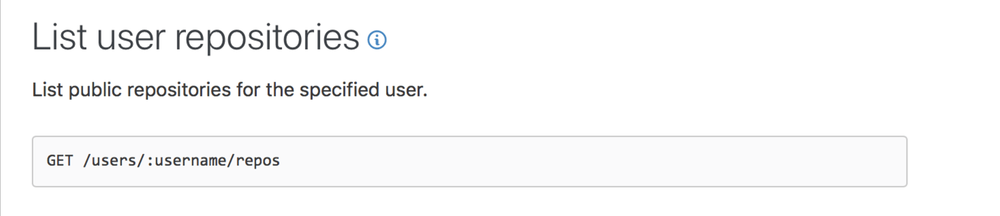
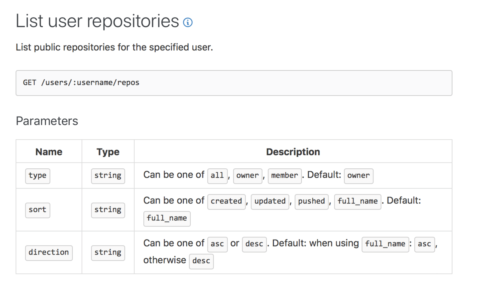
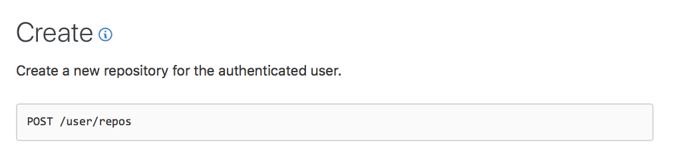
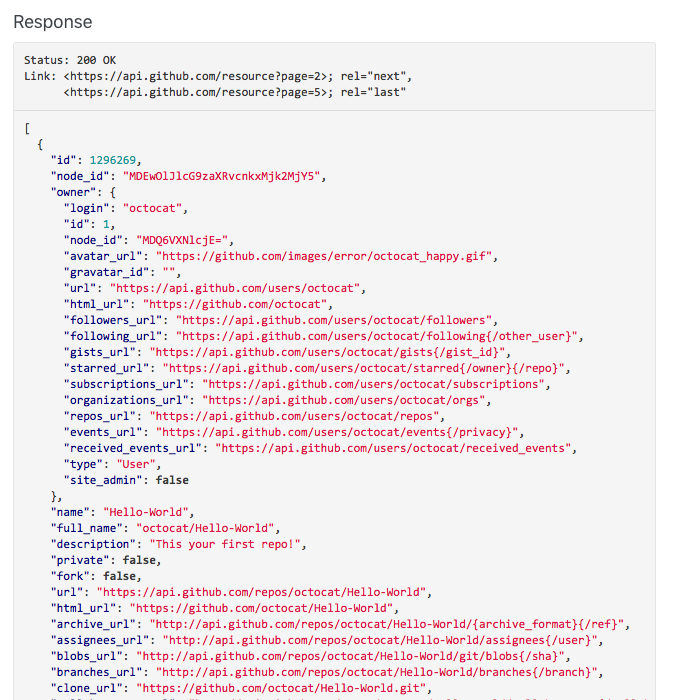

# Requests and responses

We're going to look deeper into requests and responses in this lesson.

## The anatomy of a request

A request consist of four parts:

1. The endpoint
2. The method
3. The body
4. The headers

### The endpoint

The endpoint is the URL you send a request to. It is made up of three things:

1. The root endpoint
2. The path
3. Query parameters

```
root-endpoint/path?params
```

The **root endpoint** is the starting point of the API you’re requesting from. Github API's root endpoint is `https://api.github.com`.

The **path** determines what you request for. For example, to get a user's repositories from Github, you will need to use `/users/:username/repo`.

Here, `:username` is a variable. You can replace it with your Github username to fetch a list of your repositories.

<figure>
  
  <figcaption></figcaption>
</figure>

**Query parameters** lets you modify a request. They begin with a question mark at the end of the path. Each query parameter is a key-value pair, separated by an ampersand.

```
?query1=value1&query2=value2
```

If you want to get a list of my repositories that is sorted by push date, you can set the `sort` parameter to `pushed`.

```
https://api.github.com/users/zellwk/repos?sort=pushed
```

<figure>
  
  <figcaption></figcaption>
</figure>

### The method

You can send five kinds of requests:

1. Get—used to get (or read) information
2. Post—used to create new pieces of information
3. Put—used to update information
4. Patch—used to update information too
5. Delete—used to delete information.

API documentation will tell you which method to use. For example, you use `get` to fetch a list of repositories. You use `post` to create a new repository.

<figure>
  
  <figcaption></figcaption>
</figure>

<figure>
  
  <figcaption></figcaption>
</figure>

To specify a method with XHR, you pass the method as the first argument when you call `open`.

```js
request.open('post', url)
```

To specify a method with fetch, you pass an object as the second argument. In this object, you set the `method` property to the method you want. It defaults to `get` if no method is defined.

```js
fetch('some-url', {
  method: 'post'
})
```

When you hear about APIs, you may also hear about CRUD operations.

**CRUD** stands for Create, Read, Update, and Delete. It is a set of operations we use to get servers to update databases with.

- Create—create a database entry
- Read—get a database entry
- Update—change a database entry
- Delete—delete a database entry

When we work on the frontend, we don't have to worry about CRUD. They're taken care of by API developers. We only need to use the correct method specified in the documentation.

But for your information, here's how they're mapped together:

- Read operation => `get` request
- Create operation => `post` request
- Update operation => `put` or `patch` request
- Delete operation => `delete` request

### The Body

The body contains information you want to send to the server. It is only used with `POST`, `PUT`, `PATCH` or `DELETE` requests.

We'll examine the body in details when we send `post` request in a later lesson.

### Headers

Headers provide extra information to the server. You'll learn more about headers as you go through the course. For now, know that they exist.

You can find a list of valid headers on MDN’s [HTTP Headers Reference](https://developer.mozilla.org/en-US/docs/Web/HTTP/Headers).

## The anatomy of a response

A response contains these things:

1. A `status`
2. A `statusText`
3. Headers
4. The body

### Status and StatusText

`status` and `statusText` tells you whether the request has succeeded.

There are five `status` categories:

- 1xx—informational responses
- 2xx—successful responses
- 3xx—redirection responses
- 4xx—client error responses
- 5xx—server error responses

Note: you can substitute xx with numbers. 1xx means 100 - 199, 2xx means 200 to 299, and so on.

What you need to know are 2xx, 4xx, and 5xx responses.

- 2xx means the server responded with a success message.
- You'll get an error with 4xx messages. These mean you provided wrong information, or you didn't provide the required information.
- You'll also get an error with 5xx messages. These mean something wrong happened in the server. The error you get is not your fault! (unless you programmed the server...)

### Headers

Response headers provide extra information to the browser. You'll learn more about headers as you go through the course. For now, know that they exist.

Note: `status` and `statusText` are parts of the header.

### Body

The body contains information the server sends to you. Some programmers call it the **payload**. Some documentation calls it the **response** (even though response means more than the payload).

Documentation often gives you an example of the body. This is what Github responds with when you ask for a list of repositories.

<figure>
  
  <figcaption>The payload from Github</figcaption>
</figure>

If you encounter an error, you can find information about the error in the body.

## Exercise

Answer these questions:

1. What is an endpoint?
2. What are the five kinds of requests you can send?
3. What is a get request used for?
4. What is a post request used for?
5. What is a payload?
6. What are headers?
