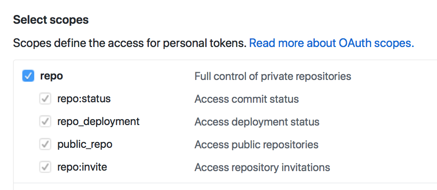

# Authentication

There are two ways to authenticate with JavaScript:

1. Basic authentication
2. OAuth authentication

## Basic Authentication

Basic authentication happens when you send your username and password to a server. The server will check whether your username and password are correct. If they are correct, the server gives you access.

To perform basic authentication in JavaScript, you need to send an `Authorization` header. The value should be `Basic` plus a base64 encoded string.

[Base64](https://en.wikipedia.org/wiki/Base64) is a format to transfer binary data. **Encoding** is the process of converting text to a format like Base64. **Decoding** is the process of converting from a format like base64 back to text.

To convert text to Base64, you can use the `btoa` function. For authentication, we want to encode your username and password like this:

```js
// Replace username with your username
// Replace password with your password
const encoded = btoa('username:password')
```

The Authorization header looks like this in XHR and Fetch.

```js
// Authorization header with XHR
request.setRequestHeader('Authorization', `Basic ${encoded}`)

// Authorization header with Fetch
fetch('some-url', {
  headers: {
    Authorization: `Basic ${encoded}`
  }
})
```

Few APIs let you perform authentication from a browser. We'll discuss why in a while.

Github is one of the rare APIs that let you authenticate yourself through a browser. Try to request for the following endpoint to fetch a list of your repositories. It will only be successful if you're authenticated.

```js
// Fetching your
fetch('https://github.com/user/repos', {
  headers: {
    Authorization: `Basic ${encoded}`
  }
})
```

## Authenticating with OAuth

OAuth (Open Authorization) is a stand for performing authentication and authorization. It requires more steps compared to basic authentication.

### Authenticating vs Authorization

Authenticating is the process of verifying who you claim to be. The API verifies you by checking your username and password.

Authorization is the process of verifying whether you can perform the requested action. Think of it as parental rights. You may give your child access to the App store to download free things, but you don't let them buy. If they try to buy something, they'll get an error message.

### Authenticating with OAuth

There are three steps in the OAuth authentication process.

1. You send your username and password to the server.
2. The server sends you an access token (if you're authenticated)
3. You send an authenticated request with the access token.

When you send a request with an access token, you need to set the `Authorization` header to `Bearer` plus the token.

```js
// Authorization header with XHR
request.setRequestHeader('Authorization', `Bearer ${encoded}`)

// Authorization header with Fetch
fetch('some-url', {
  headers: {
    Authorization: `Bearer ${encoded}`
  }
})
```

As before, most APIs don't let you authenticate yourself with OAuth through a browser. Github is the rare exception.

If you want to create an access token for Github, you can go to https://github.com/settings/tokens. Once you're on the page, click on `Generate new token`. You will need to give a description for this token.

<figure>
  
  <figcaption aria-hidden>Creating a new access token</figcaption>
</figure>

You can also choose what the person (or program) accessing Github with the token can do. This is called scopes.

<figure>
  
  <figcaption aria-hidden>Scopes</figcaption>
</figure>

Scroll down and click on `Generate token`. You will see your token. Copy it immediately. You won't be able to see it again.

<figure>
  
  <figcaption aria-hidden>The generated token</figcaption>
</figure>

Don't give anyone access to your token to anyone. (More on this in a later next section). I'm only showing it to you because I want you to know how it looks like. You won't be able to use it anyway because I deleted it already 😈.

Try sending a request again with the following link. Use your access token this time. You will only be able to fetch the request if you're authenticated.

```js
// Fetching your
fetch('https://github.com/user/repos', {
  headers: {
    Authorization: `Bearer ${token}`
  }
})
```

### Logging in with Facebook, Twitter, Google, etc.

OAuth lets us create applications to log users in with a platform. Examples of such platforms include Facebook, Twitter, Google, and Github.

This process requires four steps.

1. You send the user to log themselves in on the platform of choice.
2. The platform authenticates the user
3. The platform sends the access token to your server.
4. You perform authenticated requests with the token through your server.

## Do not authenticate yourself through a browser!

JavaScript is not secure. Anyone can see your JavaScript if they visit your website. They can steal your credentials (username, password, or access token) if you put them in your JavaScript code.

When people steal your credentials, they can hurt you. For example, a friend leaked my Amazon access token by accident. I got surprised by a $60,000 bill for this mistake.

Lucky for me, I didn't have to pay. Amazon decided to waive the fee off.

**The moral of the story is: protect your credentials. Don’t let anyone steal it. Don't authenticate through a browser.**

If we don't want anyone to steal our credentials, we need to authenticate through a server. Creating a server is out of scope for Learn JavaScript. We'll go through it in a separate course.

If you're curious, you can read [why I chose to create a separate course for authentication](https://zellwk.com/blog/authentication-in-learn-js).

## Exercise

1. Perform a basic authentication with Github
2. Perform a token-based authentication with Github
