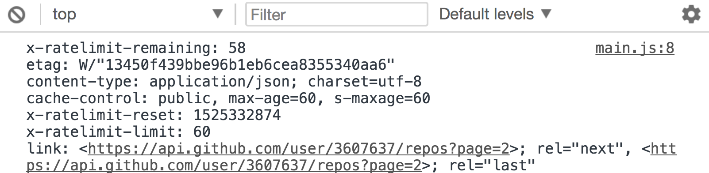
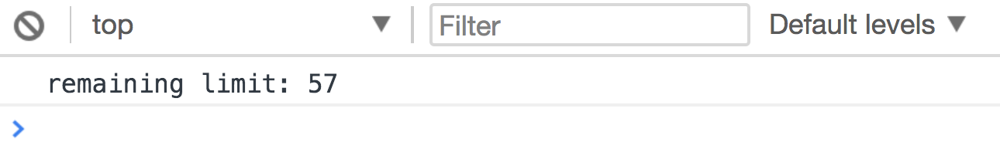
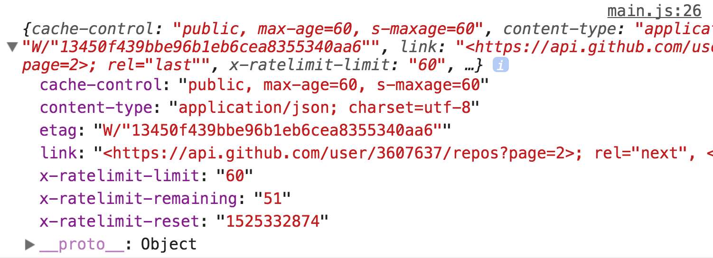

# Headers

Headers provide information about the request and response. You may need to use this information, so let's understand how to get them.

## Viewing headers in developer tools

You can see headers in your developer tools. To do so, click on the `network` tab. You'll see this.

<figure>
  
  <figcaption aria-hidden>The network tab</figcaption>
</figure>

When you're on the network tab, click on the resource you tried to fetch. You'll see information about both request and response headers.

<figure>
  
  <figcaption aria-hidden>Viewing header information</figcaption>
</figure>

If you sent a request to fetch a list of my Github repos, you'll get headers that look like this:

<figure>
  
  <figcaption aria-hidden>Request headers</figcaption>
</figure>

<figure>
  
  <figcaption aria-hidden>Response headers</figcaption>
</figure>

## Getting headers in JavaScript

You only need the response headers in JavaScript. The process to getting these headers is slightly different with XHR and Fetch.

Regardless of the method used, you will only see a subset of the response headers. This is because browsers refuse to let us access headers that are considered unsafe.

Here's a list of headers that are considered safe.

1. Cache-Control
2. Content-Language
3. Content-Type
4. Expires
5. Last-Modified
6. Pragma

Headers that are considered unsafe can be viewed in JavaScript in the server allows to. You can see the allowed headers through the `Access-Control-Expose-Headers` header (view this in the devtools).

## Getting headers with XHR

You can use `getAllResponseHeaders` to get all response headers. These headers will be formatted in a string (which is not very usable).

```js
request.addEventListener('load', e => {
  const headers = request.getAllResponseHeaders()
  console.log(headers)
})
```

<figure>
  
  <figcaption>XHR getResponseHeaders method formats headers in a raw string</figcaption>
</figure>

To get one specific header, you can use `getResponseHeader`.

```js
request.addEventListener('load', e => {
  const remaining = request.getResponseHeader('x-ratelimit-remaining')
  console.log(`remaining limit: ${remaining}`)
})
```

<figure>
  
  <figcaption aria-hidden>Logging the x-ratelimit-remaining header</figcaption>
</figure>

## Getting headers with Fetch

For Fetch, the response headers are hidden in the `headers` object. You can get one header with the `get` method.

```js
fetch('https://api.github.com/users/zellwk/repos')
  .then(r => {
    const remaining = r.headers.get('x-ratelimit-remaining')
    console.log(`remaining limit: ${remaining}`)
  })
```

<figure>
  
  <figcaption aria-hidden>Logging the x-ratelimit-remaining header</figcaption>
</figure>

To get all response headers, you need to loop through the Headers object. You can do so with the `entries` method and a loop of your choice.

```js
fetch('https://api.github.com/users/zellwk/repos')
  .then(r => {
    const headers = {}
    for (let [header, value] of r.headers.entries()) {
      headers[header] = value
    }
  })
```

If you're savvy with `reduce`, you can do this.

```js
const headers = Array.from(r.headers.entries())
  .reduce((acc, [header, value]) => {
    return Object.assign(acc, { [header]: value })
  }, {})
```

Here's a log of our headers object.

<figure>
  
  <figcaption aria-hidden>The headers object we created</figcaption>
</figure>

### Using headers and body with Fetch

If you are sharp, you may notice that in Fetch, headers and body information are read in different places. Headers can be read in the first `then` call, while body is only read in the second `then` call.

```js
fetch('some-url')
  .then(r => {
    // You can see headers here
    r.json()
  })
  .then(body => {
    // You can see the body here
  })
```

This becomes a problem if you want to use both headers and body at the same time. You'll see a use case in the next lesson.

To get the headers into the second `then` call, we need return it together with the body. To parse the body, we need to call the `json` method.

But the `json` method returns a promise. One way to get both header and body information together is through `Promise.all`.

```js
fetch('https://api.github.com/users/zellwk/repos')
  .then(r => {
    const headers = Array.from(r.headers.entries())
      .reduce((o, [header, value]) => {
        return Object.assign({}, o, { [header]: value })
      }, {})

    return Promise.all([
      headers,
      r.json()
    ])
  })
  .then(([headers, body]) => {
    console.log(headers) // the headers
    console.log(body) // the body
  })
```

This approach can feel weird because we're sending an array into the second `then` call.

A better approach is to call the `json` method first, then send headers over in the `then` call after the `json` gets parsed successfully. We can even provide more information if we want.

```js
fetch('https://api.github.com/users/zellwk/repos')
  .then(r => {
    const headers = Array.from(r.headers.entries())
      .reduce((o, [header, value]) => {
        return Object.assign({}, o, { [header]: value })
      }, {})

    return r.json()
      .then(body => ({ headers, body }))
  })
  .then(response => {
    console.log(response.headers) // the headers
    console.log(response.body) // the body
  })
```

## Exercise

1. Request for a list of my repositories from Github
2. Get the `link` header with XHR
3. Get the `link` header with Fetch
4. Get the `link` header in the second `then` call when you use Fetch.

