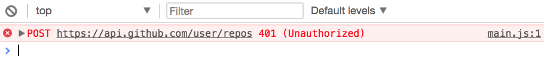
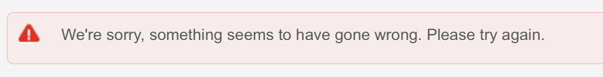
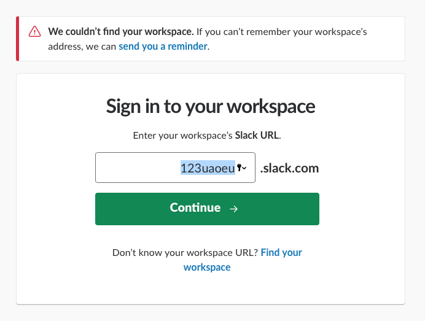
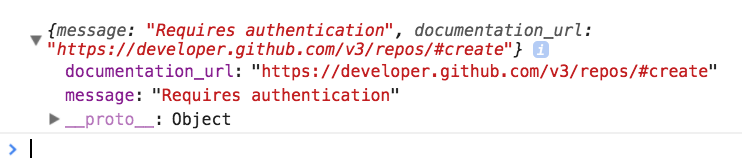
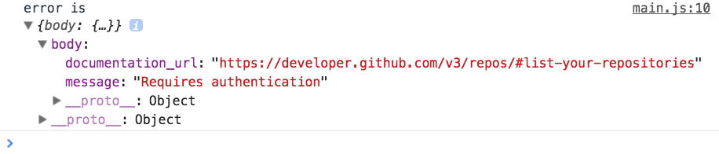

# Handling errors

Try sending a POST request to create a Github repository. If you don't provide any authentication, you'll get an error from the Github. It says 401 Unauthorized.

```js
// With XHR
const request = new XMLHttpRequest()
request.open('post', 'https://api.github.com/user/repos')
request.send()

// With Fetch
fetch('https://api.github.com/user/repos', { method: 'post' })

```

<figure>
  
  <figcaption></figcaption>
</figure>

This is one reason why an error may occur.

## Why errors occur

Errors can occur for many reasons. The error message you get will differ according to the type of error. When working with APIs, you'll usually get 400 errors.

The common ones are:

1. `400 Bad request`—this happens for many reasons. It's the most common type of error. Usually, this happens because your request didn't contain required fields.
2. `401 Unauthorized`—this happens because you are not authenticated. It also happens if you're not authorized to perform an action.
3. `403 Forbidden`—this happens because the server refuses to act on your action. Here's an example: when you hit your rate limit, you'll get a forbidden response.
4. `404 Not found`—this happens because you tried to fetch a nonexistent request.
5. `405 Method not allowed`—this happens because you used a wrong method.

## Why deal with errors

Nobody likes to receive an error. What people hate even more is an error tells them to try again without saying what's wrong.

<figure>
  
  <figcaption>Example of an error I got from Paypal</figcaption>
</figure>

You want to provide useful error messages. When you do so, the user can fix the error immediately.

<figure>
  
  <figcaption></figcaption>
</figure>

If you don't know what's wrong, the least you can do is tell your user to contact you with more information. When they send you info, you can help them overcome the error.

## Dealing with XHR errors

First, you want to know if you received an error. To do so, you can check the `status`. If the status is larger than 400, you know you received an error.

```js
request.addEventListener('load', e => {
  const response = e.target
  if (response.status >= 400) {
    // Handle error here
  }
})
```

When you get an error, the server will also send information about the error. This information is usually found in the response body.

```js
request.addEventListener('load', e => {
  const response = e.target
  if (response.status >= 400) {
    const error = JSON.parse(response.response)
    console.log(error)
  }
})
```

<figure>
  
  <figcaption></figcaption>
</figure>

You can handle the error based on what the server sends back to you. In this case, you can do one of the following:

1. Direct a user to login with their username and password.
2. Tell the user they entered the username or password incorrectly

## Dealing with Fetch errors

When you use Fetch, you also need to check if the server sends you an error message. You can do it through two ways:

1. Checking `status` is larger than 400
2. Checking `ok` is true

The `ok` property is unique to Fetch. It is set to `false` if `status` is larger than 400

```js
fetch('https://api.github.com/user/repos')
  .then(response => {
    if (response.ok) return response.json()
    // Handle error here
  })
```

When we use a Promise, we handle errors in the `.catch` call. Since Fetch is a Promise, we need to send the error into the `.catch` call ourselves.

We can do this by calling `Promise.reject`.

```js
fetch('https://api.github.com/user/repos')
  .then(response => {
    if (response.ok) return response.json()
    Promise.reject(/* Argument to pass to catch */)
  })
```

We have a slight problem here—`response.json` returns a promise. We cannot send `response.json` via `Promise.reject`. We need to resolve it first.

The complete fetch request should look like this:

```js
fetch('https://api.github.com/user/repos')
  .then(response => {
    return response.json()
      .then(body => {
        if (response.ok) return body
        return Promise.reject({ body })
      })
  })
  .then(body => console.log(`body is `, body))
  .catch(error => console.log(`error is`, error))
```

<figure>
  
  <figcaption></figcaption>
</figure>

## Exercise

1. Send an XHR request that results in an error. Handle the error.
2. Send a Fetch request that results in an error. Handle the error.