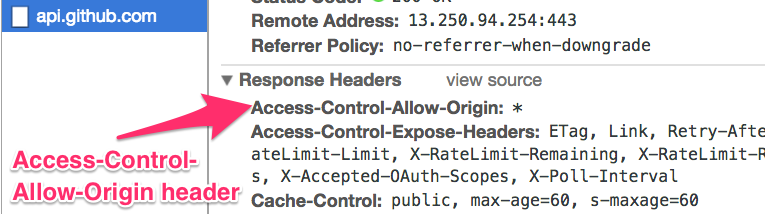
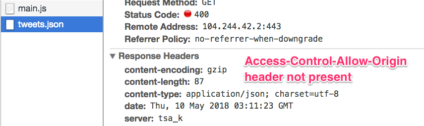
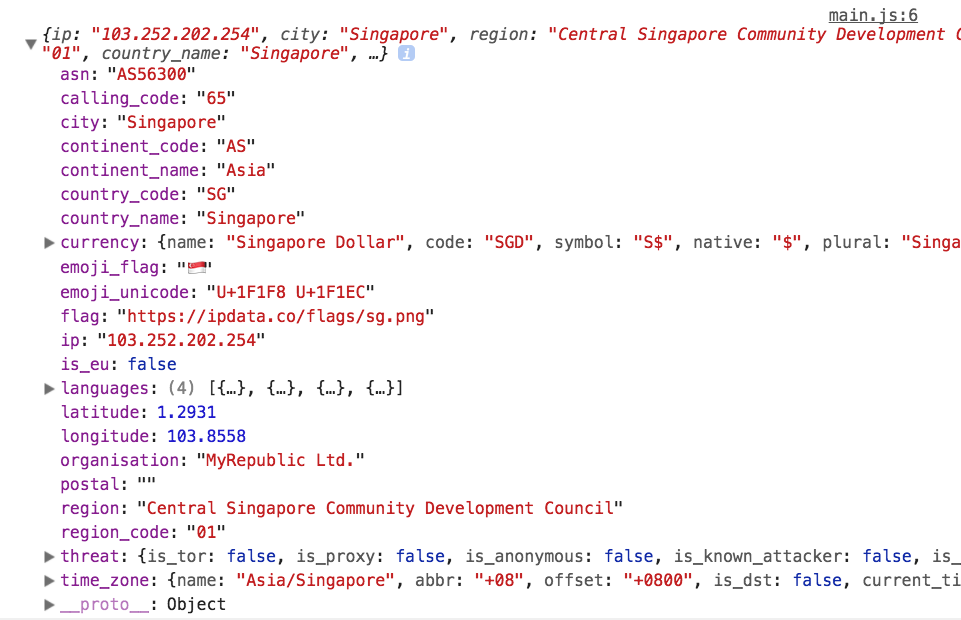

# CORS and JSONP

In this lesson, you're going to learn:

1. What is CORS
2. What is JSONP
3. How to request for resources without CORS
4. Which is better, CORS or JSONP, and why.

Let's begin with CORS.

## CORS

XHR and Fetch are built on a technology called CORS. CORS stands for **Cross Origin Resource Sharing**. It lets us request information from other origins.

### What is an origin

A URL includes a few things:

```bash
https://host.com:port/paths
```

An origin is the combination of three things:

1. Protocol (`http://` or `https://`)
2. Host
3. Port (port is rarely seen)

The host can be divided into domains and subdomains. `labs.jensimmons.com` is an example that contains both. `jensimmions.com` is the domain. `labs` is the subdomain.

**For a request to originate from the same origin, all three parts—protocol, host, and port—must match**.

1. `http://zellwk.com` and `https://zellwk.com` are different origins
2. `https://github.com` and `https://api.github.com` are different origins.

### CORS and APIs

Servers can restrict origins from accessing them under CORS. They restrict origins with the `Access-Control-Allow-Origin` header.

The server can set two kinds of values for the header.

1. `*`—the server accepts requests from any origin.
2. A series of specific origin—the server accepts requests only from listed origins.

A server that gives browsers access will contain the `Access-Control-Allow-Origin` header. An example is Github. You can see the `Access-Control-Allow-Origin` header if you send a request to Github.

<figure>
  
  <figcaption aria-hidden>Github response contains Access-Control-Allow-Origin header</figcaption>
</figure>

Servers that don't give browsers access will not contain the `Access-Control-Allow-Origin` header. Twitter is an example.

<figure>
  
  <figcaption aria-hidden>Twitter response does not contain Access-Control-Allow-Origin header</figcaption>
</figure>

If you want to send a request to an API that doesn't accept CORS, you need to do it through a server.

So, what if you wanted to send a request to a server that doesn't support CORS?

One possible way is through JSONP.

## JSONP

JSONP stands for **JSON with padding**. It's a technology that existed before CORS.

APIs that don't let you send CORS requests from browsers may let you send a JSONP request. [Behance's API](https://www.behance.net/dev) is an example of such an API.

### Using JSONP

To use JSONP, you need to create a `script` tag with `createElement`.

```js
const script = document.createElement('script')
```

Then, you link the script tag to the API endpoint you want to request from.

This link needs to have a `callback` query parameter. The value of this `callback` query parameter should be the name of a function.

```js
const myFunction = (data) => {
  console.log(data)
}

const script = document.createElement('script')
script.src = 'some-endpoint?callback=myFunction'
```

Then, you need to append the `script` tag to your DOM. The `script` tag will request for the endpoint and activate `myFunction`.

```js
const script = document.createElement('script')
script.src = 'some-endpoint?callback=myFunction'
document.body.appendChild(script)
```

Let's try this with a real example. We'll send a request to [IPData.co](https://ipdata.co/index.html). This API tells us information about our IP address.

```js
const myFunction = (data) => {
  console.log(data)
}

const script = document.createElement('script')
script.src = 'https://api.ipdata.co?callback=myFunction'
document.body.appendChild(script)
```

You should see that `data` is a JSON response.

<figure>
  
  <figcaption>JSONP response</figcaption>
</figure>

Note: IPData.co supports CORS requests in browsers. Try [Behance's API](https://www.behance.net/dev) if you want to see a real API that supports JSONP but not CORS.

### Handling errors with JSONP

You know requests can fail. You want to handle errors. To handle errors with JSONP, you can add an `error` event listener to the `script` tag.

```js
script.addEventListener('error', e => {
  // Handle the error
})
```

Unfortunately, this error event doesn't tell us what the error was. The best we can do is "something went wrong", or "please try again later".

### JSONP limitations

There are three problems with JSONP requests.

First, the server needs to support JSONP. Servers that support JSONP will decrease over time because CORS is more powerful and is preferred. JSONP is an older technology.

Second, you can only send GET requests with JSONP. You cannot send POST, PUT, PATCH, or DELETE requests. You need to use CORS if you need these request types.

Third, you provide meaningful error messages with JSONP.

## CORS vs JSONP

CORS has two advantages over JSONP:

1. CORS lets you perform more request types than JSONP.
2. CORS lets you provide meaningful error messages.

In all, CORS is a better API compared to JSONP.

The only downside to CORS is it requires you to send requests through servers sometimes. You won't ever need JSONP if you know how to send requests through servers.

Again, creating a server is out of scope for Learn JavaScript. We'll cover more about authentication and security in another course. You can read why [here](https://zellwk.com/blog/authentication-in-learn-js)

