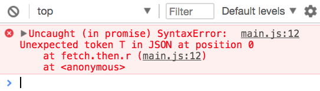

# Using an Ajax library

I recommend you use an Ajax library to make requests. This recommendation holds true for most projects.

## Why use an Ajax library

XHR and Fetch are what we call low-level APIs. We can use them, but we have to write a lot of code on our own.

### Ajax libraries vs XHR

When you use XHR, you need to write event listeners and callbacks.

Event listeners and callbacks aren't the best pattern to use for more Ajax. Promises are much better than event listeners and callbacks when it comes to Ajax. You'll see some examples in the next module.

Ajax libraries can help you convert XHR into Promise-driven code so you don't have to do it yourself. That's why I recommend you use an Ajax library.

### Ajax libraries vs Fetch

When you use Fetch, you need to write the `then` method twice.

```js
fetch('some-link')
  .then(r => r.json())
  .then(body => console.log(body))
```

There are two problems here:

First, you'll get an error if the response isn't a JSON. This error doesn't come from the API itself. It happened because we made a mistake. We tried to parse data that isn't JSON.

<figure>
  
  <figcaption aria-hidden>Error parsing JSON</figcaption>
</figure>

We need to handle the right response with the right methods for real requests. This means we need to call `json`, `text`, `blob`, or other methods according to the type of content the server sends back to us. This extra code can be handled by an Ajax library.

Second, Fetch doesn't send errors into the `catch` call. You have to do it yourself. This extra code can be handled by an Ajax library too.

```js
fetch('https://api.github.com/user/repos')
  .then(response => {
    // Extra code here can be handled by an Ajax library
    return response.json()
      .then(body => {
        if (response.ok) return body
        return Promise.reject({ body })
      })
  })
  .then(body => console.log(`body is `, body))
  .catch(error => console.log(`error is`, error))
```

That's why I recommend you use an Ajax library.

## When to use XHR and Fetch by themselves

You want to use XHR and Fetch over an Ajax library only if:

1. You don't need to handle errors
2. You don't want the add the library as a dependency of your project.

## Recommended libraries

There are many libraries out there that help you do Ajax. The ones I recommend are:

1. [Axios](https://github.com/axios/axios)
2. [zlFetch](https://github.com/zellwk/zl-fetch)

Axios is built on XHR. It lets you use Promises with XHR. Here's an example of a GET request with Axios. It looks like a normal Fetch request.

```js
axios.get('some-url')
  .then(data => console.log(data))
```

zlFetch it is built on Fetch. It helps you simplify Fetch code. Here's an example GET request with zlFetch.

```js
zlFetch('some-url')
  .then(data => console.log(data))
```

### The difference between Axios and zlFetch

Axios and zlFetch do the same thing—they help reduce the amount of code you have to write.

Axios has a stronger community. More people are using Axios. It's generally the safer choice. It's also built on XHR, so you'll be able to cancel requests and track the progress of your request.

zlFetch is a smaller library since its built on Fetch. It's a project built by yours truly. Community for zlFetch is lesser compared to Axios.

I'm going to teach you zlFetch over Axios because:

1. I built zlFetch and I'm biased 😝
2. You can learn Axios yourself because you have the skills to understand what it does.

## Downloading and installing zlFetch

You can use zlFetch by placing this script tag before your main JavaSrcipt file.

```html
<!-- Installing zlFetch -->
<script src="https://cdn.jsdelivr.net/npm/zl-fetch"></script>

<!-- Your JavaScript file -->
<script src="js/main.js"></script>
```

## zlFetch GET Requests

zlFetch transforms fetch responses for you. You can use the response from the server in the first `then` chain. If the response is an error, zlFetch directs it to the `catch` chain.

```js
zlFetch("http://some-website.com")
  .then(response => {
    const headers = response.headers;
    const body = response.body;
  })
  .catch(error => {
    const headers = error.headers;
    const body = error.body;
    const status = error.status;
  })
```

These properties are available in the response object:

1.  `headers`—response headers
2.  `body`—response body
3.  `status`—response status
4.  `statusText`—response status text
5.  `response`—original response from Fetch

### Creating query strings

zlFetch creates query strings for you so you don't have to deal with them. To create query string, add a `params` option as the second argument.

```js
zlFetch('http://some-website.com', {
  params: {
    param1: 'value1',
    param2: 'to encode'
  }
})

// Result:
fetch('http://some-website.com?param1=value1&param2=to%20encode')
```

## zlFetch POST requests

zlFetch helps you set `Content-Type` to `application/json` if you did not set a `Content-Type`. zlFetch will also convert your `body` to JSON if `Content-Type` is left alone.

```js
zlFetch("http://some-website.com", {
  method: "post",
  body: { key: 'value' }
})

// Result
fetch("http://some-website.com", {
  method: "post",
  headers: { "Content-Type": "application/json" }
  body: JSON.stringify({ key: 'value' })
})
```

### Other content types

You can set `Content-Type` if you want to send other types of content.

```js
zlFetch("http://some-website.com", {
  method: "post",
  headers: { "Content-Type": "application/x-www-form-urlencoded" }
})
```

If `Content-Type` is set to `application/x-www-form-urlencoded`, zlFetch will help you convert your `body` to a query string.

```js
zlFetch("http://some-website.com", {
  method: "post",
  headers: { "Content-Type": "application/x-www-form-urlencoded" },
  body: {
    key: "value",
    web: "https://google.com"
  }
});

// Result
fetch("http://some-website.com", {
  method: "post",
  headers: { "Content-Type": "application/x-www-form-urlencoded" },
  body: "key=value&web=https%3A%2F%2Fgoogle.com"
});
```

## Authentication with zlFetch

zlFetch adds `Authorization` headers for you if include any of these options:

1.  `username`
2.  `password`
3.  `token`

### Basic Authentication

zlFetch will add an basic authorization header if you include `username` and `password` options.

```js
// with zlFetch
zlFetch("http://some-website.com", {
  username: "yourusername",
  password: "12345678"
});

// Result
fetch("http://some-website.com", {
  headers: { Authorization: `Basic ${btoa("yourusername:12345678")}` }
});
```

### Token based authentication

zlFetch will add a token based authorization header if you include the `token` option.

```js
// with zlFetch
zlFetch("http://some-website.com", {
  token: "token_12345"
});

// with fetch
fetch("http://some-website.com", {
  headers: { Authorization: `Bearer token_12345` }
});
```

## Wrapping up

Libraries help make requests with less code. Use libraries over raw XHR and Fetch if your project starts to get complicated.

Use raw XHR and Fetch otherwise.

## Exercise

1. Make a GET request with zlFetch
2. Make a POST request with zlFetch. Send JSON data.
3. Make a POST request with zlFetch. Set `Content-Type` to `x-www-form-urlencoded`.
4. Make an authenticated GET request to Github with zlFetch

(Do the same steps with Axios if you want more exercise).
