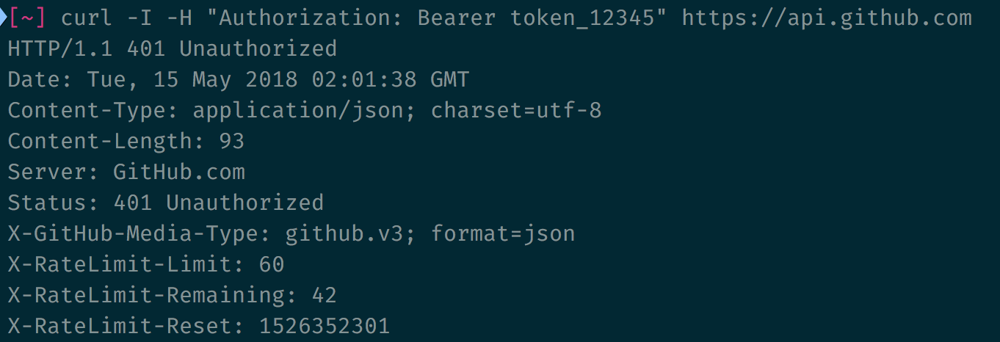

# Understanding curl

When you read API documentation, you may see requests made by a tool called curl. Here's an example from Github:

<figure>
  
  <figcaption>Github uses curl for their documentation</figcaption>
</figure>

Many APIs explain their documentation through curl. You'll be able to understand every API documentation if you know curl.

## What is curl

Curl is command line program that lets you send requests.

You can access the command line with the "Terminal" app if you use a Mac. If you use Windows, you can use Command Prompt.

The command line looks scary, but there's nothing to be afraid of. [Here's an article](https://zellwk.com/blog/fear-of-command-line/) I wrote that can help you out if you're scared.

## Installing curl

Type `curl --version` into your command line.

```bash
curl --version
```

If you see a version number, it means you have curl installed. You can move on to the next section.

If you see a "command not found" error, you will need to [install curl](https://curl.haxx.se/download.html) first.

## Sending requests

To send a GET request with curl, you type `curl`, followed by the endpoint.

```bash
curl https://api.github.com
```

If the server sends you a response, you will see the body of the response in your command line.

<figure>
  
  <figcaption>Curl shows you the response body</figcaption>
</figure>

### Query parameters

If you want to add query parameters to your request, you need to prepend question marks and equal signs with `\`. Most command line applications will prepend `\` for you automatically. This is because `?` and `=` are special characters in the command line.

```bash
curl https://api.github.com/users/zellwk/repos\?per_page\=1
```

<figure>
  
</figure>

## Sending POST requests

To send POST, PUT, PATCH, or DELETE requests, you use a `-X` flag. Make sure the `X` in `-X` is a capital letter. The flags are case sensitive.

```bash
curl -X POST https://api.github.com/user/repos
```

<figure>
  
  <figcaption aria-hidden>Sending a POST request</figcaption>
</figure>

The flag order doesn't matter. You can put it before or after the url.

```bash
curl https://api.github.com/user/repos -X POST
```

## Authentication

You can perform basic authentication with the `-u` flag.

```bash
curl -X POST -u username:password https://api.github.com/user/repos
```

<figure>
  
  <figcaption aria-hidden>Basic auth with Curl</figcaption>
</figure>

Notice the error message changed from "requires authentication" to "problems parsing JSON". This tells us the authentication is successful.

If you want to authenticate yourself through a token, you need to set an authorization header.

## Setting request headers

You can set request headers with `-H`.

```bash
curl -H "Authorization: Bearer token_12345" https://api.github.com
```

To set a second request header, you use another `-H`.

```bash
curl -H "header1: value1" -H "header2: value2" https://api.github.com
```

To see your own request headers, you can use `-v`. Your request headers will be prefixed with `>`.

```bash
curl -v -H "Authorization: Bearer token_12345" https://api.github.com
```

<figure>
  `">
  <figcaption>Request headers are prefixed with `>`</figcaption>
</figure>

## Viewing response headers

You can also use `-v` to see response headers. Response headers will be prefixed with `<`.

<figure>
  
  <figcaption>Response headers are prefixed with `<`</figcaption>
</figure>

If you want to view the response headers only, you can use `-I`.

```bash
curl -I -H "Authorization: Bearer token_12345" https://api.github.com
```

<figure>
  
  <figcaption>View only response headers with -I</figcaption>
</figure>

## Sending body

To send body data, you use `-d`. Curl will send your data as `x-www-form-urlencoded`.

```bash
curl -X POST https://jsonplaceholder.typicode.com/posts -d title='Article title' -d body='shameless plug'
```

<figure>
  
  <figcaption>Send body with `-d`</figcaption>
</figure>

If you need to encode a value, use `--data-urlencode`

```bash
curl -X POST https://jsonplaceholder.typicode.com/posts -d title='Article title' -d body='shameless plug' --data-urlencode link=https://google.com
```

<figure>
  
  <figcaption>Use `--data-urlencode` to encode urls</figcaption>
</figure>

## Line breaks

If it makes sense, you can break lines up with `\`. Make sure there are no spaces after each `\`.

```bash
curl -X POST https://jsonplaceholder.typicode.com/posts \
-d title='Article title' \
-d body='shameless plug' \
--data-urlencode link=https://google.com
```

<figure>
  
  <figcaption>You can make your requests easier to read with line breaks.</figcaption>
</figure>

## A cheat sheet

Here's a table to make the commands easier to look up.

Flag | Purpose
-----|--------
-d   | Sends data
-H   | Set request headers
-I   | View response headers
-v   | Verbose mode (view request headers, response headers, and body)
-u   | Basic authentication
-X   | Sets method

## More curl flags

The flags I taught you above should be enough for most use cases. If you want to find out more about curl, you can read [its documentation](https://curl.haxx.se/docs/manpage.html).

## Exercise

1. Send a GET request with curl
2. Do basic authentication with curl
3. Do token based authentication with curl
4. Send a POST request with curl

