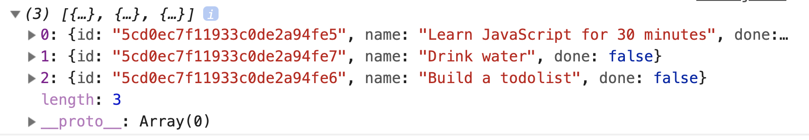

# 🛠️ Todolist: Fetching tasks

We want to fetch and display tasks that are stored in the database. Here's what you'll get by the end of this lesson:

<figure></figure>

The first step is to create a user for the Todolist API.

## Creating a user

This creates an "account" for your tasks. To create a user, you send a POST request to `/users`.

```html
<body>
  <!-- ... -->

  <!-- zlFetch Library -->
  <script src="https://cdn.jsdelivr.net/npm/zl-fetch@latest/dist/index.min.js"></script>
</body>
```

```js
const rootendpoint = 'https://api.learnjavascript.today/'

zlFetch(`${rootendpoint}/users`, {
  method: 'post',
  body: {
    username: 'your-username',
    password: 'your-password'
  }
})
  .then(response => console.log(response.body))
  .catch(error => console.log(error))
```

You should get a response that the user is created.

<figure></figure>

Note: You only need to create a user once. You can delete the code once you created your user.

## Fetching tasks

When you create a new user, the API creates three tasks for you automatically. I made it this way because I want you to learn to fetch tasks first.

To fetch tasks, you need to send a GET request to `/tasks`. Make sure you include your username and password to authenticate yourself.

```js
zlFetch(`${rootendpoint}/tasks`, {
  username: 'your-username',
  password: 'your-password
})
  .then(response => console.log(response.body))
  .catch(error => console.log(error))
```

You should see three tasks in your console. The three default tasks are:

1. Learn JavaScript for 30 minutes
2. Build a todolist
3. Drink water

<figure></figure>

## Adding tasks to the DOM

To add these tasks to the DOM, we have to:

1. Loop through the fetched tasks
2. For each task, make a task element
3. Append the task element to the DOM.

First, let's loop through the fetched tasks.

```js
zlFetch(/*...*/)
  .then(response => {
    const tasks = response.body
    tasks.forEach(task => {
      // Create Task element
      // Append task element to DOM
    })
})
```

Each `task` has three properties. You can see it if you `console.log` it.

1. `id`: ID of the task
2. `done`: Whether the task is completed
3. `name`: Name of the task

<figure></figure>

We can make the task with the `name` property.

```js
zlFetch(/*...*/)
  .then(response => {
    const tasks = response.body
    tasks.forEach(task => {
      const taskEl = makeTaskEl(task.name)
    })
})
```

Once the task is made, we can append it to the DOM.

```js
zlFetch(/*...*/)
  .then(response => {
    const tasks = response.body
    const tasksEl = todolist.querySelector('.todolist__tasks')
    tasks.forEach(task => {
      const taskEl = makeTaskEl(task.name)
      tasksEl.appendChild(taskEl)
    })
})
```

<figure></figure>

Note: You see the empty state because it takes time to fetch  tasks from the Todolist API. We'll fix this in a bit.

## Changing the id

Each task from the database contains an `id`. If we use this `id`, we don't need to generate one ourselves. Let's alter `makeTaskEl` to take in this `id`.

While we're at it, let's also accept the `done` property. (We'll use it when we edit tasks).

```js
const makeTaskEl = ({id, name, done}) => {
  const taskEl = document.createElement('li')
  taskEl.classList.add('task')
  taskEl.innerHTML = DOMPurify.sanitize(`
    <input type="checkbox" id="${id}" />
    <label for="${id}">
      <svg viewBox="0 0 20 15">
        <path d="M0 8l2-2 5 5L18 0l2 2L7 15z" fill-rule="nonzero" />
      </svg>
    </label>
    <span class="task__name">${name}</span>
    <button type="button" class="task__delete-button">
      <svg viewBox="0 0 20 20">
        <path d="M10 8.586L2.929 1.515 1.515 2.929 8.586 10l-7.071 7.071 1.414 1.414L10 11.414l7.071 7.071 1.414-1.414L11.414 10l7.071-7.071-1.414-1.414L10 8.586z" />
      </svg>
    </button>`
  )
  return taskEl
}
```

We can use `makeTaskEl` this way:

```js
zlFetch(/*...*/)
  .then(response => {
    // ...
    tasks.forEach(task => {
      const taskEl = makeTask(task)
      // ...
    })
})
```

Since we changed `makeTaskEl`, we need to update parts of the code we used it in.

```js
// Adding a task to the DOM
todolist.addEventListener('submit', ev => {
  ev.preventDefault()

  // ...
  const id = generateUniqueString(10)
  const taskEl = makeTaskEl({ id, name: inputValue, done: false })
  // ...
})
```

## Fixing the empty-state flash

Right now, the Todolist flashes the empty state for a bit before populating the DOM with tasks. This can create confusion for readers.

<figure></figure>

We want to find a way to tell users we're fetching their tasks. The simplest way is to change the message in the empty state.

```html
<div class="todolist__empty-state">
  Fetching your tasks... Please wait a bit... ⏰.
</div>
```

After tasks are fetched, we change the message of the empty state again.

```js
// Getting and fetching tasks
zlFetch(/*...*/)
  .then(response => {
    // Append tasks to DOM...
    // Change empty state text
    const emptyState = todolist.querySelector('.todolist__empty-state')
    emptyState.textContent = 'Your todo list is empty. Hurray! 🎉'
  })
  .catch(console.log)
```

<figure></figure>

That's it!
