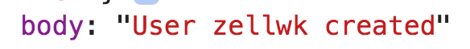
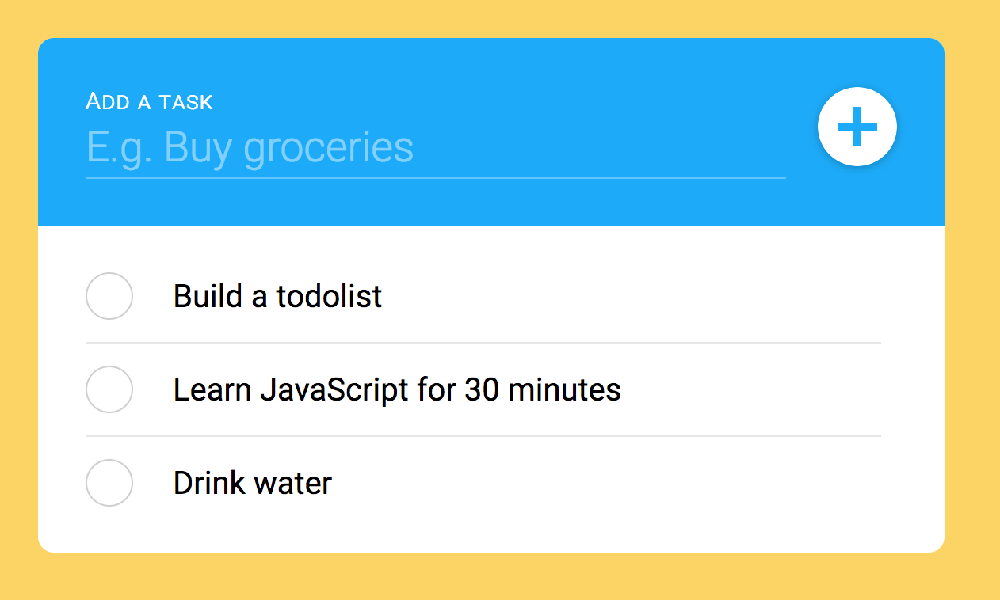

# 🛠️ Todolist: Fetching tasks from the API

We will use the Tasklist API to preserve tasks when the user reloads their browsers, and when the user switches browsers. 

First, you need to create a user to use the API. 

## Creating a user

This creates an "account" for your tasks. To create a user, you send a POST request to `/users`. 

```js
const rootendpoint = 'http://api.learnjavascript.today/tasklist'

zlFetch(`${rootendpoint}/users`, {
  method: 'post',
  body: {
    username: 'zellwk'
  }
})
```

You should get a response that the user is created.

<figure>
  
</figure>

Note: You only need to create a user once. Please delete this code once you got your user. 

## Fetching tasks

Three tasks will be created for you when you create a user. To fetch your tasks, you need to perform a GET request to `/users/:username`.

Make sure you change `:username` to the username you created.

```js
zlFetch(`http://api.learnjavascript.today/tasklist/users/:username/tasks`)
  .then(response => console.log(response))
  .catch(error => console.log(error))
```

You should see three tasks in your console. The three default tasks are:

1. Learn JavaScript for 30 minutes
2. Build a todolist
3. Drink water

We want to populate the tasklist with the created tasks. To do this, we can run `makeTask` for each task.

```js
zlFetch(`${apiURL}/users/zellwk/tasks`)
  .then(response => {
    const tasks = response.body
    tasks.forEach(task => makeTask(task.name))
  })
  .catch(error => console.log(error))
```

<figure>
  
  <figcaption aria-hidden>Tasklist populated with three items from the server</figcaption>
</figure>

o