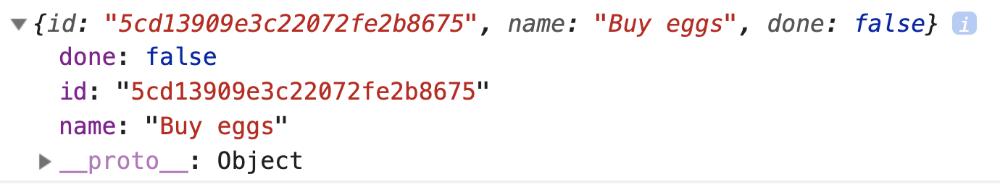
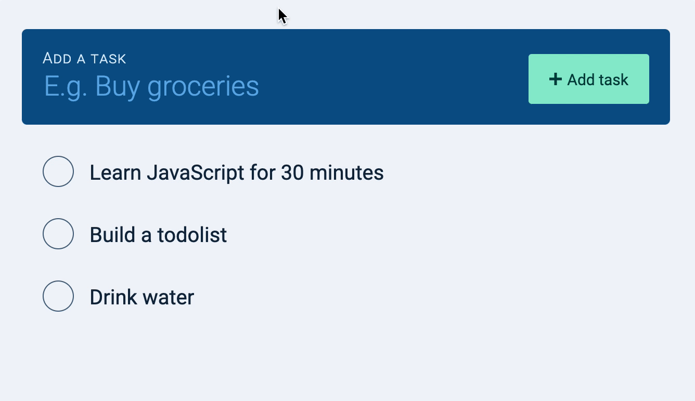
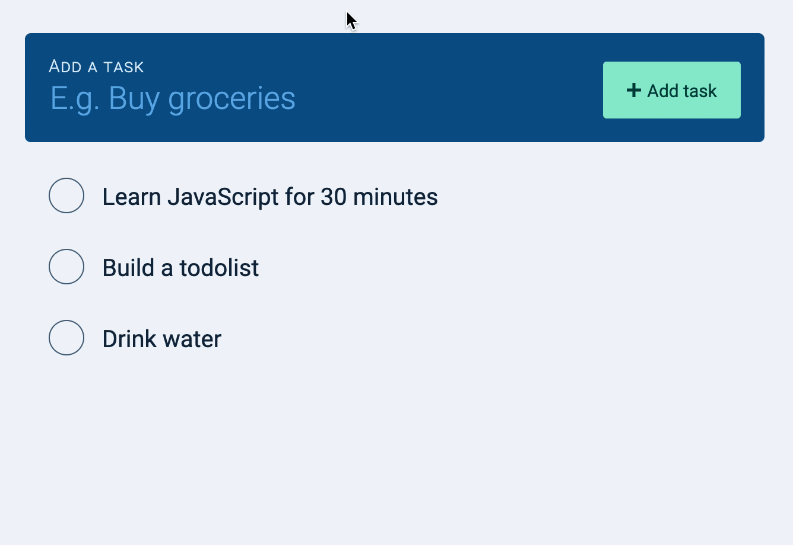
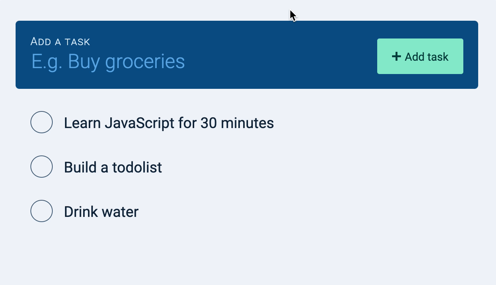
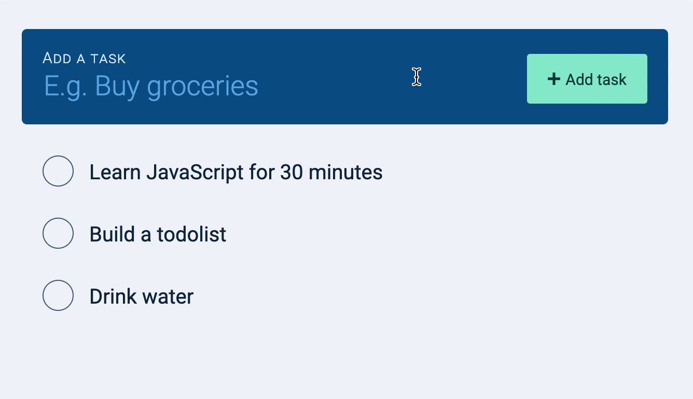

# 🛠️ Todolist: Creating tasks

When we create a task, we want to:

1. Save that task to the database
2. Update the DOM with the task

This creates an interesting set of challenges (as you'll see).

## Saving the task to the Database

To save a task to the database, we need to send a POST request to the Todolist API, to the `/tasks` endpont.

```js
zlFetch(`${rootendpoint}/tasks`, {
  method: 'post',
  username: 'your-username',
  password: 'your-password',
  body: {
    // Information about the task
  }
})
```

The API allows us to send two properties:

1. `name`: Name of the task. `name` is required.
2. `done`: Whether the task is completed

We want to save a task to the database when we create a task. This means the POST request should be written it the task-creation event listener.

```js
// Creates and saves a task
todolist.addEventListener('submit', ev => {
  // ... Send POST request here
})
```

At the very minimum, we need to know the `name` of the task to send the POST request. This means the POST request should come after `inputValue`.

```js
todolist.addEventListener('submit', ev => {
  ev.preventDefault()

  const newTaskField = todolist.querySelector('input')
  const inputValue = newTaskField.value.trim()

  zlFetch(`${rootendpoint}/tasks`, {
    method: 'post',
    username: 'your-username',
    password: 'your-password',
    body: {
      name: inputValue
    }
  })
})
```

This sends the task to the server.

Whenever you send a user-entered-value to the server, you want to sanitize that value. This prevents XSS attacks.

```js
todolist.addEventListener('submit', ev => {
  ev.preventDefault()

  const newTaskField = todolist.querySelector('input')
  const inputValue = newTaskField.value.trim()

  zlFetch(`${rootendpoint}/tasks`, {
    method: 'post',
    username: 'your-username',
    password: 'your-password',
    body: {
      name: DOMPurify.sanitize(inputValue)
    }
  })
})
```

Alternatively, you can sanitize the input immediately after retrieving it:

```js
todolist.addEventListener('submit', ev => {
  ev.preventDefault()

  const newTaskField = todolist.querySelector('input')
  const inputValue = DOMPurify.sanitize(newTaskField.value.trim())

  zlFetch(`${rootendpoint}/tasks`, {
    method: 'post',
    username: 'your-username',
    password: 'your-password',
    body: {
      name: inputValue
    }
  })
})
```

Next, we want to make sure the task is saved to the database before we add it to the DOM. This means we have to wait for a response from the API.

```js
todolist.addEventListener('submit', ev => {
  // ...
  zlFetch(`${rootendpoint}/tasks`, {
    method: 'post',
    username: 'your-username',
    password: 'your-password',
    body: {
      name: inputValue
    }
  })
    .then(response => {
      console.log(response.body)
      // Append task to DOM
    })
})
```

If the response is successful (which means the task is saved successfully), you should get an object with `id`, `name`, and `done` properties.

<figure></figure>

We can use the `id`, `name` and `done` to create a task element with `makeTaskEl`. Then, we add the task element to the DOM.

```js
todolist.addEventListener('submit', ev => {
  // ...
  zlFetch(/* ... */)
    .then(response => {
      const task = response.body
      const taskEl = makeTaskEl(task)
      const tasksEl = todolist.querySelector('.todolist__tasks')
      tasksEl.appendChild(taskEl)
    })
})
```

After the task gets appended to the DOM, we want to clear the new task field and bring the focus back to the field.

```js
todolist.addEventListener('submit', ev => {
  // ...
  zlFetch(/* ... */)
    .then(response => {
    // Append task to DOM...
    // Clear the new task field
    newTaskField.value = ''

    // Bring focus back to input field
    newTaskField.focus()
  })
})
```

We also want to prevent users from adding an empty task.

```js
todolist.addEventListener('submit', ev => {
  ev.preventDefault()

  // Get value of task
  const newTaskField = todolist.querySelector('input')
  const inputValue = newTaskField.value.trim()

  // Prevent adding of empty task
  if (!inputValue) return

  // Sends POST request...
})
```

Here's what you'll see.

<figure></figure>

This is pretty good, but did you notice a delay in adding the task? This delay introduces a huge problem.

## Problem with the delay

We didn't tell the user we're adding their task. All they experience is *nothing* for a few seconds. The DOM is unresponsive. When the DOM is unresponsive, users may think the website hung, and they may try to click a few more times.

If they click a few more times, we create duplicated tasks:

<figure></figure>

We can do two things to fix this problem:

1. Telling users we're adding a task
2. Preventing users from creating tasks as we wait for a response from the server.

## Telling users we're adding a task

First, we want to let users know we're adding a task. This is traditionally done with a spinner. But you don't need a spinner to do this.

A simple way is to change the words "Add task" to "Adding task" when we send the POST request. Then, we change "Adding task" back to "Add task" when we get a response from the API.

```js
todolist.addEventListener('submit', ev => {
  // ...

  // Give indication that we're adding a task
  const buttonTextEl = todolist
    .querySelector('button')
    .querySelector('span')
  buttonTextEl.textContent = 'Adding task...'

  // Sends POST request
  zlFetch(/* ... */)
    .then(response => {/* ... */ })
    .catch(error => console.log(error))
    .finally(_ => {
      // Change button text back to original text
      buttonTextEl.textContent = 'Add task'
    })
})
```

Note: If browser support isn't good, you can substitute `finally` with `then`.

<figure></figure>

## Preventing users from entering duplicated tasks

To prevent a user from adding a duplicated task, we disable the submit button. When we disable the submit button, users cannot trigger a `submit` event by clicking on the button. They also cannot trigger a `submit` event by hitting the enter key.

We can disable the submit button by adding a `disabled` attribute.

```js
todolist.addEventListener('submit', ev => {
  // ...

  // Disable button
  const button = todolist.querySelector('button')
  button.setAttribute('disabled', true)

  // Give indication that we're adding a task
  const buttonTextEl = button.querySelector('span')
  buttonTextEl.textContent = 'Adding task...'

  // ...
})
```

When the task is added, we enable the button again.

```js
todolist.addEventListener('submit', ev => {
  // ...

  // Sends POST request
  zlFetch(/* ... */)
    .then(response => {/* ... */ })
    .catch(error => console.log(error))
    .finally(_ => {
      // Enables button
      button.removeAttribute('disabled')
      // Change button text back to original text
      buttonTextEl.textContent = 'Add task'
    })
})
```

<figure></figure>

There's one more thing we can do. (And it's something more advanced).

## Removing the delay

We can't speed up the round-trip from the browser to the database and back (browser \-\> server \-\> database \-\> server \-\> browser). That's a limitation we have to accept. But we can give users the illusion that tasks are saved immediately.

We do this by:

1. Adding the task to the DOM immediately
2. If the server responds with an error, we remove the task from the DOM

This approach is also known as "Optimistic UI". This is an advanced concept. We'll come back and build an optimistic UI after learning to edit and delete tasks.