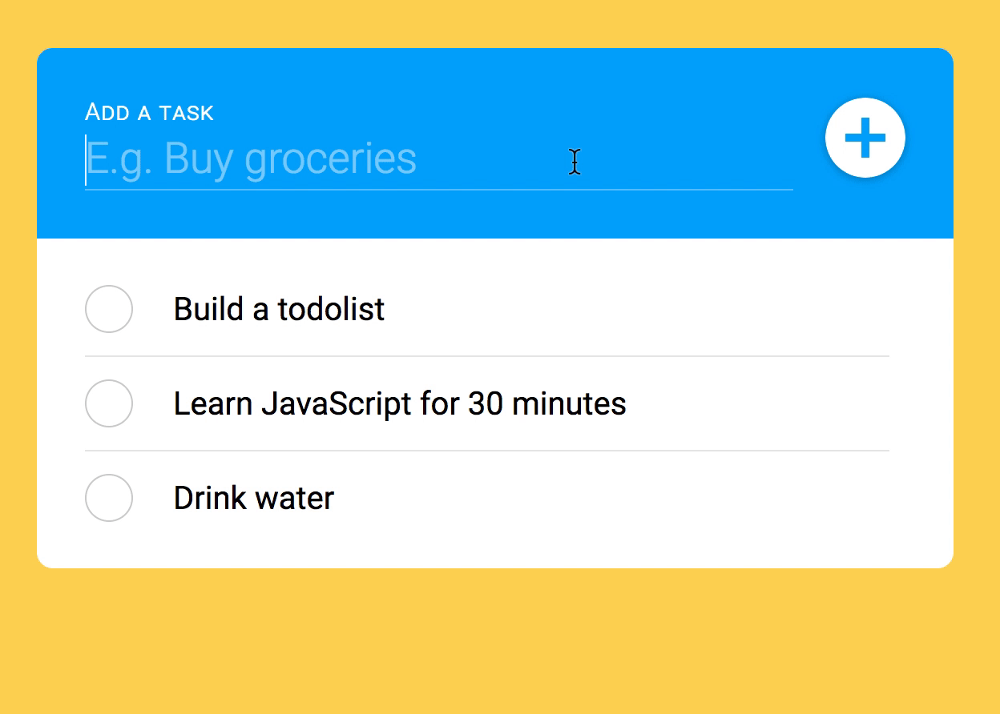
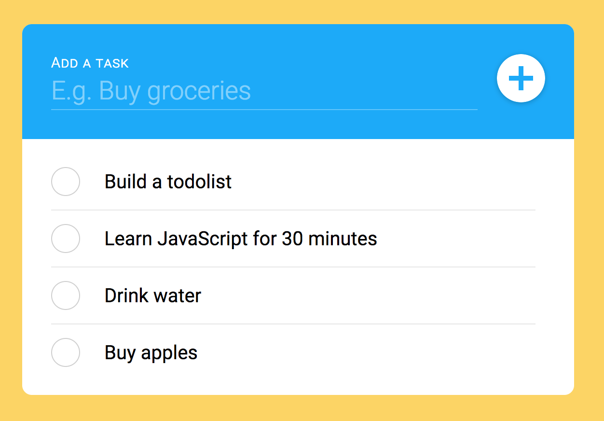
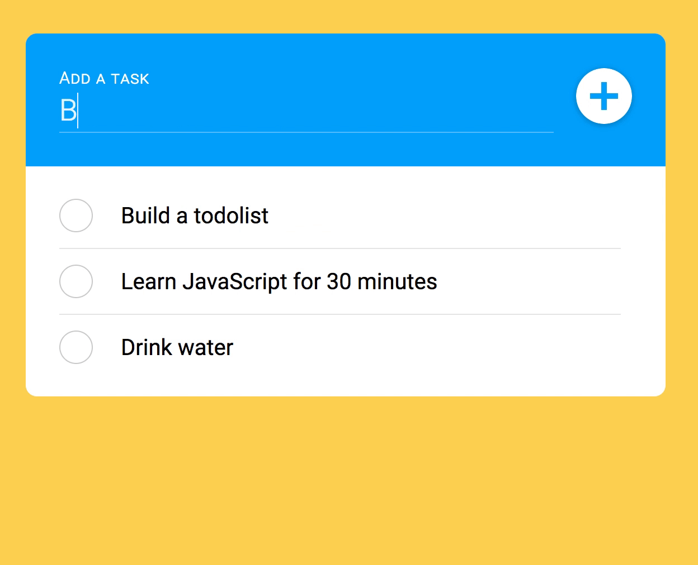

# 🛠️ Todolist: Creating and saving tasks to the API

When a user creates a task in the tasklist, we want to do two things: 

1. Save the task to the database
2. Show the task in the UI

## Saving the task to the database

To save the task to the database, we need to send a request to the API. We'll send this request when the user creates the task. 

We want to create a new task when the user types into the `newTask` field and hits the submit button (or hits enter).

To create a task, we need to send a POST request to the server through the API. This means we should start the AJAX call in the `submit` event listener.

```js
newTaskForm.addEventListener('submit', event => {
  // ...
  if (!task) return

  // Start the AJAX call here
})
```

The AJAX call must include the name of the task. We can get the name through the `task` variable.

```js
newTaskForm.addEventListener('submit', event => {
  // ...
  if (!task) return

  zlFetch(`${rootendpoint}/users/zellwk/tasks`, {
    method: 'post',
    body: { name: task }
  })
})
```

Next, we wait for the server to save the task in the database. When the server is done, they'll send us a response, and we'll show the task in the tasklist UI.

We'll do this in the `then` call. Here, we can copy what we've written into the `then` call.

```js
newTaskForm.addEventListener('submit', event => {
  // ...
  if (!task) return

  zlFetch(/* The request */)
    .then(response => {
      makeTask(task)
      input.value = ''
      input.focus()
    })
})
```

If there's an error, we'll log the error so we know what it is.

```js
newTaskForm.addEventListener('submit', event => {
  // ...
  if (!task) return

  zlFetch(/* The request */)
    .then(/* Handling the response */)
    .catch(console.log)
})
```

Here's what you see when you add a new task to the tasklist:

<figure>
  
  <figcaption aria-hidden>Task added to the UI</figcaption>
</figure>

If you refresh the page, you'll see the new task too.

<figure>
  
  <figcaption>Task persists across page refreshes</figcaption>
</figure>

## A note about the UX

Look at what happens when the user clicks on the submit button.

<figure>
  
  <figcaption aria-hidden>There's a delay before the fourth task gets added to the UI</figcaption>
</figure>

You'll notice there's a slight delay before the task gets added. There's a slight delay because we have to wait for the response from the server.

From a UX point of view, this wait is inexcusable. We don't want to wait when we add a task. We want to add the task, then move on and add the next task immediately.

Ideally, we should do the following:

1. Add the item into the DOM
2. Send a POST request to the server
3. Wait for the response from the server
4. Remove the item (or show an error) if the response fails

If we do this, the user will be able to enter as many tasks quickly. There's even an industry buzzword for this kind of UX. It's called Optimistic UI.

Unfortunately, implementing Optimistic UI in code is tough. There are lots of Ajax challenges so we won't go into them in this course.

For now, what we're most concerned about is ensuring you understand JavaScript. We want to focus on the fundamental aspects of Ajax here. We can talk about Optimistic UI in a separate course (if I ever get around to making it).

## Adding a spinner

Users have to wait when they add a task. The problem is: They don't know they have to wait. They expect it to be instant.

If they don't know they have to wait, they may believe their computer is lagging, which causes frustration. We can remove the frustration by telling them they'll have to wait.

The easiest way is to add a spinner. You'll learn how to add a spinner in the next lesson.

## Preventing duplicate entries

If a user clicks the submit button twice, they'll get a duplicated entry. This is a problem too. The best way to solve the duplicate issue is to debounce the event listener.

<figure>
  
  <figcaption>Submitting the form twice in rapid succession results in duplicated entries</figcaption>
</figure>

We'll talk about debouncing in a later lesson too.

## Exercise

Use the Todolist API to create your task list. Try the following:

1. Fetch tasks with the API
2. Create tasks with the API