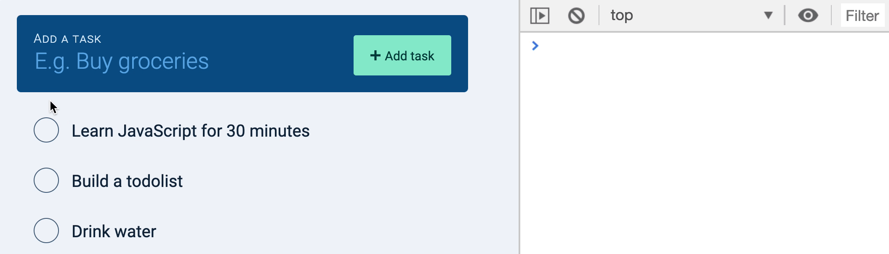

# 🛠️ Todolist: Editing tasks

We want to allow users to edit two things: 

1. Check/uncheck the task 
2. Change the task name

Once again, anything with Ajax creates a set of interesting challenges. (You'll see). 

## Checking/unchecking a task

When a user clicks on a checkbox, we want to check the checkbox. This completes the task. We also want to save the completed task to the server. 

When the checkbox is checked (or unchecked), it fires a `change` event. This means we can listen for the `change` event. And since there are many checkboxes, the best way is to use an event delegation pattern. as

```js
tasksDiv.addEventListener('change', ev => {
  if (!ev.target.matches('input[type="checkbox"]')) return
  const checkbox = ev.target
  console.log(checkbox)
})
```

<figure></figure>

The Todolist API lets us edit a task by sending a PUT request to `/tasks/:id`. This means we need to know the task `id` to send the request. 

We can get the `id` from the `id` attribute. (You can use `getAttribute` or simply the `id` property). 

```js
tasksDiv.addEventListener('change', ev => {
  // ...
  const checkbox = ev.target
  const id = checkbox.id
  console.log(id)
})
```

<figure></figure>

We also need to know whether the task is done. If the task is done, the checkbox is checked. If the task is not complete, the checkbox is unchecked. 

```js
tasksDiv.addEventListener('change', ev => {
  // ...
  const checkbox = ev.target
  const id = checkbox.id
  const done = checkbox.checked
  console.log(checked)
})
```

<figure></figure>

We fulfilled the requirements to send the POST request. Let's send it now. 

```js
tasksDiv.addEventListener('change', ev => {
  // ...
  const checkbox = ev.target
  const id = checkbox.id
  const done = checkbox.checked

  zlFetch(`${rootendpoint}/tasks/${id}`, {
    method: 'put', 
    username: 'your-username',
    password: 'your-password', 
    body: {
      done
  })
    .then(response => {
      console.log(body.response)
    })
    .catch(console.log)
    })
})
```

If the PUT request is successful, we should get a response from the server that contains the updated task. 

(In this case, the checkbox is checked). 

<figure></figure>

## Fetching done tasks

If you refresh the Todolist, you'll notice the task you completed remains unchecked. 

<figure></figure>

This happens because we did not do anything with the `done` property when we fetched tasks. 

To ensure the completed task remains checked, we can add the `done` property to each `task` we create. If `done` is true, we set the checkbox to `checked`. 

```js
const makeTaskEl = ({ id, name, done }) => {
  taskEl.innerHTML = DOMPurify.sanitize(`
    <input
      type="checkbox"
      id="${id}"
      ${done ? 'checked' : ''}
    />
    ...
  `)
```

The checkbox should remain checked now. 

<figure></figure>

And if you uncheck the checkbox and refresh the page, the task should be unchecked. 

<figure></figure>

## Editing the task name

The Todolist API lets us change the name of the task as well. If we want to allow users to change the name of the task, we need to let them edit the task in the UI first. 

### Allowing users to edit the task name

We can do this by changing the `.task__name` from a `<span>` element to an `<input>` element. (You have to style the `<span>` and `<input>` elements accordingly, but I did it for you already). 

```js
// Change this 
const makeTaskEl = ({ id, name, done }) => {
  task.innerHTML = DOMPurify.sanitize(`
    ... 
    <span class="task__name">${name}</span>
    ... 
  `)
})

// To this
const makeTaskEl = ({ id, name, done }) => {
  // ...
  task.innerHTML = DOMPurify.sanitize(`
    ... 
    <input class="task__name" value="${name}" />
    ... 
  `)
})
```

With this change, users should be able to edit a task. 

<figure></figure>

### Choosing an event to listen to

We have two options here. We can either update the database when

1. the user types into the input field
2. the user removes focus from the input field

The option you choose determines the event you'll listen for: 

1. Option 1: listen for `input` event 
2. Option 2: listen for `change` event

Both options have their pros and cons. 

If you choose option 1, you might send too many requests to the server. (Because you'll trigger a PUT request whenever the user changes a text). 

If you choose option 2, there's a chance you don't send anything to the server. (If the user types into the input field, but closes the tab immediately, the input field doesn't lose focus, and the request doesn't get sent). 

Which should you choose? 

Here, we'll choose option 1 because sending too many requests beats not updating the database according to our users' actions. (Also, because there's a way to reduce the number of requests we send). 

### Saving the task name to the database

As before, because there are many tasks in the DOM, the best way is to use an event delegation pattern. 

```js
todolist.addEventListener('input', ev => {
  if (!ev.target.matches('.task__name')) return
  // Do something
})
```

First, we need to find the input value: 

```js
todolist.addEventListener('input', ev => {
  if (!ev.target.matches('.task__name')) return
  const input = ev.target
  const inputValue = const inputValue = DOMPurify.sanitize(input.value.trim())
  console.log(inputValue)
})
```

<figure></figure>

To update the Todolist API, we need to know the `id` of the task. We can find the `id` from the checkbox. And we can find the checkbox by traversing upwards to the task. 

```js
todolist.addEventListener('input', ev => {
  // ...
  const taskEl = input.parentElement 
  const checkbox = input.querySelector('input[type="checkbox"]')
  const id = checkbox.id
  console.log(id)
})
```

<figure></figure>

Once we know the checkbox's `id`, we can update the task. 

```js
todolist.addEventListener('input', ev => {
  if (!ev.target.matches('.task__name')) return
  const input = ev.target
  const inputValue = DOMPurify.sanitize(input.value().trim())
  
  const taskEl = input.parentElement 
  const checkbox = input.querySelector('input[type="checkbox"]')
  const id = checkbox.id
  
  zlFetch(`${rootendpoint}/tasks/${id}`, {
    method: 'put',
    username: 'your-username',
    password: 'your-password,
    body: {
      name: inputValue
    }
  })
    .then(response => {
      console.log(response.body)
    })
    .catch(console.log)
  })
})
```

The task should remain updated if you refresh the DOM. 

<figure></figure>

## Update done and name at the same time 

Did you know the `input` event fires whenever the checkbox `checked` state changes?

```js
todolist.addEventListener('input', ev => {
  console.log(ev.target)
  
  // ...
})
```

<figure></figure>

This means we can update `done` and `name` at the same time—with the `input` event. We don't need two event listeners. (Less code, easier to read!). 

We'll work on this. 

You can comment out (or delete) the `change` event listener now. 

### Updating the `input` event listener 

First, we need to know we're listening for two elements: 

1. A change in the checkbox's checked state
2. A change in the text value 

This means `ev.target` can either be the checkbox or the text field. 

We need to find BOTH the checkbox and the text field with each event. The best way is to traverse up to the task element. 

```js
tasksEl.addEventListener('input', ev => {
  const taskEl = ev.target.parentElement
  const checkbox = taskEl.querySelector('input[type="checkbox"]')
  const taskInput = taskEl.querySelector('.task__name')

  console.log(checkbox)
  console.log(taskInput)
})
```

<figure></figure>

To update the task, we need three things—the checked state, the id, and the task name. 

```js
tasksEl.addEventListener('input', ev => {
  // ...

  const id = checkbox.id 
  const done = checkbox.checked
  const name = DOMPurify.sanitize(taskInput.value.trim())
})
```

Once we know these three values, we can send a PUT request to update the task. 

```js
tasksEl.addEventListener('input', ev => {
  // ...
  zlFetch(`${rootendpoint}/tasks/${id}`, {
    method: 'put',
    username: 'your-username',
    password: 'your-password',
    body: {
      name,
      done
    }
  })
    .then(response => {
      console.log(response.body)
    })
    .catch(console.log)
})
```

<figure></figure>

## Debouncing

When we use an `input` event, we run the risk of sending too many requests to the server. Watch what happens when a user edits their task... 

<figure></figure>

That's A LOT OF REQUESTS. 

You're going to hit the rate-limit of an API if you send so many requests. (Because each request puts pressure on the server to respond). 

And most of these requests are unnecessary... The later request will overwrite the former one anyway. This means we want to reduce the rate where we send requests. 

We can do this with debounce. 

Let's take a quick theory detour and learn about debounce. We'll come back to the Todolist in a bit. 

