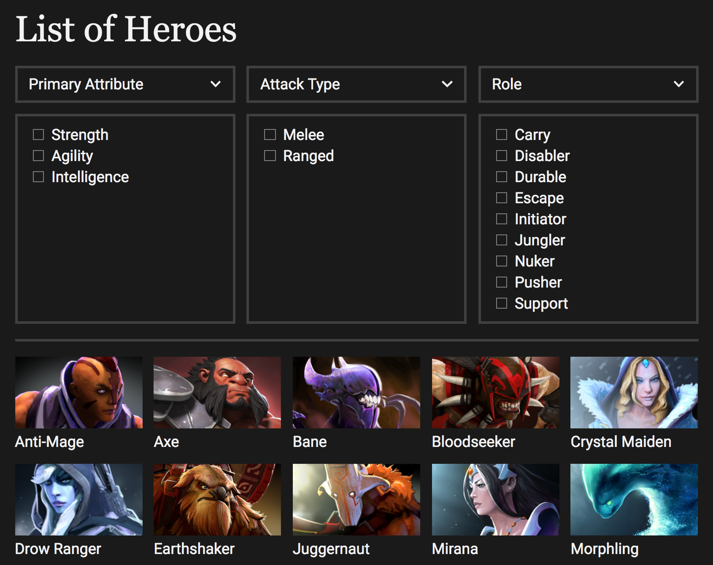
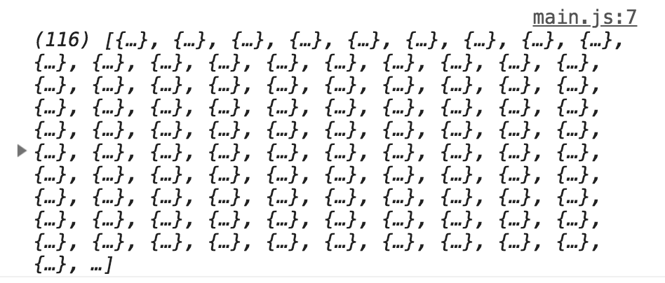
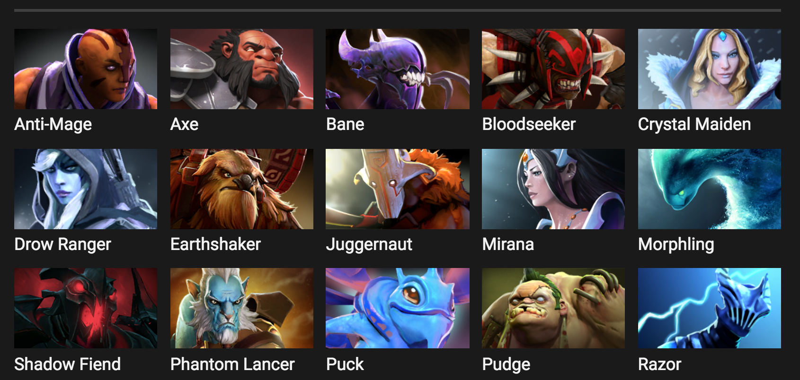

# 🛠️ Dota Heroes: Building the app

Dota is stands for **D**efense **o**f **t**he **a**ncients. It's a popular game where up to ten people (5 on each team) battle out against each other. The goal of the game is to take down the enemy's fortress.

When you play the game, you select one character, a hero, from a list of heroes. At the time of writing, Dota has 116 heroes in total.

This app we're building is a Dota heroes explorer. It shows a list of available Dota heroes. It also lets users filter the heroes according to three categories.

Here's what the app looks like:

<figure>
  
</figure>

## The filters

You may notice the filters look weird. This is because the filters are not at their final form. For the final form, you'll be able to click on each filter and a popover box will show up. This popover box contains the fields you see directly under the filter.

We don't want to worry about creating the popover at this point. You'll learn how to integrate the popover we built in a previous lesson into this app later.

For now, we want to focus on making sure the app and the filters work.

Now, the filters will need some explaining if you've never played Dota before.

There are three categories of filters.

The first category is called primary attribute. In Dota, each hero has a primary attribute that determines the hero's attack damage. There are three primary attributes:

1. Strength
2. Agility
3. Intelligence

The second category is called attack type. Some heroes can attack units only when they're standing beside them. These heroes are said to be melee heroes.

Other heroes can attack while standing at a distance. These heroes have a ranged attack.

1. Melee: Can only attack when standing next to an enemy
2. Ranged: Can attack from a range

The third category is called roles. Every Dota hero has unique abilities that make them suitable for different roles. These roles are well-known in the Dota community.

There are 9 roles at the time of writing. We're not sure whether there are will be new roles in the future. (It's unlikely, but not impossible).

Note: You don't need to know what each role means. Heroes are already categorized into each role. You only need to know they exist and how to filter heroes with them.

These are the 9 roles:

1. Carry
2. Disabler
3. Durable
4. Escape
5. Initiator
6. Jungler
7. Nuker
8. Pusher
9. Support

Note: If you're having problems envisioning Dota, treat this Dota Heroes app like an E-commerce store. Each hero is an item in the store. We're going to fetch a list of items and allow users to filter the items based on different categories.

## Getting the list of Heroes

There is an API called Open Dota API. We'll use this API to get information about Dota heroes.

You can find the API documentation [here][1]

To get a list of heroes, you can send a `GET` request to the `/heroStats` endpoint.

```js
const dotaApi = 'https://api.opendota.com/api'

zlFetch(`${dotaApi}/heroStats`)
  .then(data => console.log(data.body))
  .catch(error => console.log(error))
```

The server should respond with an array of objects. Each object contains information about one hero. Since there are 116 heroes in total, you should see an array that contains 116 items.

<figure>
  
  <figcaption aria-hidden>Console.log shows 116 items</figcaption>
</figure>

To create a list of heroes, we need to get their name and image into the DOM. The data you need is already in the response.

1. `localized_name`: Name of each hero
2. `image`: Link to the image of the hero. You can prepend `https://api.opendota.com` to this value to get the image.

By the way, finding the image link required some trial-and-error guessing. Sometimes, you have to be able to make smart guesses like this one.

Moving on, you should be able to create a list of the hero once you know how to get their name and image. Here's what you want to produce:

<figure>
  
  <figcaption aria-hidden>A list of heroes</figcaption>
</figure>

The HTML for each hero is:

```html
<li class="hero">
  
  <span class="hero__name">{{Hero's name}}</span>
</li>
```

The heroes container is a `<ul>` element. This `<ul>` element has already been created for you in the starter HTML.

```html
<ul class="heroes"></ul>
```

Try building this on your own. Refer to the next section only if you have problems.

## Creating the list of heroes

We can only create the list of heroes after we fetched data from Open Dota API. This means our code must be inside the `then` call.

```js
zlFetch(`${dotaApi}/heroStats`)
  .then(data => {/* Code goes here*/})
  .catch(error => console.log(error))
```

We'll have to write a lot of code in the `then`. It makes sense to put these code in a function. We can call this function `init`.

```js
const init = data => {
  /* Code goes here */
}
```

We'll use init like this:

```js
zlFetch(`${dotaApi}/heroStats`)
  .then(data => init(data))
  .catch(error => console.log(error))
```

Because `init` takes in only one argument, we can pass the function as a callback to the `then` call directly.

```js
zlFetch(`${dotaApi}/heroStats`)
  .then(init)
  .catch(console.log)
```

Next, we want to create a list of heroes in the `<ul class="heroes">` element. The easiest way is to set the `innerHTML` of the `.heroes` element.

(Note: Don't forget to sanitize the HTML With DOMPurify!)

```js
const init = data => {
  const heroesDiv = document.querySelector('.heroes')

  const innerHTML = 'Some HTML here'
  heroesDiv.innerHTML = DOMPurify.sanitize(innerHTML)
}
```

`innerHTML` should be a list of `<li>` elements. Each `<li>` element contains information about each one. It looks like this:

```html
<li class="hero">
  
  <span class="hero__name">{{Hero's name}}</span>
</li>
<li class="hero">
  
  <span class="hero__name">{{Hero's name}}</span>
</li>
<!-- ... -->
```

To create this innerHTML, we need to get each hero's name and image. We can do this by looping through `data.body`.

```js
const init = data => {
  const heroesDiv = document.querySelector('.heroes')

  const innerHTML = data.body.map(hero => {
	return `<div class="hero">
	  
	  <div class="hero__name">${hero['localized_name']}</div>
	</div>`
  }).join('')

  heroesDiv.innerHTML = DOMPurify.sanitize(innerHTML)
}
```

This is what you'll get:

<figure>
  
  <figcaption aria-hidden>A list of heroes</figcaption>
</figure>

Let's stop here for now. In the next lesson, you'll learn how to create the filters. You'll also learn how to modify the heroes list based on filters that are checked.

## Exercise

Build the Dota Hero Explorer without looking at the lesson.


[1]:	https://docs.opendota.com "Open Dota API"