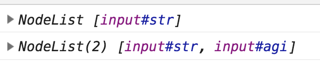
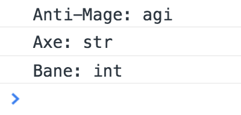
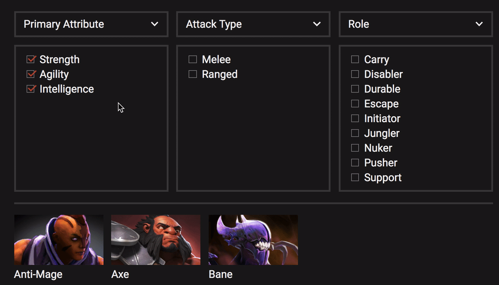
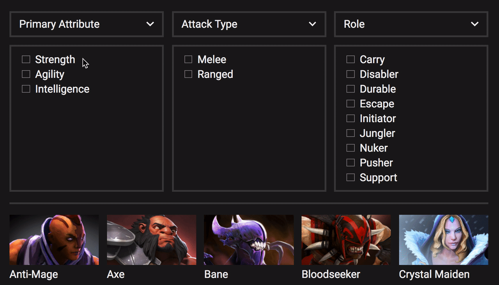
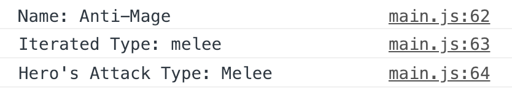
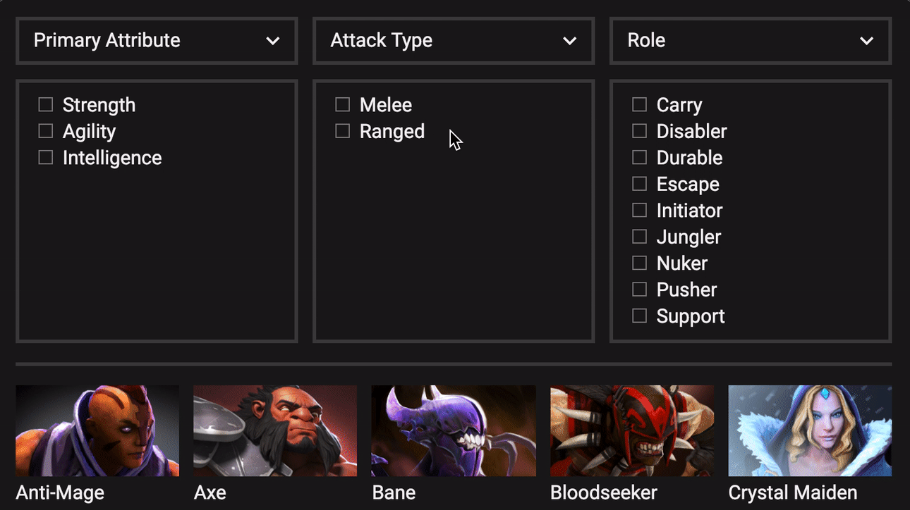
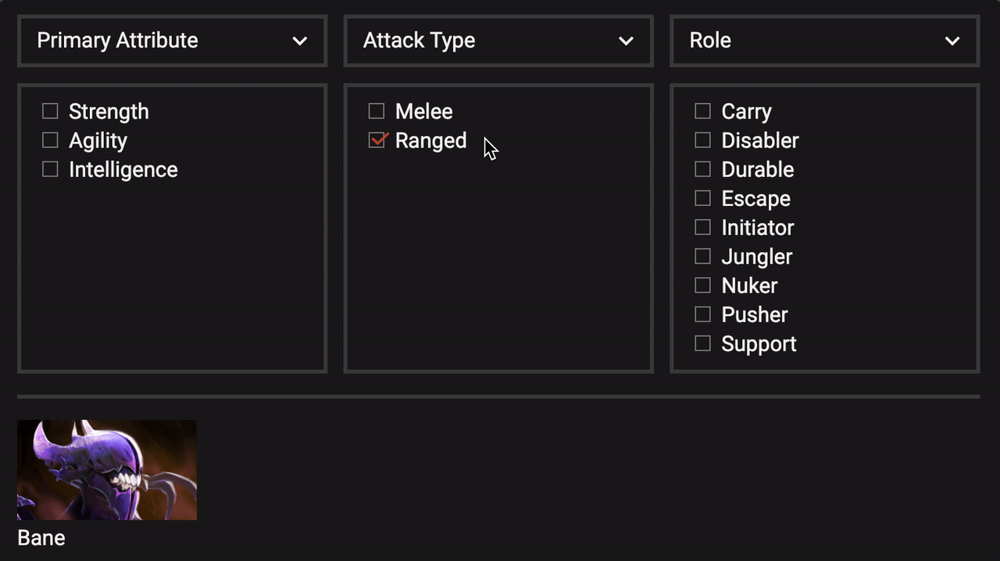
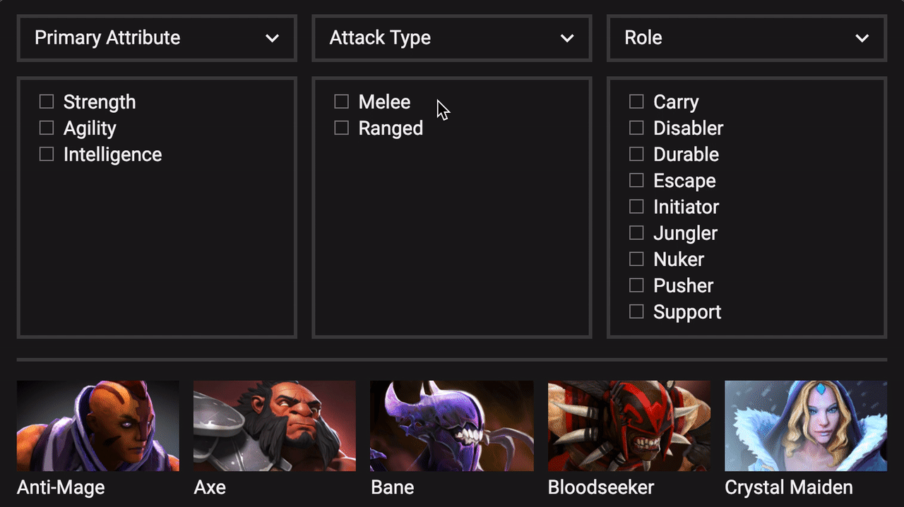

# 🛠️ Dota Heroes: Creating filters

In Dota Heroes, we want to let users filter the list of heroes according to three categories:

1. Primary Attribute
2. Attack Type
3. Role

You already have data how each hero falls into the three categories. (Hint: It's in the data you fetched). You can find them in these properties:

1. Primary Attribute: `primary_attr`
2. Attack Type: `attack_type`
3. Role: `role`

You'll learn to filter heroes according to these three categories in this lesson.

## Filtering according to primary attribute

First, we need to know when filters get checked. Since each filter is a checkbox, we can use the `change` event that fires when a checkbox gets checked. We can also use the delegation pattern here to listen to all checkboxes at once.

```js
const init = data => {
  // ...

  const filters = document.querySelector('.filters')

  filters.addEventListener('change', event => {
  	// Change list of heroes heroes list
  })
}
```

There are three primary attributes, `Strength`, `Agility`, and `Intelligence`. We need to know if they're checked.

To know if `Strength` was checked, we can check for its checkbox's `checked` property.

```js
filters.addEventListener('change', event => {
  const strength = document.querySelector('#str')
  const isStrengthChecked = strength.checked
})
```

We can do the same for Agility and Intelligence.

```js
filters.addEventListener('change', event => {
  const strength = document.querySelector('#str')
  const isStrengthChecked = strength.checked
  const agility = document.querySelector('#agi')
  const isAgilityChecked = agility.checked
  const intelligence = document.querySelector('#int')
  const isIntelligenceChecked = intelligence.checked
})
```

But this method creates needless lines of code.

A better way is to look for all checked checkboxes with `querySelectorAll`. We can do this by searching for the `:checked` pseudo class.

```js
filters.addEventListener('change', event => {
  const primaryAttributeDiv = document.querySelector('#primary-attribute')
  const selectedAttributeEls = primaryAttributeDiv.querySelectorAll('input:checked')
})
```

`selectedAttributeEls` is a NodeList of input elements that are checked.

<figure>
  
  <figcaption>In the first `console.log`, only strength was checked. We can tell what checkboxes are checked this way</figcaption>
</figure>

Next, we want to filter the list of heroes based on the selected primary attributes. If the primary attribute was selected, we want to show the hero on screen. Otherwise, we remove the hero from the list.

We can do this with `filter`.

```js
filters.addEventListener('change', event => {
  // ...

  const filteredHeroes = data.body.filter(heroes => {
    // Filter heroes here
  })
})
```

Note: We're filtering through 116 heroes at once if we run `filter` through `data.body`. It can be overwhelming to work through 116 heroes at once. This is because each `console.log` statement you write in the loop produces 116 logs in the console.

To make it easier, we'll filter with three heroes first. Once we get three heroes right, we can get 116 heroes right.

Here's a list of the first three heroes and their relevant properties:

```js
const firstThree = [{
  localized_name: "Anti-Mage",
  primary_attr: "agi",
  img: "/apps/dota2/images/heroes/antimage_full.png?"
}, {
  localized_name: "Axe",
  primary_attr: "str",
  img: "/apps/dota2/images/heroes/axe_full.png?"
}, {
  localized_name: "Bane",
  primary_attr: "int",
  img: "/apps/dota2/images/heroes/bane_full.png"
}]
```

The code to filter through the three-hero-array is:

```js
filters.addEventListener('change', event => {
  // ...

  const filteredHeroes = firstThree.filter(hero => {
	// Filter heroes here
  })
})
```

From the properties above, we know that:

1. Anti-Mage's `primary_attr` is `agi` (Agility).
2. Axe's `primary_attr` is `str` (Strength).
3. Bane's `primary_attr` is `int` (Intelligence).

We can get the hero's primary attribute with `primary_attr`.

```js
filters.addEventListener('change', event => {
  // ...

  const filteredHeroes = firstThree.filter(hero => {
   const heroAttribute = hero['primary_attr']
   const heroName = hero['localized_name']
   console.log(`${heroName}: ${heroAttribute}`)
  })
})
```

<figure>
  
  <figcaption>Each heroes' primary attributes logged into the console</figcaption>
</figure>

For each hero, we want to check whether the primary attribute was checked. If their primary attribute was checked, we want to include the hero in the list.

We can loop through `selectedAttributeEls` to check if the hero's attribute was selected. If the hero's attribute is selected, we return `true` to add the hero to `filteredHeroes`.

```js
filters.addEventListener('change', event => {
  // ...
  const selectedAttributeEls = Array.from(primaryAttributeDiv.querySelectorAll('input:checked'))

  const filteredHeroes = firstThree.filter(hero => {
    const heroAttribute = hero['primary_attr']

    for (const el of selectedAttributeEls) {
      // Check whether hero primary attribute
      // is included in the selected attribute.
      // Return true to add to filteredHeroes
    }
  })
```

How do we get the attribute from `el`?

If you look at the HTML, you realize that the `id` of each checkbox corresponds to the primary attribute. You can get the primary attribute from this `id`.

```html
<!-- Strength attribute -->
<input type="checkbox" id="str">

<!-- Agility attribute -->
<input type="checkbox" id="agi">
```

```js
filters.addEventListener('change', event => {
  // ...
  const filteredHeroes = firstThree.filter(hero => {
  const heroAttribute = hero['primary_attr']

  for (const el of selectedAttributeEls) {
    const attr = el.id
  }
})
```

If the hero's primary attribute is included in `selectedATtributeEls`, we return `true` to add the hero to the `filteredHeroes`. Otherwise, we return false.

```js
filters.addEventListener('change', event => {
// ...
const filteredHeroes = firstThree.filter(hero => {
  const heroAttribute = hero['primary_attr']

  for (const el of selectedAttributeEls) {
    const attr = el.id
    if (attr === heroAttribute) {
      return true
    }
  }
})
```

Cleaning up the code a little: We don't need an `if` statement here. We can return the condition we checked for.

```js
filters.addEventListener('change', event => {
// ...
const filteredHeroes = firstThree.filter(hero => {
  const heroAttribute = hero['primary_attr']

  for (const el of selectedAttributeEls) {
    return el.id === heroAttribute
  }
})
```

Once you have the new list of heroes, you need to update the DOM. You can do this by changing `.heroes`'s innerHTML.

```js
filters.addEventListener('change', event => {
  // ...

  const innerHTML = filteredHeroes.map(hero => {
  	return `<div class="hero">
   
   <div class="hero__name">${hero['localized_name']}</div>
   </div>`
  }).join('')

  heroesDiv.innerHTML = DOMPurify.sanitize(innerHTML)
})
```

If you've done the above steps right, you should see only see Axe when Strength is checked.

If you check both Strength and Agility, you should see Axe and Anti-Mage.

If you check all Strength, Agility, and Intelligence, you should see all three heroes.

<figure>
  
  <figcaption>Axe is a strength hero</figcaption>
</figure>

Now, watch what happens when you uncheck every filter. You'll notice that there are no more heroes on the list.

<figure>
  
  <figcaption>Zero heroes in the heroes list</figcaption>
</figure>

This happens because no primary attributes are selected. When no primary attributes are selected, there is no way any hero will be selected through the `filter`.

Now, users would not expect to see a list of zero heroes if they check anything. They would think they didn't filter by the category at all!

We have to adapt to this UX. Luckily, this is easy.

If no primary attribute filters are checked, `selectedAttributeEls` will be an empty NodeList. We can use the `length` of `selectedAttributeEls` to check if we should filter the list of heroes. If `selectedAttributeEls` is empty, we'll return `true` for every hero.

```js
filters.addEventListener('change', event => {
  // ...
  const filteredHeroes = firstThree.filter(hero => {
    if (!selectedAttributeEls.length) return true

    const heroAttribute = hero['primary_attr']
    for (const el of selectedAttributeEls) {
      return el.id === heroAttribute
    }
  })
})
```

<figure>
  
  <figcaption>All three heroes show up when zero attributes are checked</figcaption>
</figure>

We got the three-hero list right now. You can switch to the 116-hero list now and everything will work as before:

```js
filters.addEventListener('change', event => {
  // ...

  const filteredHeroes = data.body.filter(hero => {/* Filter by Primary Attribute */})
})
```

<figure>
  
  <figcaption>Filtering 116 heroes via primary attributes</figcaption>
</figure>

## Filtering according to Attack Type

There are two possible attack types: Melee and Ranged.

Once again, we can get the selected attack types through `querySelectorAll`.

```js
filters.addEventListener('change', event => {
  // ...
  const attackTypeDiv = document.querySelector('#attack-type')
  const selectedTypeEls = attackTypeDiv.querySelectorAll('input:checked')
})
```

Like before, it will be hard to filter 116 heroes at once. We're going to filter three heroes instead. Here are the three heroes we used (updated with `attack_type`).

```js
const firstThree = [{
  localized_name: "Anti-Mage",
  img: "/apps/dota2/images/heroes/antimage_full.png?",
  primary_attr: "agi",
  attack_type: "Melee"
}, {
  localized_name: "Axe",
  img: "/apps/dota2/images/heroes/axe_full.png?",
  primary_attr: "str",
  attack_type: "Melee"
}, {
  localized_name: "Bane",
  img: "/apps/dota2/images/heroes/bane_full.png",
  primary_attr: "int",
  attack_type: "Ranged"
}]
```

For now, we're also going to focus on filtering via Attack Type only. You'll learn how to filter by both Primary Attribute and Attack Type later.

To Filter by attack type, we need to know the hero's `attack_type`.

```js
filters.addEventListener('change', event => {
  // ...
  const filteredHeroes = firstThree.filter(hero => {
    const heroType = hero['attack_type']
  })
})
```

For each hero, we want to check whether their attack type was checked. If their attack type was checked, we want to include the hero in the list.

We can loop through `selectedTypeEls` to check if the hero's attack type was selected. If the hero's attack type was selected, we return `true` to add the hero to `filteredHeroes`.

```js
filters.addEventListener('change', event => {
  // ...
  const filteredHeroes = firstThree.filter(hero => {
    const heroType = hero['attack_type']

    for (const el of selectedTypeEls) {
      // Check whether hero's attack type
      // is included in selectedTypeEls
    }
  })
})
```

Each attack type checkbox has the following HTML:

```html
<!-- Melee Attack Type -->
<input type="checkbox" id="melee">

<!-- Ranged Attack Type -->
<input type="checkbox" id="ranged">
```

We can get the element's attack type through the checkbox's `id` property.

```js
filters.addEventListener('change', event => {
  // ...
  const filteredHeroes = firstThree.filter(hero => {
    const heroType = hero['attack_type']

    for (const el of selectedTypeEls) {
      const type = el.id
    }
  })
})
```

Try logging `type` and `heroType`into the console. You'll notice that `type` is lowercased and `heroType` is title-cased. This means `type` will never be equal to `heroType`.

<figure>
  
  <figcaption>`type` and `heroType` aren't in the same case</figcaption>
</figure>

To properly compare `type` and `heroType` we need to convert these two values into the same case. One easy way is to convert `heroType` to lowercase.

```js
filters.addEventListener('change', event => {
  // ...
  const filteredHeroes = firstThree.filter(hero => {
    const heroType = hero['attack_type'].toLowerCase()
    // ...
  })
})
```

Then we can compare `type` and `heroType`. The process is the same as with Primary Attribute.

```js
filters.addEventListener('change', event => {
  // ...
  const filteredHeroes = firstThree.filter(hero => {
    const heroType = hero['attack_type'].toLowerCase()

    for (const el of selectedTypeEls) {
      return el.id === heroType
    }
  })
})
```

Now, if you check `Ranged`, only Bane should be selected.

<figure>
  
  <figcaption>Bane is a ranged hero. Others are melee heroes</figcaption>
</figure>

We must be mindful that users don't expect to filter via a category if they leave the category unchecked. If both `Melee` and `Ranged` are unchecked, we'll have to show all three heroes:

```js
filters.addEventListener('change', event => {
  // ...
  const filteredHeroes = firstThree.filter(hero => {
    if (!selectedTypeEls.length) return true
    const heroType = hero['attack_type'].toLowerCase()

    for (const el of selectedTypeEls) {
      return el.id === heroType
    }
  })
})
```

<figure>
    
    <figcaption>Unchecking both melee and ranged should show all heroes</figcaption>
</figure>

You know how to filter three heroes according to Attack Type now. You can `firstThree` with `data.body` to filter all Dota heroes anytime.

```js
filters.addEventListener('change', event => {
  // ...
  const filteredHeroes = data.body.filter({/* Filter by Attack Type */})
})
```

## Filtering according to both Primary Attribute and Attack Type

Here's what happens if the user checks filters from both primary attribute and attack type (with our three-hero list):

1. The user checks `Melee`.
2. We show `Anti-Mage` and `Axe` since they're both have the `Melee` attack type
3. Then user checks `Str`
4. We only show `Axe` because `Axe`'s primary attribute is `Strength`.

<figure>
    
    <figcaption>Filtering via two categories</figcaption>
</figure>

To do this, we chain two filter functions together to allow users to filter both categories at once.

```js
filters.addEventListener('change', event => {
  // ...
  const filteredHeroes = firstThree.filter(/* Filter by Primary Attributes */)
  .filter(/* Filter by Attack Type */)
})
```

## Filtering according to Roles

It's more difficult to filter by roles because heroes can only have one primary attribute and one attack type, but they can have many roles.

Our three heroes have the following roles:

- Anti-Mage: `Carry`, `Escape`, `Nuker`
- Axe: `Initiator`, `Durable`, `Disabler`, `Jungler`
- Bane: `Support`, `Disabler`, `Nuker`, `Durable`

When a user filter heroes according to roles, they want to find heroes that fulfill every role they select. We should only show Bane out of the three heroes if they check `Disabler` and `Nuker`.

Here are the three heroes we used (updated with `roles`).

```js
const firstThree = [{
  localized_name: "Anti-Mage",
  img: "/apps/dota2/images/heroes/antimage_full.png?",
  primary_attr: "agi",
  attack_type: "Melee",
  roles: ["Carry", "Escape", "Nuker"]
}, {
  localized_name: "Axe",
  img: "/apps/dota2/images/heroes/axe_full.png?",
  primary_attr: "str",
  attack_type: "Melee",
  roles: ["Initiator", "Durable", "Disabler", "Jungler"]
}, {
  localized_name: "Bane",
  img: "/apps/dota2/images/heroes/bane_full.png",
  primary_attr: "int",
  attack_type: "Ranged",
  roles: ["Support", "Disabler", "Nuker", "Durable"]
}]
```

First, we need to know what roles are checked. We can get the checked roles with `querySelectorAll`.

```js
filters.addEventListener('change', event => {
  // ...
  const roleDiv = document.querySelector('#roles')
  const selectedRoleEls = roleDiv.querySelectorAll('input:checked')
})
```

Then, we need to get each hero's roles.

```js
filters.addEventListener('change', event => {
  // ...
  const filteredHeroes = firstThree.filter(hero => {
    const heroRoles = hero.roles
  })
})
```

If the hero fulfills all checked roles, we want to add them to the filtered list. We can test if the hero fulfills all checked roles by looping through `selectedRoleEls`.

```js
filters.addEventListener('change', event => {
  // ...
  const filteredHeroes = firstThree.filter(hero => {
    const heroRoles = hero.roles

    for (const el of selectedRoleEls) {
      // Checks if hero has selected role
    }
  })
})
```

In the loop, we'll test whether the hero has the selected role. If the hero has the selected role, we continue with the next test. If the hero doesn't have the selected role, we can stop the loop and return `false` immediately.

We can get the selected role from the checkbox's `id`.

```html
<!-- Carry role -->
<input type="checkbox" id="carry">

<!-- Disabler role -->
<input type="checkbox" id="disabler">
```

```js
filters.addEventListener('change', event => {
  // ...
  const filteredHeroes = firstThree.filter(hero => {
    const heroRoles = hero.roles

    for (const el of selectedRoleEls) {
      const selectedRole = el.id
      // Checks if hero has selected role
    }
  })
})
```

If you pay attention to the HTML and data, you'll see that the `id` is lowercased while the roles are title-cased. We'll need to match the cases.

There are two ways to match the cases:

1. Loop through the heroes' roles and change every role into lower case
2. Change the `id` to title case

In this case, it's more efficient to change the `id` into title-cased since there is only one `id` per loop.

```js
filters.addEventListener('change', event => {
  // ...
  const filteredHeroes = firstThree.filter(hero => {
    const heroRoles = hero.roles

    for (const el of selectedRoleEls) {
      // Converts role to title-cased
      const selectedRole = el.id.substring(0, 1).toUpperCase() + el.id.substring(1)
    }
  })
})
```

We have matched the cases and we can test whether the hero has the selected role now. Since `heroRoles` is an array, and `selectedRole` is a string, we can use `includes` for this condition.

Remember, if the hero has the selected role, we continue with the next test. If the hero doesn't have the selected role, we stop the loop and return `false` immediately.

```js
filters.addEventListener('change', event => {
  // ...
  const filteredHeroes = firstThree.filter(hero => {
    const heroRoles = hero.roles

    for (const el of selectedRoleEls) {
      const selectedRole = el.id.substring(0, 1).toUpperCase() + el.id.substring(1)
      if (!heroRoles.includes(selectedRole)) return false
    }
  })
})
```

If code goes through the `for` loop, it means the hero contains every selected role. We should add the hero into `filteredHeroes`, so we return `true`.

```js
filters.addEventListener('change', event => {
  // ...
  const filteredHeroes = firstThree.filter(hero => {
    const heroRoles = hero.roles

    for (const el of selectedRoleEls) {
      const selectedRole = el.id.substring(0, 1).toUpperCase() + el.id.substring(1)
      if (!heroRoles.includes(selectedRole)) return false
    }

    return true
  })
})
```

<figure>
    
    <figcaption>Filtering by roles</figcaption>
</figure>

You know how to filter three heroes according to roles now. You can `firstThree` with `data.body` to filter all Dota heroes anytime.

```js
filters.addEventListener('change', event => {
  // ...
  const filteredHeroes = data.body.filter(hero => {/* Filter by Roles */})
```

## Filtering according to all three categories

To filter according to all three categories, you can chain the `filter` functions we've created so far.

```js
filters.addEventListener('change', event => {
  // ...
  const filteredHeroes = data.body.filter(/* Filter by Primary Attributes */)
    .filter(/* Filter by Attack Type */)
    .filter(/* Filter by Roles */)
})
```

You learned how to filter the data according to multiple categories in this lesson. The code we have now worked, but isn't clean and pretty. You'll learn how to clean up the code in the next lesson.

## Exercise

Filter according to the three categories. Try doing it without looking at this lesson.
