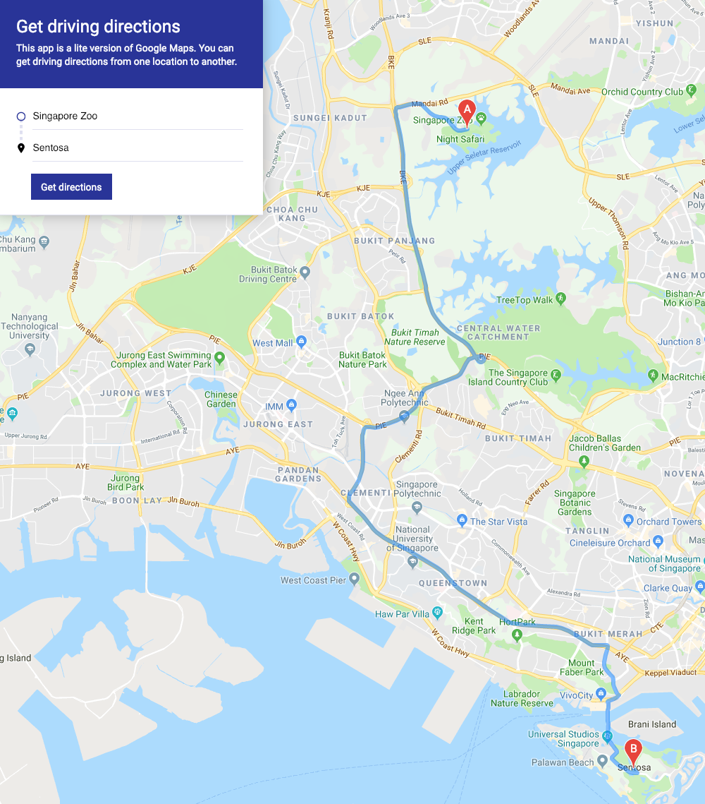
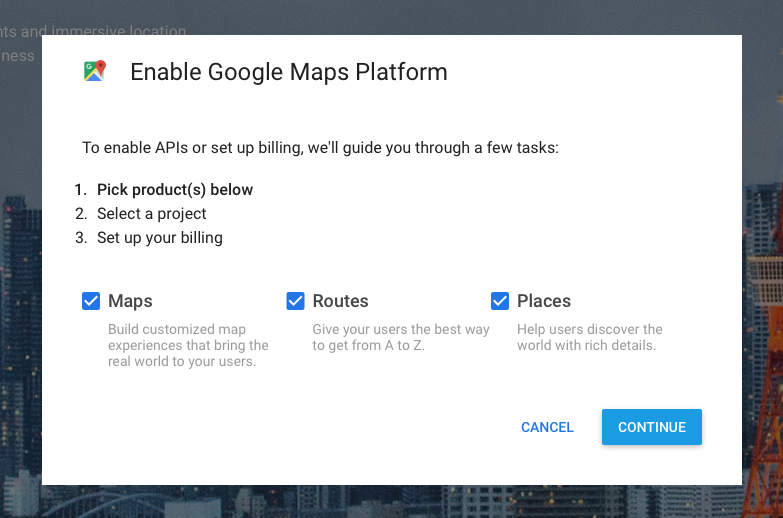
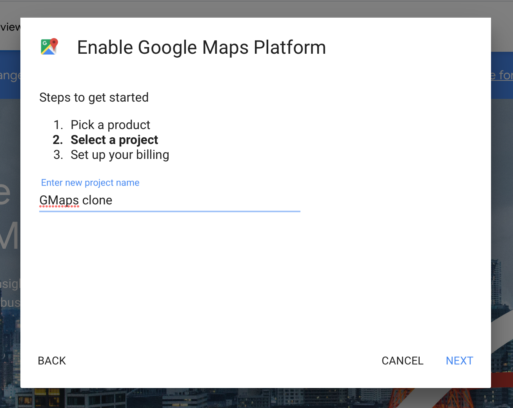
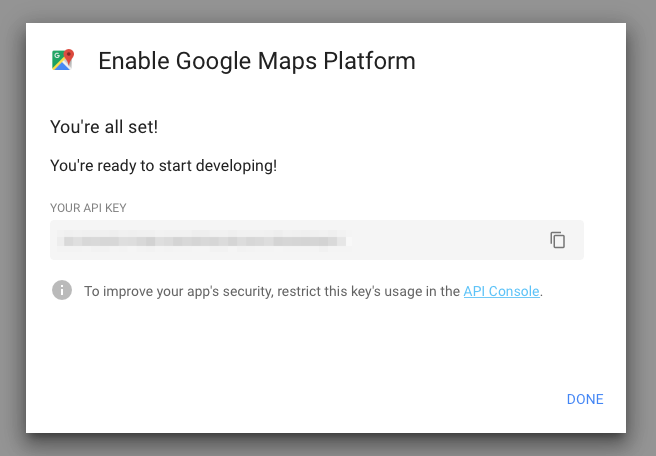
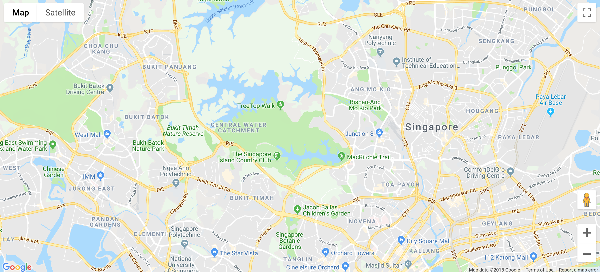
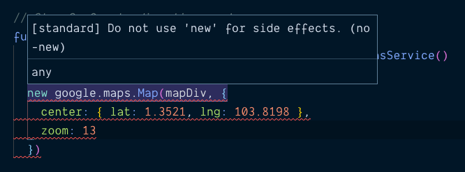

# 🛠️ Google Maps Clone: Creating your first Google Map

We're going to be ambitious. You'll learn to build a Google Maps clone over the next few lessons. This clone is a lite-version where users can search for driving directions between 2 or more places.

Here's a screenshot of what it looks like. I'll update this screenshot with a GIF of the final version when I'm done creating the series

<figure>
  
</figure>

It'll be fun and exciting!

Let's begin.

## Set up your Google Account

Head over to [Google Maps Platform][1] and click on `Get started`. A modal window will pop up. Select all products (Maps, Routes, and Places).

<figure>
  
</figure>

Google will ask you to create a new project. You can name this anything you want. (Note: You can't have "Google" in your project name).

I named mine Gmaps Clone.

<figure>
  
</figure>

Google will then ask you to set up a billing account. You need to create this account because Google has converted the Maps API into a paid product.

Don't worry about money though! Google gives you a $200 credit to use the API every month. You won't use more than this amount in this course.

(Here's Google's new [pricing sheet][2] if you're worried).

Follow the rest of the on-screen instructions. At the end of the process, you'll get an API key.

<figure>
  
</figure>

Note: Make sure you use your API Key for the rest of the course!

## Before you continue...

Try to create a Google Maps clone yourself. Go ahead and spend 2-3 days to figure it out. Read the [Google Maps JavaScript API Guide][3] that Google provides. Try their code. See how far you get.

Don't worry if you fail. What matters is you tried. You'll learn much more from this series if you have tried it on your own first.

Come back here once you're done trying. We'll work it out together.

## Connecting to Google Map's JavaScript API

Before you create your first Google Map, you need to connect to the Google Map JavaScript API. You can do this with the following link.

```html
<script src="https://maps.googleapis.com/maps/api/js?key=YOUR_API_KEY&callback=initMap"></script>
```

This link should follow your `main.js` file.

```html
<script src="js/main.js"></script>
<script src="https://maps.googleapis.com/maps/api/js?key=YOUR_API_KEY&callback=initMap"></script>
```

Note: if you've read the API Guide, you would have seen `async` and `defer` attributes on the `script` tag. `async` and `defer` exist to change script-loading order. You don't need them if you follow the format above.

## Creating your first map

Google Map's JavaScript API uses JSONP. You can tell because it accepts a `callback` value. In this case, we defined `callback` to be a function called `initMap`.

```html
<script src="https://maps.googleapis.com/maps/api/js?key=YOUR_API_KEY&callback=initMap"></script>
```

We need to create `initMap` before we call the API. We can do this in the `main.js` file.

Note: Google Map's API doesn't accept an arrow function for the callback. Make sure you declare `initMap` with the `function` keyword.

```js
// main.js
function initMap() {
  // Code for initializing the map here
}
```

To create a map, you can use `google.maps.Map`. It takes two values:

1. `element`: The DOM element to contain the map.
2. `options`: Options for the map. You can find a list of available options in [Google Map's reference][4]. Two of these options are required: `center` and `zoom`.

```js
function initMap () {
  const mapDiv = document.querySelector('#map')

  // Creating the Google Map
  const map = new google.maps.Map(mapDiv, {
    center: { lat: 1.3521, lng: 103.8198 },
    zoom: 13
  })
}
```

`center` determines the center of the map. It is an object that contains the latitude and longitude values (`lat` and `lng`). They let you determine a location on the world map.

When you create your Google Map, I suggest you look up your hometown's `lat` and `lng` values. It'll be easier to comprehend the map this way. The `lat` and `lng` values above point to Singapore.

`zoom` determines how close-up the map should be. The smaller the value, the smaller the zoom. Here's a rough estimate on the zoom levels:

- 1: World
- 5: Landmass/continent
- 10: City
- 15: Streets
- 20: Buildings

Once you create `initMap` map, refresh your page and you'll see a map.

<figure>
  
</figure>

Yay!

## New and Standard

A quick note before you continue: We created a `map` variable and didn't use it. This is a violation according to Standard (our linter). We shouldn't create any variable we don't use.

```js
// This works the same as before
function initMap () {
  // ...
  const map = new google.maps.Map(mapDiv, {
    center: { lat: 1.3521, lng: 103.8198 },
    zoom: 13
  })
}
```

Our code should become:

```js
// This works the same as before
function initMap () {
  // ...
  new google.maps.Map(mapDiv, {
    center: { lat: 1.3521, lng: 103.8198 },
    zoom: 13
  })
}
```

You'll see another error when you remove `const map =` from the `new google.maps.Map` line. This time, Standard tells you not to use `new` for side effects.

<figure>
  
</figure>

You can disable this error message by adding an `eslint-disable` comment at the top of your code. `no-new` is the type of error we're disabling here.

```js
/* eslint-disable no-new  */
```

[1]:	https://cloud.google.com/maps-platform/ "Google Maps Platform"
[2]:	https://cloud.google.com/maps-platform/pricing/sheet/?_ga=2.76981909.1042725295.1540612648-1483132270.1518666609
[3]:	https://developers.google.com/maps/documentation/javascript/tutorial "Google Maps JavaScript API Guide"
[4]:	https://developers.google.com/maps/documentation/javascript/reference/map#MapOptions "Google Map MapOptions interface"
