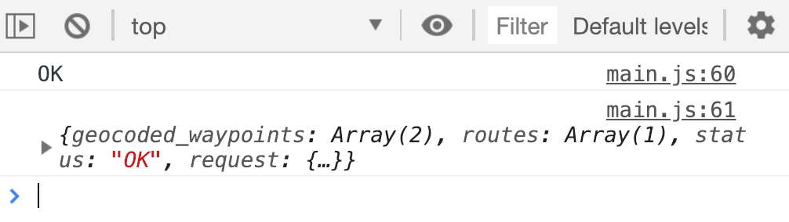
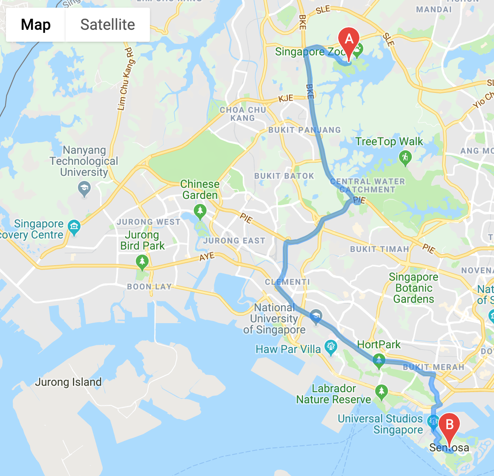

# 🛠️ Google Maps Clone: Getting directions

You have created a Google Map successfully. The next step is to get and plot directions between two points on the map.

We can do this with Google's direction API. You can read about Google's direction API [over here][1].

## Getting routes

We can use `google.maps.directionsService` to request directions between two places.

```js
function initMap () {
  // ...
  const directionsService = new google.maps.DirectionsService()
}
```

`directionsService` has a method called `route` that lets you request for directions. It takes in two arguments: a `request` object and a `callback`.

```js
function initMap () {
  // ...
  const directionsService = new google.maps.DirectionsService()

  directionsService.route(request, callback)
}
```

`request` is an object that contains options for Google Map's Direction API. You can find a list of possible options in [Google Map's Direction API reference][2].

When you create a request you need to pass in at least three options:

1. `origin`: Starting point of the route. `origin` and `destination` can be a `LatLng` object, a `String`, or a `google.maps.Place` object
2. `destination`: Ending point of the route. Same types as above
3. `travelMode`: Type of travel mode. Can be `DRIVING`, `TRANSIT`, `BICYCLING`, or `WALKING`. We will only use `DRIVING` for this Google Maps clone

### Constructing a request

I have created a list of popular attractions in Singapore. You can use these values as the `origin` and `destination` of your directions request.

```js
const places = {
  artScienceMuseum: {
    latlng: { lat: 1.2863, lng: 103.8593 },
    addr: '6 Bayfront Ave, Singapore 018974'
  },
  gardensByTheBay: {
    latlng: { lat: 1.2816, lng: 103.8636 },
    addr: '18 Marina Gardens Dr, Singapore 018953'
  },
  littleIndia: {
    latlng: { lat: 1.3066, lng: 103.8518 },
    addr: 'Little India, Singapore'
  },
  sentosa: {
    latlng: { lat: 1.2494, lng: 103.8303 },
    addr: 'Sentosa, Singapore'
  },
  singaporeZoo: {
    latlng: { lat: 1.4043, lng: 103.7930 },
    addr: '80 Mandai Lake Rd, Singapore 729826'
  }
}
```

Let's construct the `request` object together.

First, we'll want to set the `travelMode`. In this Google Maps Clone, we will only use the `DRIVING` mode. You can experiment with others if you wish to.

```js
const request = {
  travelMode: 'DRIVING'
}
```

Next, both `origin` and `destination` can take in a LatLong object, an address string, and a `google.maps.Places` value. You can use a Latlong or address string from the attractions above.

Let's say we want to travel from Singapore Zoo to Sentosa. You'll construct the request like this:

```js
// I have a mix of both 'latlng' and 'addr' to show that it's possible to use either value. You should stick with one or the other for consistency.
const request = {
  origin: places.singaporeZoo.latlng
  destination: places.sentosa.addr
  travelMode: 'DRIVING'
}
```

You can use this request to get directions between Singapore Zoo and Sentosa.

```js
directionsService.route(request, callback)
```

The callback contains two arguments: `result` and `status`. If the request is successful, you should see `status === OK` and a `results` object.

```js
directionsService.route(request, (result, status) => {
  console.log(status)
  console.log(result)
})
```

<figure>
  
</figure>

If the result is unsuccessful, we want to handle errors. Here's a [list of possible statuses][3] if the error is unsuccessful.

We're can skip the errors in the early stage of building the app. For now, we'll do a `console.error` to notify us of any errors that occur.

If the `status` is `OK`, we want to show the map.

```js
directionsService.route(request, (result, status ) => {
  if (status === 'OK') {
    // Show map
  } else {
    console.error(status)
    console.log(result)
  }
}
```

## Showing the route on the map

We can use `google.maps.DirectionsRenderer` to show the route on the map.

```js
if (status === 'OK') {
  new google.maps.DirectionsRenderer()
}
```

`directionsRenderer` can take in a list of options. You can find the full list [here][4]. Two of these options are required. They are:

1. `map`: The map to plot to. A value returned from `new google.maps.Map()`
2. `directions`: `result` from `directionsService.route`

Here's how you can plot the map:

```js
function initMap () {
  const mapDiv = document.querySelector('#map')
  const map = new google.maps.Map(mapDiv, {
    center: { lat: 1.3521, lng: 103.8198 },
    zoom: 13
  })

  // ...

  directionsService.route(request, (result, status) => {
    if (status === 'OK') {
      new google.maps.DirectionsRenderer({
        map,
        directions: result
      })
    } else {
      // ...
    }
  })
}
```

<figure>
  
</figure>

[1]:	https://developers.google.com/maps/documentation/javascript/directions "Google Directions API"
[2]:	https://developers.google.com/maps/documentation/javascript/reference/directions#DirectionsRequest "Google Map Directions Service reference"
[3]:	https://developers.google.com/maps/documentation/javascript/reference/directions#DirectionsStatus "Direction Status"
[4]:	https://developers.google.com/maps/documentation/javascript/reference/directions#DirectionsRenderer "Directions Renderer"