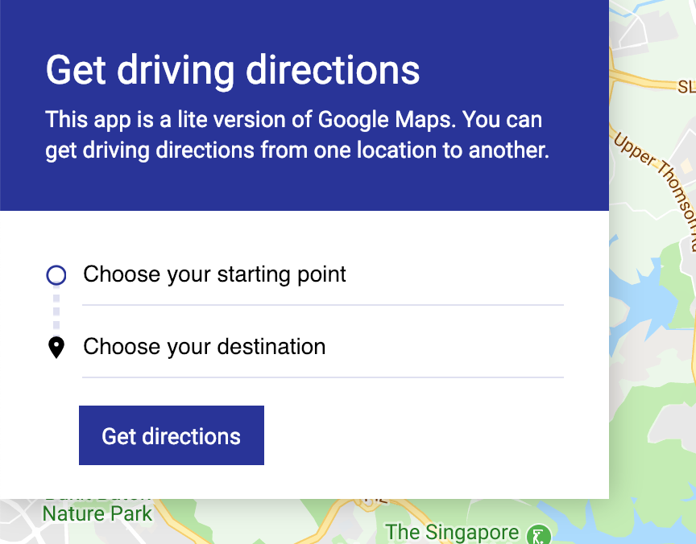
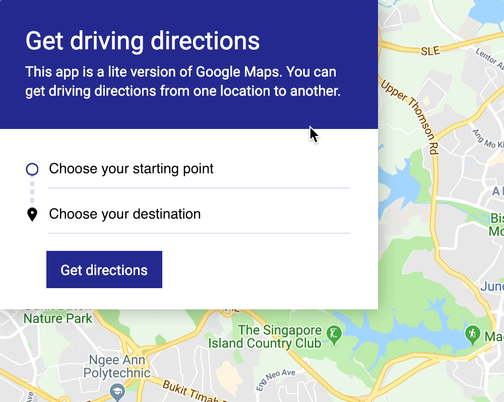
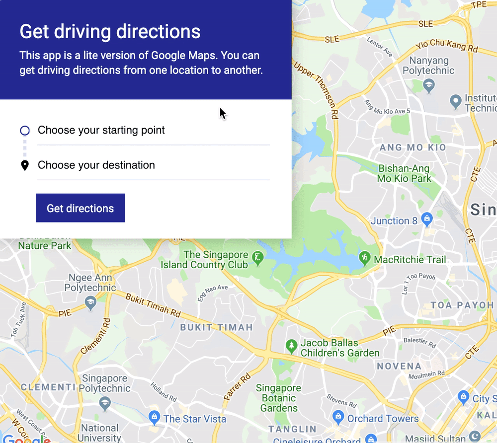

# 🛠️ Google Map Clone: Searching for places

Here's the most important thing about a Google Maps clone... Users need to be able to search for directions to any place they want. You can allow them to search for directions to any place with the `places` library.

## Adding the places library

To use the `places` library, you need to add the `libraries=places` query parameter to your Google Maps API call.

```js
`https://maps.googleapis.com/maps/api/js?key=YOUR_API_KEY&libraries=places&callback=initMap`
```

## Building the UI

First, we need to build a form that contains two search fields.

1. First search field: Lets user search for their start point
2. Second search field: Lets user search for their destination

Each search field should:

1. Have a label
2. Have `type` set to `search`

This form has already been created for you. You can find it in the source code for this lesson. It's located in `components/11.google-map/04.places-source`.

Here's an overview of the form:

```html
<form action="#" class="controls" autocomplete="off">
  <!-- ... -->

  <div class="controls__search-box">
    <label class="is-invisible" for="startpoint">Start point</label>
    <input type="search" id="startpoint" name="startpoint" placeholder="Choose your starting point"/>
    <span class="search-box__icon"></span>
  </div>

  <div class="controls__search-box">
    <label class="is-invisible" for="destination">Destination</label>
    <input id="destination" type="search" name="destination" placeholder="Choose your destination"/>
    <span class="search-box__icon"></span>
  </div>
</form>
```

When you add the form to your HTML, you'd see this:

<figure>
  
</figure>

## Google's Autocomplete Widget

The `places` library contains an Autocomplete Widget. A widget is a component that can be embedded into another website. The implementation details differ from widget to widget.

In this case, the `places` Autocomplete Widget gives us the necessary HTML, CSS, and JavaScript so we don't have to do much to search for places.

It works this way:

1. You initialize the Widget on each search box you want to use
2. When a user types on the input, the widget automatically looks for five results based on the what the user typed
3. These five results will be shown on a dropdown
4. Users can click the dropdown (or use their keyboard) to complete their search

Here's all the JavaScript you need (thanks to the Autocomplete Widget):

```js
function initMap () {
  // ...
  const form = document.querySelector('form')
  const searchFields = [...form.querySelectorAll('input')]

  searchFields.forEach(el => {
    const autocomplete = new google.maps.places.Autocomplete(el)
  })
}
```

<figure>
  
</figure>

Looks-wise, the Autocomplete Widget isn't polished. I went ahead and restyled the CSS for you. This CSS can be found in the `04.places-source`. Just uncomment the section that says `/* Autocomplete widget styles */`.

Once you uncomment the CSS, you should see this:

<figure>
  
</figure>

Note: If you're up for a challenge, or if the Autocomplete Widget doesn't work for you, you can create an autocomplete component yourself through Google's [Autocomplete Service][1].

## Configuring the Autocomplete Widget

There are two problems with the Autocomplete Widget now:

1. It searches the entire globe
2. It returns every detail about the autocompleted-place

### Creating a bias for search results

If your map starts in Singapore, it doesn't make sense for your search box to populate results from Istanbul. We need to create a bias for search results in Singapore.

There are many methods to do this. The simplest way is to use `bindTo`. (I found out about `bindTo` through Google's [Autocomplete guide][2]).

```js
searchFields.forEach(el => {
  const autocomplete = new google.maps.places.Autocomplete(el)
  autocomplete.bindTo('bounds', map)
})
```

### Returning lesser details

The Autocomplete Widget returns every detail about the autocompleted place by default. The problem with this is Google [bills you accordingly][3] to the information it returns.

We don't need every detail about a place. We only need to know only one of the following:

1. Their `lat` and `lng` coordinates (which can be found `geometry`)
2. Their address (which can be found in `formatted_address`)

To conserve the $200 Google gave us, we need to limit the details returned by the Autocomplete Widget. We do this by passing a `fields` option to `google.maps.places.Autocomplete`.

For this component, we only need the `formatted_address`.

```js
searchFields.forEach(el => {
  const autocomplete = new google.maps.places.Autocomplete(el,
    { fields: ['formatted_address'] }
  )
  autocomplete.bindTo('bounds', map)
})
```

## Drawing the route

When a user submits the form, we want to draw the route between the two places they chose. We can do that by listening to the `submit` event.

```js
function initMap () {
  // ...
  form.addEventListener('submit', evt => {
    // Draw route here
  })
}
```

First, we need to prevent the form's default submission behavior, because it'll navigate us towards the `action` attribute (which refreshes the page).

```js
function initMap () {
  // ...
  form.addEventListener('submit', evt => {
    evt.preventDefault()
  })
}
```

Next, we need to get the values from both input fields.

```js
form.addEventListener('submit', evt => {
  evt.preventDefault()

  const origin = searchFields[0].value.trim()
  const destination = searchFields[1].value.trim()
})
```

Once we know the origin and destination, the rest is easy. You've already done it in a previous lesson.

```js
  form.addEventListener('submit', evt => {
    // ...

    const directionsService = new google.maps.DirectionsService()
    const request = {
      origin,
      destination,
      travelMode: 'DRIVING'
    }

    directionsService.route(request, (result, status) => {
      if (status === 'OK') {
        new google.maps.DirectionsRenderer({
          map,
          directions: result
        })
      } else {
        console.error(status)
        console.log(result)
      }
    })
  })
```

<figure>
  
</figure>

## About formatted\_address

Notice we didn't use `formatted_address` when we drew the route in the above code?

We didn't have to use `formatted_address` here because Google fills the search field's `value` with the `formatted_address` of the autocompleted place.

We will have to use `formatted_address` in the next lesson though. Go to the next to find out more.

[1]:	https://developers.google.com/maps/documentation/javascript/reference/places-autocomplete-service "Google Autocomplete Service"
[2]:	https://developers.google.com/maps/documentation/javascript/places-autocomplete "Autocomplete Guide"
[3]:	https://developers.google.com/maps/billing/understanding-cost-of-use#places-details