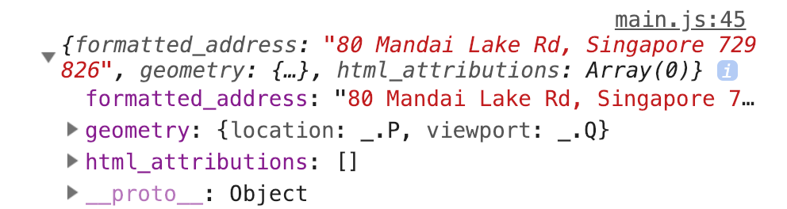

# 🛠️ Google Maps Clone: Dealing with incomplete searches

There's one problem with the Autocomplete Widget. 

If a user types halfway and decides to click away, the Autocomplete Widget leaves the user's original text in the input.   

<figure>
  
</figure>

We can't draw directions if this happens because the Directions API needs either a `formatted_address`, a `Latlng` object, or a `Place` object. 

The user's original text is simply a search string. 

Let's fix this. 

## Detecting an incomplete search

In the previous lesson, you learned that you can get `formatted_address` and `geometry` from the Autocomplete's `getPlace` method. This is true only if the user selected a dropdown item. 

```js
form.addEventListener('submit', evt => {
  // ... 
  const origin = inputFields[0].autocompleteWidget.getPlace()
  console.log(origin)
})
```

<figure>
  
</figure>

If the user did not select a dropdown item, the `getPlace` method returns one of these values: 

1. `undefined`
2. An object with the `name` property set to the input's `value`. 

The behavior is kind of weird. It returns `undefined` if you click to submit the form, but it returns the object if you hit enter to submit the form. ¯\_(ツ)_/¯

<figure>
  
</figure>

To check if `getPlace` returns a valid place, we need to check if: 

1. the `returned` value is `undefined`
2. the `returned` value contains the `formatted_address` property

The best way for both conditions is to first check if the `return` value is an object. If it's an object, we check if the `formatted_address` property exists

```js
if (typeof origin === 'object' && origin.formatted_address) {
  // Place is valid 
} else {
  // Place is invalid
}
```

## Before drawing the route...

We have three conditions to fulfil before we can draw the route: 

1. `origin` must be an `object`
2. `origin` must contain a `formatted_address` property
3. The `formatted_address` property must be recognized by the `directionsService.route`

(We also have to the same for `destination`. Let's work on `origin` first). 

If `origin` is invalid, we fix it before it gets to the `directionsService.route` call. There's an easy way to do this without refactoring our code: We can assign another value to `origin` if `origin` is invalid. 

```js
let origin = inputFields[0].autocompleteWidget.getPlace()

if (typeof origin !== 'object' || origin.formatted_address) {
  // Set 'origin' to a valid place before directionsService.route
  origin = {
    formatted_address: 'some-address'
  }
} 
```

Next, we need to `some-address` to a valid address. 

## Getting a valid address 

What address should we use to complete the search? 

There are many answers to this question. For this component, we are going to get the address from the first dropdown item. 

If you look at the HTML, you should see two `.pac-container` divs. Each `.pac-container` is a dropdown created by an Autocomplete Widget. 

1. The first `.pac-container` is for the first Autocomplete Widget
2. The second `.pac-container` is the dropdown for the second Autocomplete Widget
3. And so on...

If we are working on `origin`, we want to get the address from the first dropdown. If we are working on `destination`, we want to get the address from the second dropdown. 

If you searched for `Chinatown`, you should see the following HTML in a dropdown. 

```js
<div class="pac-container pac-logo">
  <div class="pac-item">
    <span class="pac-icon pac-icon-marker"></span>
    <span class="pac-item-query">
      <span class="pac-matched">Chinatown</span> MRT Station</span
    >
    <span>New Bridge Road, Singapore</span>
  </div>
  <!-- ...other items -->
</div>
```

If you clicked on the first Dropdown item, the Autocomplete Widget will fill in the following into the input: 

```js
'Chinatown MRT Station, New Bridge Road, Singapore'
```

This address is in the format that`directionsService.route` requires. We need to convert the HTML into a string with the formatted address. 

To convert it, we need to: 

1. Get text in `.pac-item-query`
2. Remove `.pac-matched` the `span`
3. Add a comma to the text in `.pac-item-query`
4. Add the `textContent` of the next sibling element

Here's the code that does this: 

```js
if (typeof origin !== 'object' || !origin.formatted_address) {
  const dropdown = document.querySelectorAll('.pac-container')[0]
  const queryEl = dropdown.querySelector('.pac-item-query')
  const queryText = queryEl.innerHTML.replace('<span class="pac-matched">', '')
    .replace('</span>', '')
  const street = queryEl.nextElementSibling.textContent
  const address = `${queryText}, ${street}`
}
```

Once we construct the `formatted_address` from the Dropdown item, we can reassign it to `origin`. 

```js
if (typeof origin !== 'object' || !origin.formatted_address) {
  // ...
  origin = { formatted_address: address }
}
```

We also need to fill this address into the input. 

```js
if (typeof origin !== 'object' || !origin.formatted_address) {
  // ...
  inputFields[0].value = address
}
```

Now let's do the same for `destination`: 

```js
if (typeof destination !== 'object' || !destination.formatted_address) {
  const dropdown = document.querySelectorAll('.pac-container')[1]
  const queryEl = dropdown.querySelector('.pac-item-query')
  const queryText = queryEl.innerHTML.replace('<span class="pac-matched">', '')
    .replace('</span>', '')
  const country = queryEl.nextElementSibling.textContent
  const address = `${queryText}, ${country}`
  destination = { formatted_address: address }
  inputFields[1].value = address
}
```

Now, users can type any incomplete query. We'll draw a best-guess route for them. 

<figure>
  
</figure>
