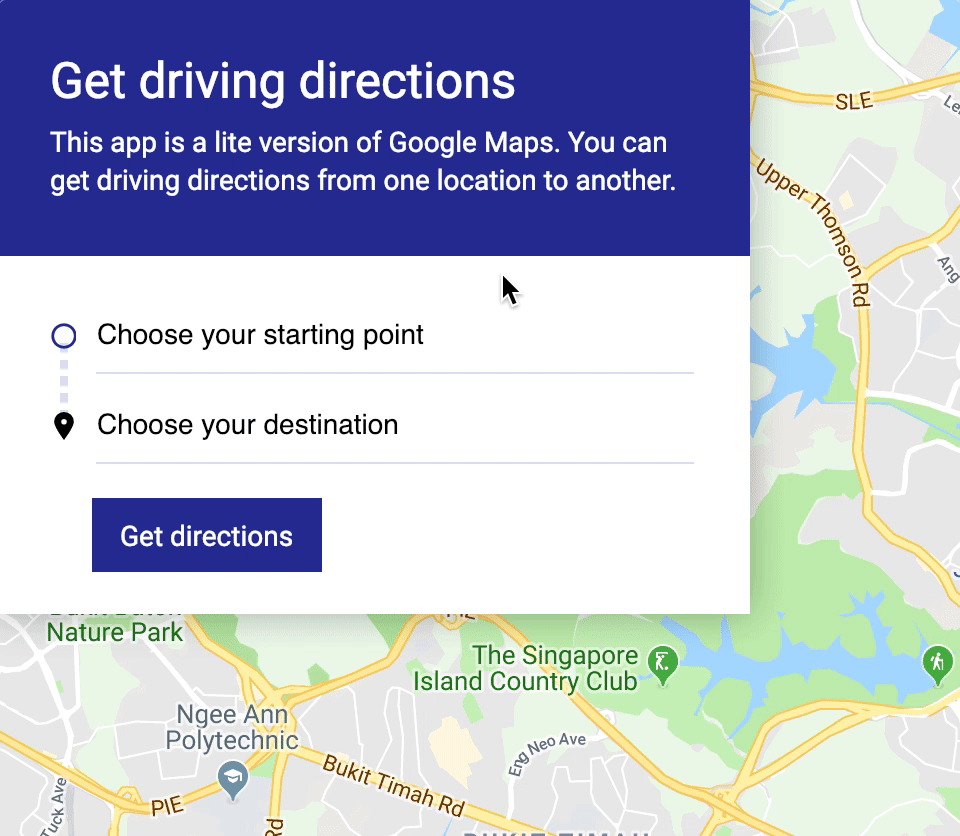
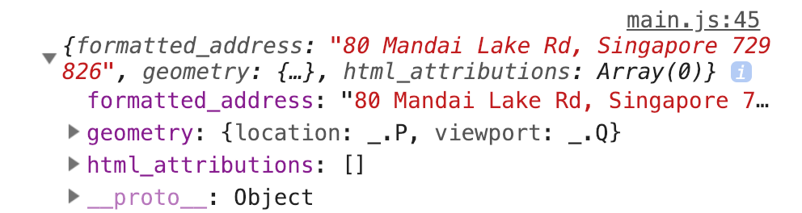
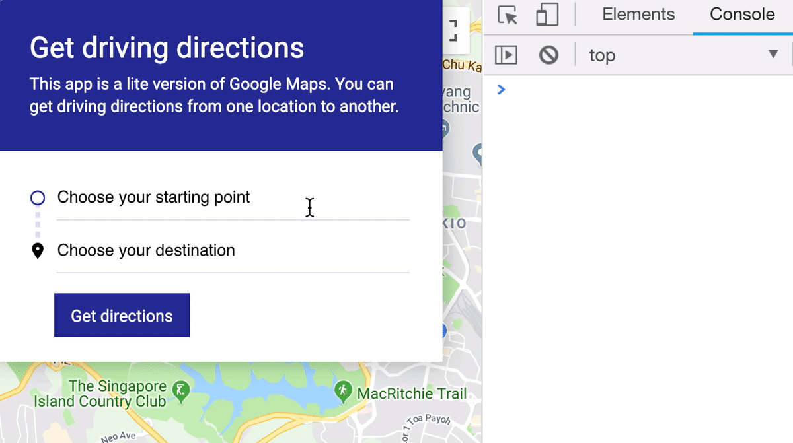
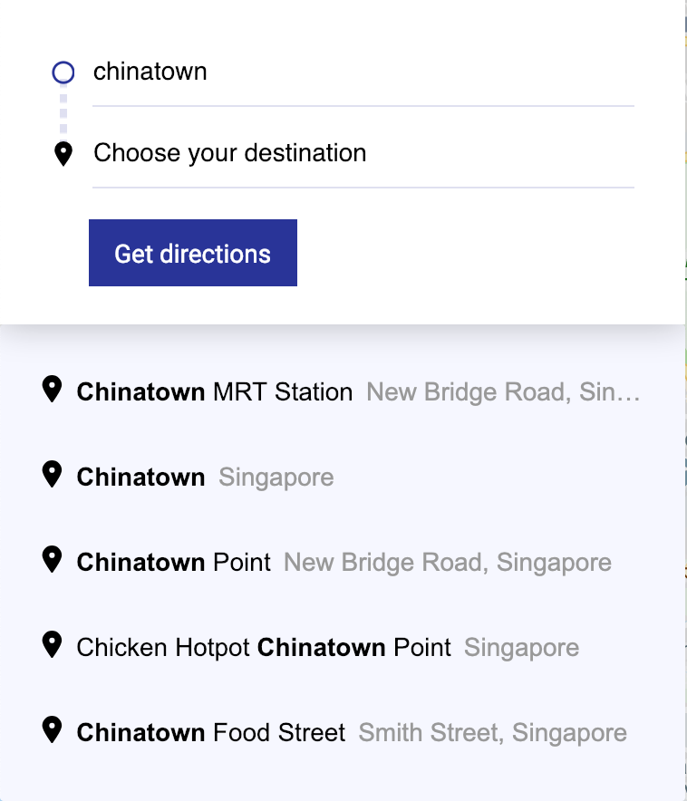

# 🛠️ Google Maps Clone: Dealing with incomplete searches

There's one problem with the Autocomplete Widget.

If a user types halfway and clicks away, the Autocomplete Widget leaves the user's original text in the input.

<figure>
  
</figure>

The Directions need API needs a `formatted_address` to draw directions. Right now, we only have a search string.

Let's fix this.

## Getting a formatted address

How can we tell the difference between a search string a `formatted_address`? We need to know if the Autocomplete Widget has activated and completed the search field.

We know the Autocomplete Widget has been activated if Google returns a `formatted_address` field somehow. Turns out, the Autocomplete Widget has a `getPlace` method that tells you if a place was found.

To use this `getPlace` method, we need to keep a reference to the initialized Autocomplete Widget.

```js
searchFields.forEach(el => {
  // ...
  el.autocompleteWidget = autocomplete
})
```

Note: `autocomplete` is a valid HTML attribute. We can't use it. This is why we stored Google's autocomplete widget in an `autocompleteWidget` property instead.

Then, in the submit event, we can use `getPlace` to detect if the Autocomplete found a valid place.

```js
form.addEventListener('submit', evt => {
  // ...
  const origin = searchFields[0].autocompleteWidget.getPlace()
  console.log(origin)
})
```

If the place is valid, `getPlace` will return an object that contains `formatted_address`.

<figure>
  
</figure>

We need this `formatted_address` to construct the route `request`.

```js
form.addEventListener('submit', evt => {
  // ...
  const origin = searchFields[0].autocompleteWidget.getPlace()
  const destination = searchFields[1].autocompleteWidget.getPlace()

  const request = {
    origin: origin.formatted_address,
    destination: destination.formatted_address
    travelMode: 'DRIVING'
  }
  // ...
})
```

## Detecting an incomplete search

If the user selects a place from the dropdown menu, `getPlace` returns one of these values:

1. `undefined`
2. An object with the `name` property set to the input's `value`.

The behavior is kind of weird. It returns `undefined` if you click to submit the form, but it returns the object if you hit enter to submit the form. ¯\\\_(ツ)\_/¯

(Weird things can happen when you work with 3rd-party APIs. Be sure to check each interaction thoroughly!).

<figure>
  
</figure>

We know `getPlace` must be an object with a `formatted_address` property. We need to check for both conditions.

The best way is to first check if `getPlace` returns an object. If `getPlace` returns an object, we check if `formatted_address` exists.

(When we do this, we avoid an error that says `Uncaught TypeError: Cannot read property 'getPlace' of undefined`)

```js
if (typeof origin === 'object' && origin.formatted_address) {
  // Place is valid
} else {
  // Place is invalid
}
```

## Getting a valid Address

We need to look for a valid address if the address is invalid. An easy way is to search for the address before sending a request to Directions Service.

```js
let origin = searchFields[0].autocompleteWidget.getPlace()

if (typeof origin !== 'object' || origin.formatted_address) {
  // Place is invalid.
  // 1. Find an address.
  // 2. Then make origin contain a `formatted_address` field
  const address = 'some-address'
  origin = {
    formatted_address: address
  }
}
```

What address can we use to complete the search for our user?

We can:

1. See if there are any hints left behind by the Autocomplete Widget
2. Use Google's Autocomplete Service to find an address
3. Use a Google Places library to search for an address

Option 1 works for us because each Autocomplete Widget contains an accompanying dropdown menu. When a user searches for a place (but doesn't complete the search), the dropdown menu contains the results of that search.

If you look at the HTML, you should see two `.pac-container` divs. The first `.pac-container` is the dropdown for the Autocomplete Widget and the second `.pac-container` is the dropdown for the second Autocomplete Widget.

Now, let's say the user searches for Chinatown (with the map pointed to Singapore). They'll see the following dropdown:

<figure>
  
  <figcaption></figcaption>
</figure>

The HTML of the dropdown is:

```html
<div class="pac-container pac-logo">
  <div class="pac-item">
    <span class="pac-icon pac-icon-marker"></span>
    <span class="pac-item-query">
      <span class="pac-matched">Chinatown</span> MRT Station</span
    >
    <span>New Bridge Road, Singapore</span>
  </div>
  <!-- ...other items -->
</div>
```

If the user clicks on the first dropdown item, the Autocomplete widget fills the following into the search field:

```js
'Chinatown MRT Station, New Bridge Road, Singapore'
```

This filled-in address is a `formatted_address`. It's the address we're looking for. We need to convert the HTML of the first dropdown item into a string form.

To convert it, we need to:

1. Get text in `.pac-item-query`
2. Remove `.pac-matched` class and `span` tag
3. Add a comma to the text in `.pac-item-query`
4. Add `textContent` of the next `span` element.

Here's the code that does this:

```js
if (typeof origin !== 'object' || !origin.formatted_address) {
  const dropdown = document.querySelectorAll('.pac-container')[0]
  const queryEl = dropdown.querySelector('.pac-item-query')
  const queryText = queryEl.innerHTML
    .replace('<span class="pac-matched">', '')
    .replace('</span>', '')
  const street = queryEl.nextElementSibling.textContent
  const address = `${queryText}, ${street}`
}
```

Once we have the address, we need to reassign it to `origin`.

We also need to fill this address into the input.

```js
if (typeof origin !== 'object' || !origin.formatted_address) {
  // ...
  origin = {
    formatted_address: address
  }
  searchFields[0].value = address
}
```

Let's do the same for `destination` too.

```js
let destination = searchFields[1].autocompleteWidget.getPlace()

// ...

if (typeof destination !== 'object' || !destination.formatted_address) {
  const dropdown = document.querySelectorAll('.pac-container')[1]
  const queryEl = dropdown.querySelector('.pac-item-query')
  const queryText = queryEl.innerHTML
    .replace('<span class="pac-matched">', '')
    .replace('</span>', '')
  const country = queryEl.nextElementSibling.textContent
  const address = `${queryText}, ${country}`
  destination = {
    formatted_address: address
  }
  searchFields[1].value = address
}
```

With this change, users can type an incomplete query. We'll draw a best-guess route for them.

<figure>
  
</figure>
