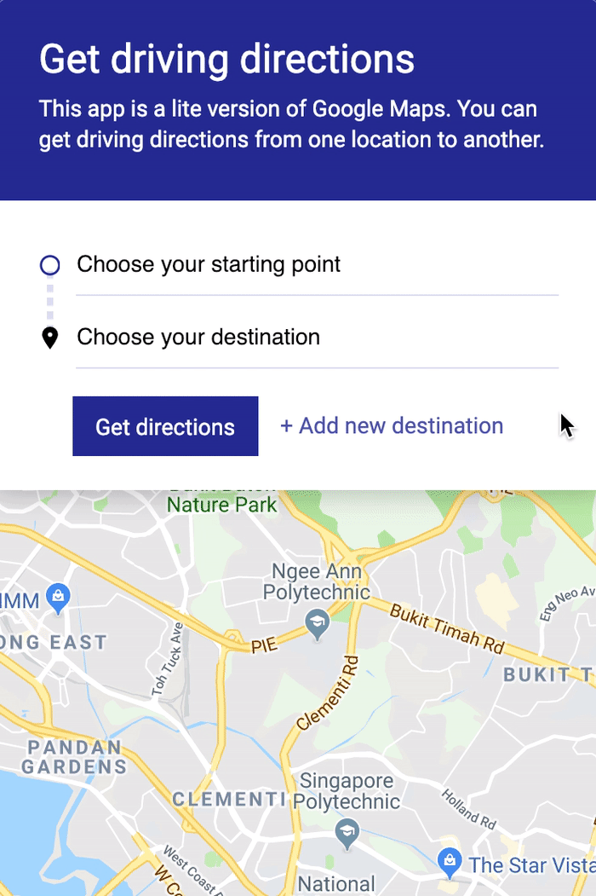
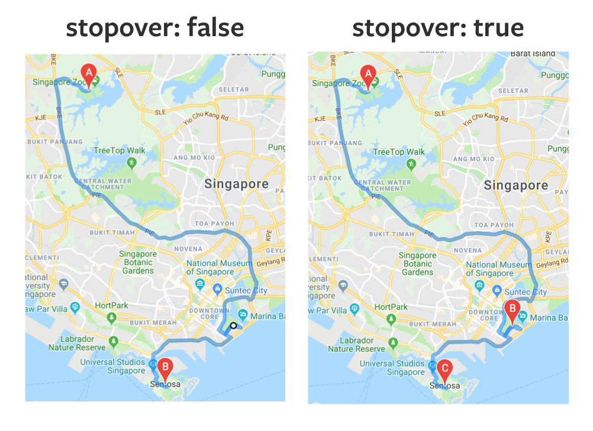

# 🛠️ Google Maps Clone: Adding stopovers

Let's say you want to travel to three places in Singapore. You want to plot a route to all three places on our Google Maps Clone. The three places are:

1. The Singapore Zoo
2. Gardens by the bay
3. Sentosa

We can show these points on our Google Maps clone. Here's what it looks like:

<figure>
  
</figure>

## Building the UI

To build this UI, we need to:

1. Add the "Add new destination" button
2. Create waypoints with Direction Service

## Add the "add new destination" button

We'll add the "add new destination" `button` to `.controls__button`.

When you add a secondary `button` a `form`, make sure you set `type` to `button`. This is because browsers believe that all buttons in a form are `submit` buttons. Clicking on `submit` buttons trigger a `submit` event.

We don't want to trigger the `submit` event.

```html
<div class="controls__button">
  <!-- ... -->
  <button type="button" class="secondary">+ Add new destination</button>
</div>
```

When a user clicks on "Add new destination", we want to add a third search field to the UI. This new search field should also autocomplete the user's search terms.

To do this, we have to first add a `click` event listener to the "Add new destination" button.

```js
function initMap () {
  // ...
  const newDestinationButton = form.querySelector('.secondary')

  newDestinationButton.addEventListener('click', evt => {
    // Add new destination box
  })
}
```

When the user clicks on the button, we want to add a search box. The HTML for a search box, along with the necessary label, styles, and icon is the following.

(Note: This is the HTML for the destination field).

```html
<div class="controls__search-box">
  <label class="is-invisible" for="destination">Destination</label>
  <input
    type="search"
    id="destination"
    name="destination"
    placeholder="Choose your destination"
  />
  <span class="search-box__icon"></span>
</div>
```

When we add a search box, we need to watch out for three things:

1. The `for`, `id`, and `name` must be unique to the new field
2. The `label` must reflect the new field
3. The `placeholder` must reflect the new field

### Naming `label` and `placeholder`

How we name `label` and `placeholder` affects the user experience.

In this case, let's say the user wants to travel from Singapore Zoo, to Gardens by the bay, to Sentosa. And they think this way:

1. I'm at the Singapore Zoo
2. I want to go to Gardens by the bay
3. Then, I want to go to Sentosa

Here, the user thinks that Gardens by the bay is their first destination. And Sentosa is their second destination.

Our search fields can have the following placeholders (and labels):

1. Choose your start point
2. Choose your destination
3. Choose destination 2

The `name`, `id` and `for` attributes can be:

1. start point
2. destination
3. destination 2

### Creating the search box

Let's say there are two search boxes in the UI. One for `origin` and one for `destination`.

The user clicks "Add new destination".

We want to add a third search box to the DOM. This search box should have the following HTML:

```html
<div class="controls__search-box">
  <label class="is-invisible" for="destination-2">Destination 2</label>
  <input
    type="search"
    id="destination-2"
    name="destination-2"
    placeholder="Choose destination 2"
  />
  <span class="search-box__icon"></span>
</div>
```

If the user clicks "Add new destination" again, we'll add another search box to the DOM. This search box should have the following HTML:

```html
<div class="controls__search-box">
  <label class="is-invisible" for="destination-3">Destination 3</label>
  <input
    type="search"
    id="destination-3"
    name="destination-3"
    placeholder="Choose destination 3"
  />
  <span class="search-box__icon"></span>
</div>
```

(Notice the locations of the 2s and 3s. See a pattern?).

We can use the number of search fields currently present in the UI to create the search box.

```js
newDestinationButton.addEventListener('click', evt => {
  const searchFields = form.querySelectorAll('input')
  const numFields = searchFields.length
  const index = numFields

  const div = document.createElement('div')
  div.classList.add('controls__search-box')
  div.innerHTML = ` <label class="is-invisible" for="destination-${index}">Destination ${index}</label>
    <input
      type="search"
      id="destination-${index}"
      name="destination-${index}"
      placeholder="Choose destination ${index}"
    />
    <span class="search-box__icon"></span>
  `
})
```

We should also make certain to re-define `searchFields` in the `submit` event listener. Otherwise, the `request` will only ever consist of the first two entries, ignoring anything after them.

```js
form.addEventListener("submit", evt => {
  evt.preventDefault()

  const searchFields = [...form.querySelectorAll("input")]
  // ...
})
```

After creating the search field, we need to append it to the DOM. If you look at the HTML, you'll realize we need to insert it before `.controls__buttons`.

```html
<div class="controls__body">
  <div class="controls__search-box"><!-- ... --></div>
  <div class="controls__search-box"><!-- ... --></div>
  <div class="controls__search-box"><!-- ... --></div>
  <div class="controls__buttons"><!-- ... --></div>
</div>
```

To insert the search field `div` before `.controls__buttons`, we need to use `insertBefore`. `insertBefore` requires a reference Node (which is `.controls__buttons`).

```js
newDestinationButton.addEventListener('click', evt => {
  // ...

  const refNode = form.querySelector('.controls__button')
  const parent = refNode.parentNode
  parent.insertBefore(div, refNode)
})
```

Here's what we have so far.

<figure>
  
</figure>

After inserting the search field into the DOM, we need to turn it into an Autocomplete. We have to initiate the Autocomplete on the `input` element.

```js
newDestinationButton.addEventListener('click', evt => {
  // ...
  const searchField = div.querySelector('input')
  const autocomplete = new google.maps.places.Autocomplete(searchField, {
        fields: ['formatted_address']
      })
  autocomplete.bindTo('bounds', map)
  searchField.autocompleteWidget = autocomplete
})
```

You may wish to refactor the code at this point. Hold the urge. We'll refactor the code after we complete the stopover functionality.

## Drawing waypoints

A waypoint is an intermediate point between a start and end point of a journey. For example:

1. Singapore Zoo (Start point)
2. Gardens by the bay (Waypoint)
3. Sentosa (End point)

You can ask Google's Directions Service to draw waypoints if you provide them with a `waypoint` property. This property is an array of objects with two properties:

1. `location`: a formatted address
2. `stopover`: Boolean. When true, Google adds an intermediate break point. When false, Google shows you how to drive to the destination while passing through this point. For our use case, `stopover` is always true.

```js
const request = {
  // ...
  waypoints: [{
    location: 'Formatted address',
    stopover: true
  }]
}
```

Here's the difference between `stopover` set to `false` and `stopover` set to true.

<figure>
  
  <figcaption></figcaption>
</figure>

Once again, let's say the user wants to travel from Singapore Zoo, to Gardens by the bay, to Sentosa. Their addresses are as follows:

1. Zoo: 80 Mandai Lake Rd, Singapore 729826
2. Gardens: 18 Marina Gardens Dr, Singapore 018953
3. Sentosa: Sentosa, Singapore

Our request object should be:

```js
const request = {
  origin: '80 Mandai Lake Rd, Singapore 729826',
  destination: 'Sentosa, Singapore',
  waypoints: [{
    location: '18 Marina Gardens Dr, Singapore 018953',
    stopover: true
  }]
  travelMode: 'DRIVING'
}
```

From this example, we can see that:

1. The first search field is the `origin`
2. The last search field is the `destination`
3. Every search field in-between is a waypoint

It's easy to find `origin` and `destination`. We can use an `index` of `0` to find the `origin`. For `destination`, we can use the number of search fields as a guide.

```js
const request = {
  origin: getFormattedAddress(searchFields, 0),
  destination: getFormattedAddress(searchFields, searchFields.length - 1),
  // ...
}
```

Next, we need to construct an array of waypoints. Each waypoint should have a `location` and `stopover` property. Let's loop through our search boxes quickly and add them in.

```js
const getWaypoints = searchFields => {
  const mapped = searchFields.map((input, index) => {
    return {
      location: getFormattedAddress(searchFields, index),
      stopover: true
    }
  })
}
```

`getWayponits` should only return points if they're not the `origin` or the `destination`. We can use `filter` to filter the search fields.

```js
const getWaypoints = searchFields => {
  const mapped = searchFields.map((input, index) => {
    return {
      location: getFormattedAddress(searchFields, index),
      stopover: true
    }
  })

  const filtered = mapped.filter((input, index) =>
    index !== 0 && index !== searchFields.length
  )
}
```

To clean up `getWaypoints`, we'll chain `map` and `filter` together. We'll also return filtered results.

```js
const getWaypoints = searchFields => {
  return searchFields
    .map((input, index) => {
      return {
        location: getFormattedAddress(searchFields, index),
        stopover: true
      }
    })
    .filter((input, index) =>
      index !== 0 && index !== searchFields.length
    )
}
```

Note: Normally you'll `filter` before `map`. (Lesser items to map, lesser operations, more performant). But we put `map` before filter in this case because we need the original `index` value for `getFormattedAddress`. `filter` changes the number of items in the array, which changes the `index` value.

Here's our request object (with waypoints):

```js
const request = {
  origin: getFormattedAddress(searchFields, 0),
  destination: getFormattedAddress(searchFields, searchFields.length - 1),
  waypoints: getWaypoints(searchFields)
  travelMode: 'DRIVING'
}
```

<figure>
  
  <figcaption></figcaption>
</figure>
