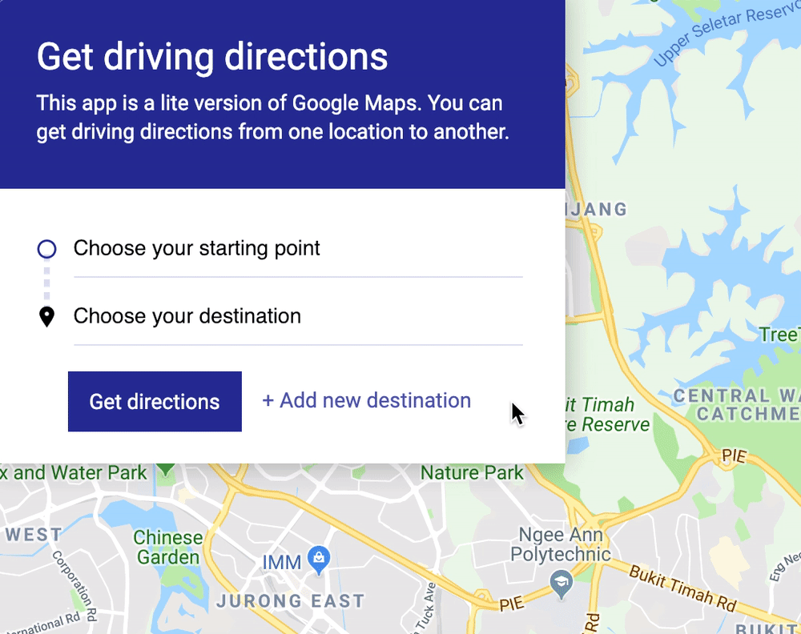
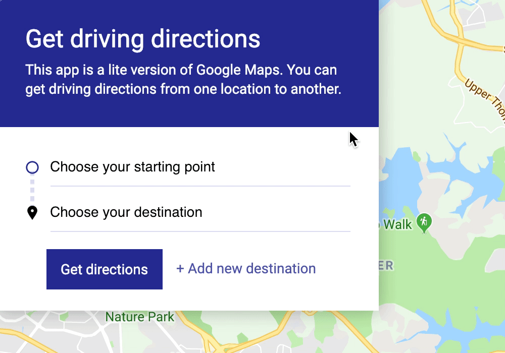
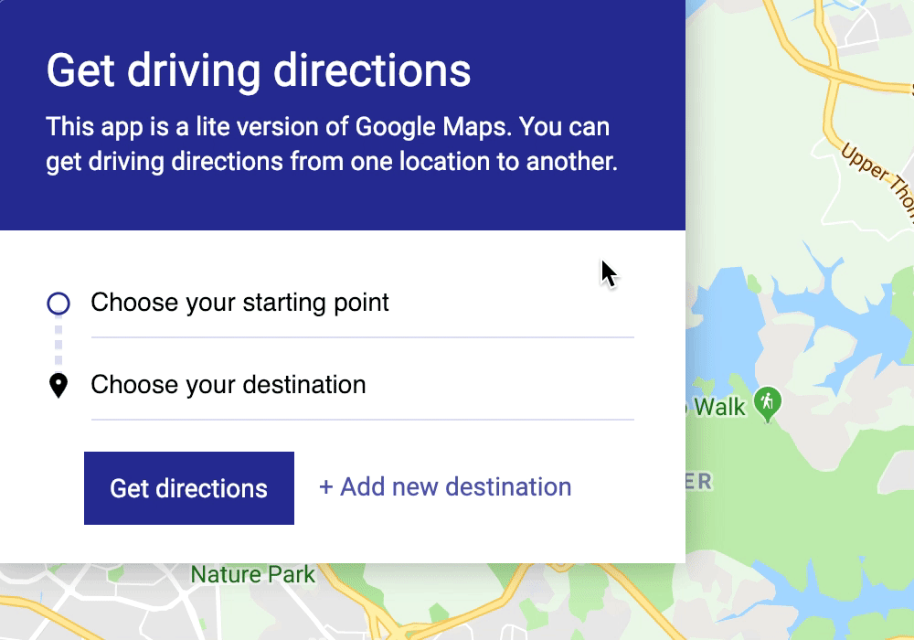
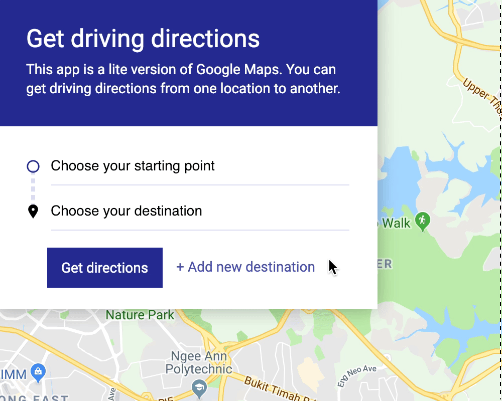
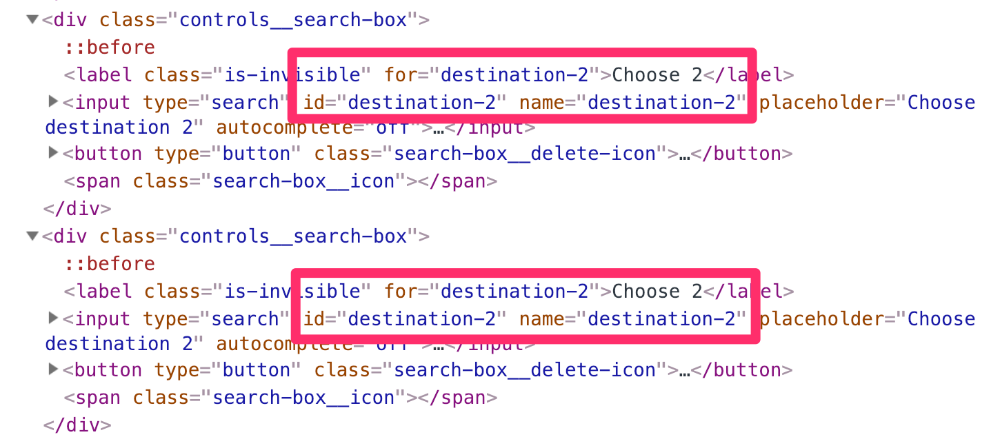
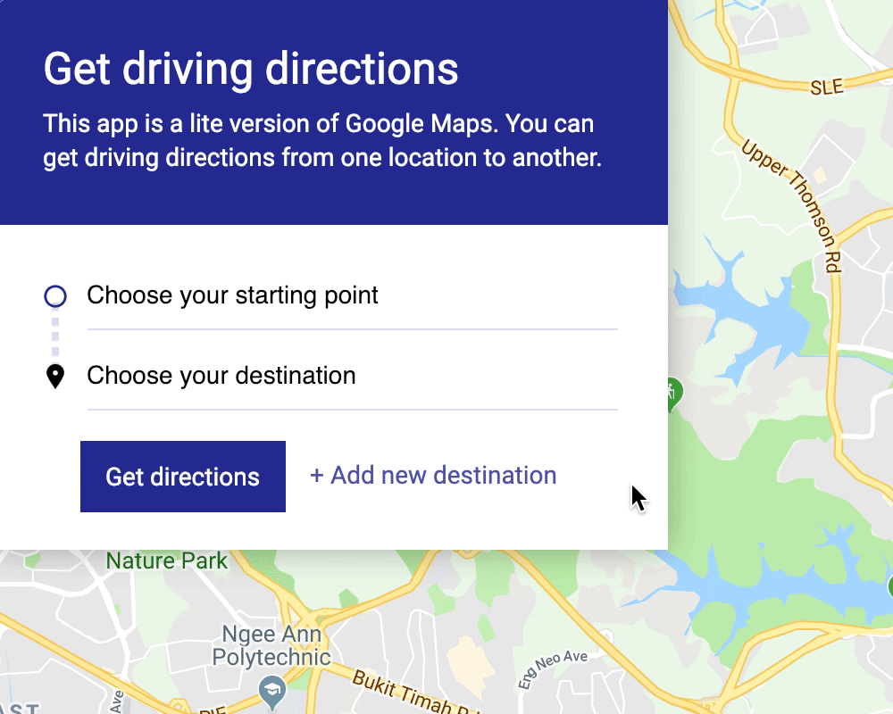
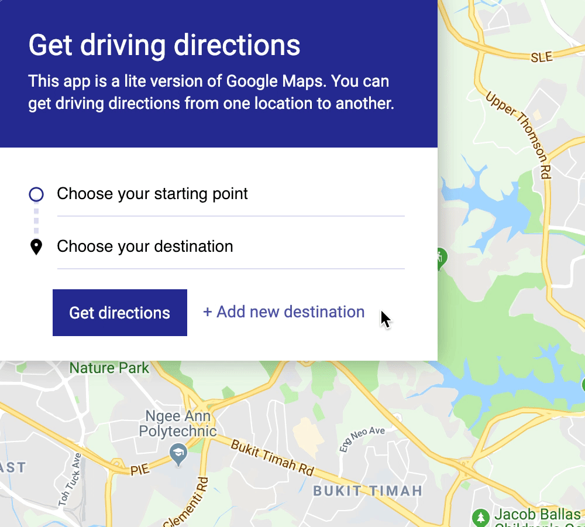

# 🛠️ Google Maps Clone: Removing stopovers

Users may want to remove stopovers from their route. Let's add this functionality.

<figure>
  
</figure>

We'll start by adding a delete button to each search box.

## The HTML

The delete button should be a `button` element because we're adding custom functionality to it. Remember to set `type` to `button` or the `submit` event will trigger.

```html
<div class="controls__search-box">
  <label class="is-invisible" for="startpoint">Starting point</label>
  <input
    type="search"
    id="startpoint"
    name="startpoint"
    placeholder="Choose your starting point"
  />
    <button type="button" class="search-box__delete-icon">
    <svg viewBox="0 0 20 20">
      <path d="M10 8.586L2.929 1.515 1.515 2.929 8.586 10l-7.071 7.071 1.414 1.414L10 11.414l7.071 7.071 1.414-1.414L11.414 10l7.071-7.071-1.414-1.414L10 8.586z"/>
    </svg>
  </button>
  <span class="search-box__icon"></span>
</div>
```

We'll add the delete button to search boxes we create with JavaScript too.

```js
newDestinationButton.addEventListener('click', evt => {
  // ...
  div.innerHTML = `
    <label class="is-invisible" for="destination-${index}">Destination ${index}</label>
    <input
      type="search"
      id="destination-${index}"
      name="destination-${index}"
      placeholder="Choose another destination ${index}"
    />
    <button type="button" class="search-box__delete-icon">
      <svg viewBox="0 0 20 20">
        <path
          d="M10 8.586L2.929 1.515 1.515 2.929 8.586 10l-7.071 7.071 1.414 1.414L10 11.414l7.071 7.071 1.414-1.414L11.414 10l7.071-7.071-1.414-1.414L10 8.586z"
        />
      </svg>
    </button>
    <span class="search-box__icon"></span>
  `
  // ...
})
```

## Showing the delete button

We are going to show/hide the delete button when a user hovers onto the search box. Here's the CSS:

```css
.search-box__delete-icon {
  display: none;
  margin-left: 0.5em;
  padding: 0;
}

.controls__search-box:hover .search-box__delete-icon {
  display: block;
}

.search-box__delete-icon svg {
  width: 1em;
}
```

<figure>
  
</figure>

## Clicking on the delete button

When a user clicks on a delete button, we want to:

1. Remove the search box attached to the delete button
2. Remove the accompanying dropdown (created by the Autocomplete Widget)

### Removing the search box

The UI can have many search boxes. Each search box has one delete button. It's not practical for us to add one event listener to each delete button. This is especially true since search boxes can be added dynamically.

We should use an event delegation pattern instead.

```js
function initMap () {
  const searchBoxParent = document.querySelector('.controls__body')

  searchBoxParent.addEventListener('click', evt => {
    // Remove search box
  })
}
```

We only want to remove the search box if a delete button was clicked. We can check for the delete button with `matches`.

```js
searchBoxParent.addEventListener('click', evt => {
  if (!evt.target.matches('.search-box__delete-icon')) return
})
```

For this to work, we have to the delete button is the target (not the `<svg>`). This means we need to add `pointer-events: none` to our css. 

```css
button * {
  pointer-events: none;
}
```

If the delete button is clicked, we want to remove the corresponding search box. We can find the search box with `closest`.

Then, we remove it with `removeChild`.

```js
searchBoxParent.addEventListener('click', evt => {
  if (!evt.target.matches('.search-box__delete-icon')) return
  const searchBox = evt.target.closest('.controls__search-box')
  searchBoxParent.removeChild(searchBox)
})
```

<figure>
  
</figure>

### Removing the accompanying dropdown

We also need to remove the dropdown that accompanies each Autocomplete Widget. We do this because of two reasons:

1. It's good practice to remove unneeded things from the DOM
2. We use an `index` to find the correct dropdown in `getFormattedAddress`. We may get a wrong address from `getFormattedAddress` if we don't remove the extra dropdown.

To find the dropdown, we need to know the `index` of the search box we're removing.

```js
searchBoxParent.addEventListener('click', evt => {
  if (!evt.target.matches('.search-box__delete-icon')) return
  const searchBox = evt.target.closest('.controls__search-box')
  const index = [...searchBoxParent.children].findIndex(el => el === searchBox)

  searchBoxParent.removeChild(searchBox)
})
```

Once we know the index, we can find the dropdown. Once we find the dropdown, we'll remove it with `removeChild`.

```js
searchBoxParent.addEventListener('click', evt => {
  if (!evt.target.matches('.search-box__delete-icon')) return
  const searchBox = evt.target.closest('.controls__search-box')
  const index = [...searchBoxParent.children].findIndex(el => el === searchBox)
  const dropdown = document.querySelectorAll('.pac-container')[index]

  searchBoxParent.removeChild(searchBox)
  dropdown.parentNode.removeChild(dropdown)
})
```

## Preventing search fields from getting deleted

This component works only if users provide at least two points of the journey:

1. The origin
2. The destination

We need to prevent users from removing these two points. We can hide the delete buttons to prevent users from removing these two points.

<figure>
  
</figure>

How can you tell whether there are two or more search boxes?

We need to use JavaScript. We can't do it with pure CSS.

From the HTML, we know there are two search boxes when there are three elements in `.controls__body`.

```html
<!-- Two search boxes when there are 3 elements in .controls__body -->
<div class="controls__body">
  <div class="controls__search-box"></div>
  <div class="controls__search-box"></div>
  <div class="controls__buttons"></div>
</div>
```

We can use `children.length` to check the number of elements in `searchBoxParent`. If the number of children elements falls to 3, we know we have only two search boxes left.

```js
searchBoxParent.addEventListener('click', evt => {
  if (searchBoxParent.children.length < 4) {
    // Prevent delete buttons from showing up
  }
})
```

The easiest way to prevent delete buttons from showing up is to add a class to `searchBoxParent`. If delete buttons can show up, we add a `can-remove-search-box` class. Otherwise, we remove it.

```js
searchBoxParent.addEventListener('click', evt => {
  if (searchBoxParent.children.length < 4) {
    searchBoxParent.classList.remove('can-remove-search-box')
  }
})
```

```css
/* Change this */
.controls__search-box:hover .search-box__delete-icon {
  display: block;
}

/* To this */
.can-remove-search-box .controls__search-box:hover .search-box__delete-icon {
  display: block;
}
```

Users should be able to delete search boxes when there are three or more search boxes. We know there will be three or more search boxes when we add a search box. This means we can add `can-remove-search-box` to `searchBoxParent` when we add a search box.

```js
newDestinationButton.addEventListener('click', evt => {
  // ...
  parent.classList.add('can-remove-search-box')
})
```

## Labels, placeholders, ids and names

Two final touches.

1. Duplicated `for`, `id`, and `name` attributes
2. Microcopy when user removes search boxes

### Duplicated `for`, `id`, and `name` attributes

Let's say there are three search boxes. The user removes the second one. Then, the user clicks on add new destination again.

If you inspect the DOM, you'll notice two search boxes with the same `for`, `id`, and `name` attributes.

<figure>
  
</figure>

Why?

When we create a new search box, we check for the number of search boxes in the UI. We used this number to differentiate the `for`, `id` and `name` attributes between search boxes.

This approach fails when search boxes can be deleted.

We should generate a unique value for `for`, `id` and `name`. We need to make sure there are no duplicates.

```js
const generateUnique = length =>
  Math.random().toString(36).substring(2, 2 + length)

// ...
newDestinationButton.addEventListener('click', evt => {
  // ...
  const unique = generateUnique(5)

  const div = document.createElement('div')
  div.classList.add('controls__search-box')
  div.innerHTML = `
    <label class="is-invisible" for="destination-${unique}">Choose destination 2</label>
    <input
      type="search"
      id="destination-${unique}"
      name="destination-${unique}"
      placeholder="Choose destination 2"
    />
    <button type="button" class="search-box__delete-icon">
      <svg viewBox="0 0 20 20">
        <path
          d="M10 8.586L2.929 1.515 1.515 2.929 8.586 10l-7.071 7.071 1.414 1.414L10 11.414l7.071 7.071 1.414-1.414L11.414 10l7.071-7.071-1.414-1.414L10 8.586z"
        />
      </svg>
    </button>
    <span class="search-box__icon"></span>
  `

  // ...
})
```

### Microcopy

Let's say a user adds a search box to the UI. We have three search boxes now.

Then, the user removes the first search box. They see two boxes that say `Choose Destination` and `Choose Destination 2`. This doesn't make sense because there's no starting point to begin with.

<figure>
  
</figure>

If the user removes the second box, they see `Choose your starting point` and `Choose Destination 2`. This doesn't make sense because there's no `destination 1`.

<figure>
  
</figure>

If there are four search boxes, and they remove the third one. They'll see `Choose your starting point`, `Choose your destination`, and `Choose destination 3`. This doesn't make sense because there's no `destination 2`.

<figure>
  
</figure>

This tiny UI text is called microcopy. We need to make sure our microcopy makes sense or users will get confused.

In this case, we can do two things to fix the microcopy.

First. When there are only 2 search boxes, the first search box must read `Choose your starting point`. The second search box must read `Choose your destination`.

We can do this by resetting `label` and `placeholder` to the correct values.

```js
searchBoxParent.addEventListener('click', evt => {
  // ...
  if (parent.children.length < 4) {
    parent.classList.remove('can-remove-search-box')

    searchBoxParent[0].querySelector('input').placeholder = 'Choose your starting point'
    searchBoxParent[0].querySelector('label').textContent = 'Choose your starting point'
    searchBoxParent[1].querySelector('input').placeholder = 'Choose your starting point'
    searchBoxParent[1].querySelector('label').textContent = 'Choose your destination'
  }
})
```

Second, when we add a search box, the label and placeholder should not show the destination number. We can say `Choose another destination`. It'll always make sense.

```js
newDestinationButton.addEventListener('click', evt => {
  // ...
  div.innerHTML = `
    <label class="is-invisible" for="destination-${unique}">Choose another destination</label>
    <input
      type="search"
      id="destination-${unique}"
      name="destination-${unique}"
      placeholder="Choose another destination"
    />
    <button type="button" class="search-box__delete-icon">
      <svg viewBox="0 0 20 20">
        <path
          d="M10 8.586L2.929 1.515 1.515 2.929 8.586 10l-7.071 7.071 1.414 1.414L10 11.414l7.071 7.071 1.414-1.414L11.414 10l7.071-7.071-1.414-1.414L10 8.586z"
        />
      </svg>
    </button>
    <span class="search-box__icon"></span>
  `
  // ...
```

We're done :)