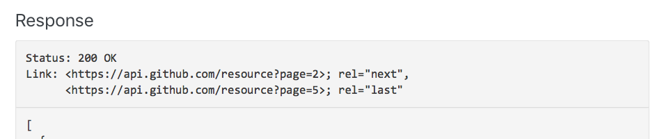
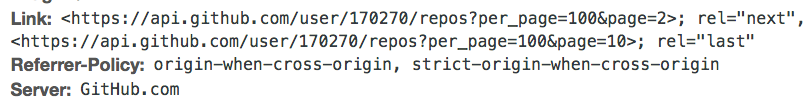
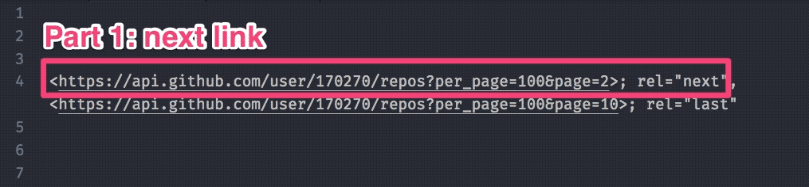
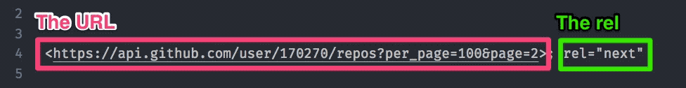
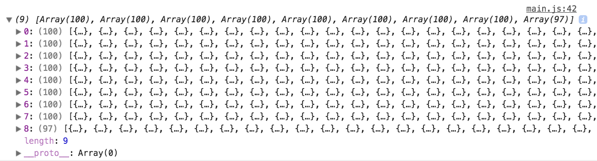
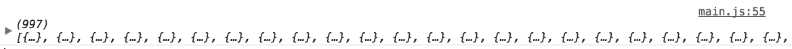

# Dealing with paginated responses (part 1)

When you request for a list of items, many APIs respond with an incomplete list. For example, Github sends you 30 repositories even if the user has more than 30 repositories.

If you want to fetch all repositories, you can do two things:

1. Increase the number of items per request
2. Make more requests

## Increasing the number of items per request

APIs may let you change the number of items you get per request. For example, Github lets you get up to 100 items. To get 100 items, you change the `per_page` query parameter.

If the user has more than 100 repositories, Github will send you the first 100 repositories. If the user has less than 100 repositories, Github will send you every repository.

For this lesson, we're going to fetch Sindre Sorhus's repositories. Sindre creates a lot of open source projects and has over 900 repositories on Github.

```js
fetch('https://api.github.com/users/sindresorhus/repos?per_page=100')
  .then(r => r.json())
  .then(repos => console.log(repos))
```

## Making more requests

APIs will tell you how to make more requests. This is usually found in the Pagination section of the API. Make sure to read it.

How you make more requests depends on the first response.

If your first response tells you the total number of pages, you can fetch the rest of the information at once. If the response doesn't tell you the total number of pages, you need to fetch page by page.

You'll learn how to fetch many pages at once in this lesson, and how to fetch page by page in the next lesson.

## Fetching many pages at once

Many APIs use a `Link` header to tell you the number of pages. Github is one example.

<figure>
  
  <figcaption></figcaption>
</figure>

When you get a paginated response from Github, you'll see the `Link` header in your dev tools.

```js
fetch('https://api.github.com/users/sindresorhus/repos?per_page=100')
```

<figure>
  
  <figcaption></figcaption>
</figure>

Your first step is to get this link header in JavaScript. We have already gone through how.

Here's how you do it with XHR.

```js
// Getting link header with XHR
request.addEventListener('load', e => {
  const linkHeader = request.getRequestHeader('link')
})
```

Here's how you do it with Fetch.

```js
fetch('some-url')
  .then(r => {
    const headers = Array.from(r.headers.entries())
      .reduce((accumulator, [header, value]) => {
        return Object.assign(accumulator, {
         [header]: value
        })
      }, {})

    return r.json()
      .then(body => ({ headers, body }))
  })
  .then(response => {
    const linkHeader = response.headers.link
  })
```

And here's how you do it with zlFetch.

```js
zlFetch('some-url')
  .then(response => {
    console.log(response.headers) // the headers
    console.log(response.body) // the body
  })
```

I'm going to show you how to use Fetch for the rest of the lesson. You can try this out with zlFetch later.

## Parsing the link header

If you examine the link header carefully, you'll see a pattern. There are two parts to this link header.

1. The link to the next page
2. The link to the last page

These two links are separated by a comma.

<figure>
  
  <figcaption aria-hidden>The link header has two parts</figcaption>
</figure>

You can also see that links to the next page (and last page) share another pattern.

1. Each link begins and ends with angled brackets.
2. The `rel` tells us which page the link leads to.

<figure>
  
  <figcaption aria-hidden>Each part of the link header has two more parts—link and rel.</figcaption>
</figure>

The two patterns let us convert the link header into a JavaScript object that looks like this:

```js
const parsedLinkHeader = {
  next: 'a link',
  last: 'another link'
}
```

To create this JavaScript object, we need to split the header into two parts. We can do this with the `split` method.

### Split

`split` lets you split a string into two or more parts. These parts will be stored as an array.

```js
const array = string.split(separator, limit)
```

`separator` is the character(s) you want to use to split the string. The character(s) used will be removed from all parts.

`limit` lets you control the number of splits to make. You won't use this much.

Here's an example:

```js
const string = 'My name is Zell'
const array = string.split(' ')

console.log(array)
// ['My', 'name', 'is', 'Zell']
```

### Splitting the link header

We want to split the link header into two parts:

1. The "next" part
2. The "last" part

<figure>
  
  <figcaption aria-hidden>The link header has two parts</figcaption>
</figure>

We can do this with `split`.

```js
const parts = linkHeader.split(',')

console.log(parts)
// [
//   <https://api.github.com/user/170270/repos?per_page=100&page=2>; rel="next",
//   <https://api.github.com/user/170270/repos?per_page=100&page=10>; rel="last"
// ]
```

Next, we want to split each part with `;` to get the `link` and `rel` for each part.

<figure>
  
  <figcaption aria-hidden>Each part of the link header has two more parts—link and rel.</figcaption>
</figure>

Here's how splitting the first part would look like:

```js
const firstPart = parts[0]
const [link, rel] = firstPart.split(';')

console.log(link) // '<https://api.github.com/user/170270/repos?per_page=100&page=2>'
console.log(rel) // ' rel="next"'
```

Next, we want to format `link` and `rel` so we get an object that uses `rel` as a property and `link` as the value, like this:

```js
const parsedLinkHeader = {
  next: 'a link',
  last: 'another link'
}
```

We can do this with the `replace` method.

### Replace

`replace` lets you replace parts of a string with other characters.

```js
const replaced = string.replace(partToBeReplaced, replacer)
```

`partToBeReplaced` is the character(s) you want to replace.

`replacer` is the characters you want to replace with.

Here's an example:

```js
const string = 'My name is Zell'
const replaced = string.replace('Zell', 'Vincy')

console.log(replaced) // My name is Vincy
```

### Formatting the first part

We'll use an empty string as the replacer to remove the angled brackets. After we remove the angled brackets, we also want to use `trim` to remove any leading and trailing spaces.

```js
const removedLeftBracket = link.replace('<', '')
const removedRightBracket = removedLeftBracket.replace('>', '')
const trimmed = removedRightBracket.trim()
```

These three steps can be combined into one.

```js
const formattedLink = link.replace('<', '').replace('>', '').trim()

console.log(formattedLink) // 'https://api.github.com/user/170270/repos?per_page=100&page=2'
```

We want to format `rel` as well.

```js
const formattedRel = rel.replace('rel="', '').replace('"', '').trim()

console.log(formattedRel) // 'next'
```

Once we've formatted `link` and `rel`, we can create an object that gives us information about the next link.

```js
const parsedFirstPart = {
  [formattedRel]: formattedLink
}

console.log(parsedFirstPart.next)
// { next: 'https://api.github.com/user/170270/repos?per_page=100&page=2' }
```

### Parse and format the second part

The process to parse and format the second part is the same as the process to parse and format the first part. I've created a function for you to speed things up.

```js
const parseLinkHeader = linkHeader => {
  const parts = linkHeader.split(',')
  return parts.reduce((acc, part) => {
    const [l, r] = part.split(';')
    const link = l.replace('<', '').replace('>', '').trim()
    const rel = r.replace('rel="', '').replace('"', '').trim()
    return Object.assign({}, acc, { [rel]: link })
  }, {})
}

// Usage
const parsedLink = parseLinkHeader(linkHeader)
```

## Getting the last page

Your parsed link header should look like this:

```js
const parsedLinkHeader = {
  'last': 'some-url?per_page=100&page=10',
  'next': 'some-url?per_page=100&page=2'
}
```

We need to parse `some-url?per_page&page=10` to get the final page. We can do this with `URLSearchParams`.

### URLSearchParams

`URLSearchParams` help us extract parameters from query strings. To use it, you provide the query string you want to parse to `new URLSearchParams`.

```js
const searchParams = new URLSearchParams('per_page=100&page=5')
```

You can search for can search for the parameter you want with the `get` method.

```js
const page = searchParams.get('page')
console.log(page) // 5
```

### Getting the last page with URLSearchParams

We need to pass the query string into `URLSearchParams`. To get the query string, we can split the link at `?`.

```js
const queryString = parsedLinkHeader.last.split('?')[1]
```

We can get the last page with the following code:

```js
const searchParams = new URLSearchParams(queryString)
const lastPage = searchParams.get('page')

console.log(lastPage) // 10
```

## Fetching many pages at once

We need to use `Promise.all` to fetch many requests at once. Since we know the last page is ten, we need to construct a `Promise.all` that looks like this:

```js
Promise.all([
  fetch('Page 2')
  fetch('Page 3')
  fetch('Page 4')
  fetch('Page 5')
  fetch('Page 6')
  fetch('Page 7')
  fetch('Page 8')
  fetch('Page 9')
  fetch('Page 10')
])
```

We can use a `for` loop to create this array or promises. This for loop can start with `index` 2 (for page 2) and end at `index` 10 (for page 10).

```js
const link = 'https://api.github.com/users/sindresorhus/repos?per_page=100'

let array = []
for (let index = 2; index <= lastPage; index++) {
  const request = fetch(`${link}&page=${index}`)
    .then(r => r.json())

  array = array.concat(request)
}

Promise.all(array)
  .then(results => { /* Do something with results*/ })
```

Note: you'll hit your rate limit quickly when you request for many pages at once. You might want to authenticate yourself so you have a larger limit.

### Flattening Promise.all results

`Promise.all` returns an array with results from each promise.

```js
Promise.all(array)
  .then(results => console.log(results))
```

<figure>
  
  <figcaption aria-hidden>Promise.all returns an array of responses. Each response is an array</figcaption>
</figure>

We don't want an array of arrays. We don't care about the pages. We want one array that contains all repositories.

```js
// What we want
const repos = [
  repo1,
  repo2,
  repo3,
  ...,
  lastRepo
]
```

We can use `reduce` to flatten the array of arrays into a single array. We covered how to do this in the lesson on reduce.

```js
Promise.all(requests)
  .then(responses => {
    const flattened = responses.reduce(
      (acc, repos) => [...acc, ...repos]
    , [])
  })
```

This gives us an array of repositories from Page 2 to the last page. We can include repositories from the first page if we set the first page as the initial value.

```js
const page1 = response.body
Promise.all(requests)
  .then(responses => {
    const flattened = responses.reduce(
      (acc, repos) => [...acc, ...repos], page1
    )
  })
```

You can return the value from `Promise.all` to work and work on the repos in the next `then` call.

```js
.then(response => {
  const page1 = response.body
  return Promise.all(requests)
    .then(responses => {
      return responses.reduce(
        (acc, repos) => [...acc, ...repos], page1
      )
    })
})
.then(repos => {
  console.log(repos)
})
```

<figure>
  
  <figcaption>We can flatten the responses to get an array of repositories</figcaption>
</figure>

## The code

Here's the code to execute everything we talked about.

```js
const link = 'https://api.github.com/users/sindresorhus/repos?per_page=100'
fetch(link)
  // Pass headers and body into the next then call
  .then(r => {
    const headers = Array.from(r.headers.entries())
      .reduce((accumulator, [header, value]) => {
        return Object.assign(accumulator, {
          [header]: value
        })
      }, {})

    return r.json()
      .then(body => ({ headers, body }))
  })
  .then(res => {
    // Parse link headers
    const parsed = parseLinkHeader(res.headers.link)

    // Gets last page
    const queryString = parsed.last.split('?')[1]
    const searchParams = new URLSearchParams(queryString)
    const lastPage = searchParams.get('page')

    // Make array of promises
    let promises = []
    for (let index = 2; index <= lastPage; index++) {
      const request = fetch(`${link}&page=${index}`)
        .then(r => r.json())
      promises = promises.concat(request)
    }

    // Fetches all pages and flattens the results
    return Promise.all(promises)
      .then(results => {
        return results.reduce(
          (acc, result) => [...acc, ...result], res.body
        )
      })
  })
  .then(repos => {
    console.log(repos)
  })
```

## An alternate way to make the array of promises

We can make the array of promises with `Array.from`. To do so, we pass an object with a `length` property. `Array.from` will treat this object as an array-like object. It will create array items and fill them with `undefined`.

```js
const promises = Array.from({length: lastPage - 1})

console.log(promises.length) // 9
console.log(promises) // [undefined, undefined, undefined, undefined, undefined, undefined, undefined, undefined, undefined,]
```

You can use `map` to create the array of fetch requests. Use the `index` value to fetch the correct page.

```js
const promises = Array.from({length: lastPage - 1})
  .map((value, index) => {
    return fetch(`https://api.github.com/users/sindresorhus/repos?per_page=100&page=${index + 2}`)
      .then(r => r.json())
  })
```

## Exercise

1. Fetch all repositories by Sindre with fetch
2. Fetch all repositories by Sindre with zlFetch
