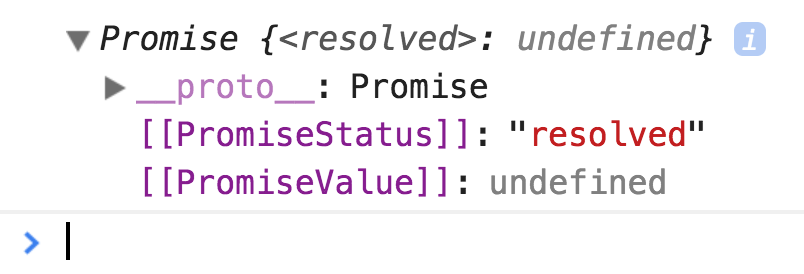
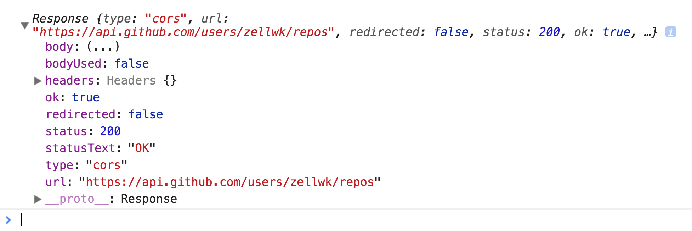
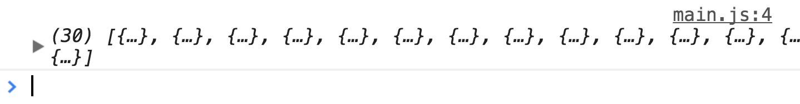
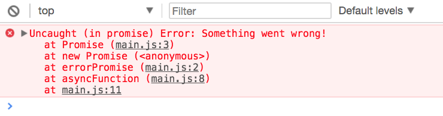
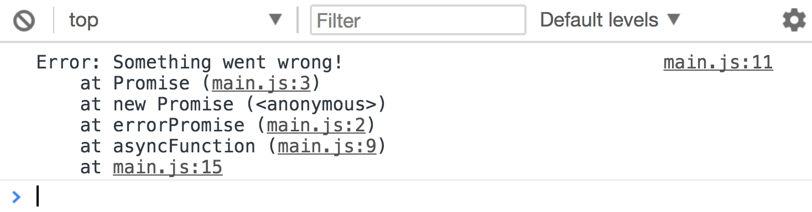

# Asynchronous functions

Asynchronous functions are functions with the `async` keyword. They let you use an `await` keyword to wait for promises to resolve. This `await` keyword helps you write asynchronous code as if they're synchronous.

## Declaring asynchronous functions

You declare asynchronous functions with an `async` keyword. The `async` keyword must be placed before the `function` keyword.

```js
// Function declaration
async function anAsyncFunction () { /* Do stuff here */ }

// Function expression
const anAsyncFunction = async function () { /* Do stuff here */ }
```

You can also create asynchronous functions with the arrow function syntax. In this case, you write `async` before the arguments.

```js
const anAsyncFunction = async (arg1, arg2) => { /* Do stuff here */ }
```

## Using asynchronous functions

You can call asynchronous functions like normal functions. You write the name of the function, followed by parenthesis.

```js
// Calling an async function
anAsyncFunction()
```

Asynchronous functions always return a promise.

```js
const anAsyncFunction = async _ => { /* Do stuff here */ }

const promise = anAsyncFunction()
console.log(promise)
```

<figure>
  
  <figcaption>Asynchronous functions always return a promise</figcaption>
</figure>

This means you can treat asynchronous functions like promises. If you return a value from an asynchronous function, you can use that value in the next `then` call.

```js
const asyncSum = async (num1, num2) => num1 + num2

asyncSum(5, 10)
  .then(result => console.log(result)) // 15
```

## The await keyword

The `await` keyword is where the magic happens. It waits for a promise to resolve before doing anything else.

Let's say we send a Fetch request for a list of my repositories. This is how we write the Fetch request if we use promises.

```js
fetch('https://api.github.com/users/zellwk/repos')
  .then(response => response.json())
  .then(repos => console.log(repos))
```

We can perform the same Fetch request with asynchronous functions. To do so, we first create an asynchronous function.

We can place the promise we wrote in the asynchronous function. It'll work as before.

```js
const fetchRepo = async link => {
  return fetch(link)
    .then(response => response.json())
    .then(repos => console.log(repos))
}

fetchRepo('https://api.github.com/users/zellwk/repos')
```

We know Fetch returns a promise. We can use `await` to wait for Fetch's promise to resolve in an asynchronous function. We can declare a variable to hold this resolved value.

```js
const fetchRepo = async link => {
  const response = await fetch(link)
}

fetchRepo('https://api.github.com/users/zellwk/repos')
```

Try logging `response` into the console. You'll see that it's the same `response` that is returned from a Fetch request.

<figure>
  
  <figcaption>`await` waits for the promise to resolve</figcaption>
</figure>

We need to call `response.json` to get the repos. Since `response.json` returns a promise, we can also use `await` to wait for this promise to resolve.

```js
const fetchRepo = async link => {
  const response = await fetch(link)
  const repos = await response.json()
}

fetchRepo('https://api.github.com/users/zellwk/repos')
```

If you log `repos`, you'll see a list of 30 repositories.

<figure>
  
  <figcaption>`await` waits for the promise to resolve once more</figcaption>
</figure>

## Handling errors

`await` waits for the promise to resolve. It only waits for the `then` call. This means won't handle errors in the asynchronous function we wrote.

Let's see this in action. Say we `await` for a promise that always throws an error, `errorPromise`. You'll see an "uncaught" error in your console.

```js
const errorPromise = _ => {
  return new Promise((resolve, reject) => {
    reject(Error('Something went wrong!'))
  })
}

const asyncFunction = async _ => {
  const res = await errorPromise()
}

asyncFunction()
```

<figure>
  
  <figcaption>An uncaught error</figcaption>
</figure>

We get this "uncaught" error message because we didn't catch the error in our code. The console caught it for us, and it tells us that we need to catch the error.

We can use a `try/catch` block to handle errors in an asynchronous function. A `try/catch` block looks like this:

```js
try {
  // Try something that may cause an error
} catch (error) {
  // Do something if an error occurs
}
```

When you `await` a promise, you don't know the promise will resolve or reject. This means `await` should always go into the `try` block.

If an error occurs, the error will be caught by the `catch` block.

```js
const asyncFunction = async _ => {
  try {
    const res = await errorPromise()
  } catch(error) {
    console.log(error) // Something went wrong!
  }
}
```

<figure>
  
  <figcaption>Error was caught and logged</figcaption>
</figure>

The `try` block works like this: it executes code from top to bottom, left to right (like normal). When it encounters an error, it skips the rest of the code and goes straight to the `catch` block.

```js
const asyncFunction = async _ => {
  try {
    const res = await errorPromise()
    console.log('JavaScript will never read this line of code!')
  } catch(error) {
    console.log(error) // Something went wrong!
  }
}
```

## The promise catcher

Error handling with `try/catch` works, but it makes the code harder to digest. We don't want to write `try/catch` blocks for every asynchronous function we write. It would be horrible!

```js
const asyncFunction1 = async (arg1, arg2) {
  try {
    // Do something
  } catch (e) {
    // Catch the error
  }
}

const asyncFunction2 = async (arg1, arg2) {
  try {
    // Do something
  } catch (e) {
    // Catch the error
  }
}

const asyncFunction3 = async (arg1, arg2) {
  try {
    // Do something
  } catch (e) {
    // Catch the error
  }
}
```

There's a way to make error catching easier.

We know asynchronous functions return promises. This means we can catch errors with a `catch` call after calling an asynchronous function. With the `catch` call in place, we no longer need to write `try/catch` blocks.

```js
const asyncFunction = async _ => {
  const res = await errorPromise()
}

asyncFunction()
  .catch(e => console.log(e)) // Error: Something went wrong!
```

## Exercise

1. Use an asynchronous function to fetch a list of your repositories
2. Handle async errors with the try/catch block.
3. Handle async errors with a Promise `catch` call.
