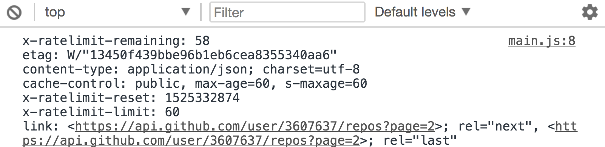
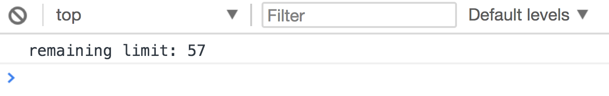
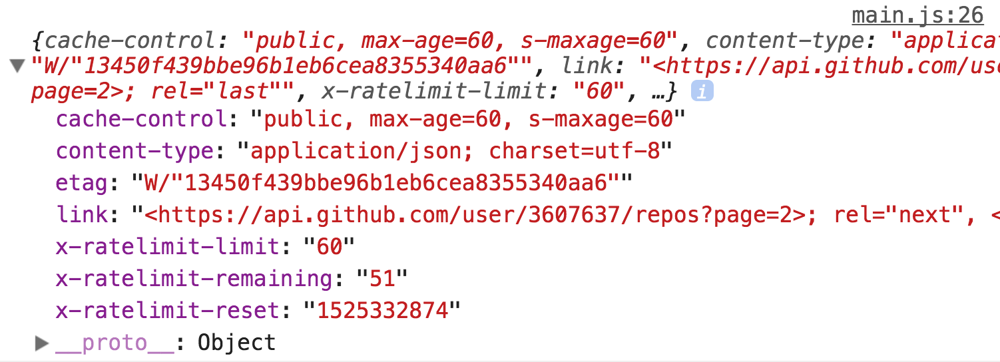

# Using response headers

You only need the response headers in JavaScript. The process of getting these headers is different with XHR and Fetch.

Regardless of the method used, you will only see a subset of the response headers. This is because browsers don't let us access unsafe headers.

Here's a list of safe headers.

1. Cache-Control
2. Content-Language
3. Content-Type
4. Expires
5. Last-Modified
6. Pragma

We can only access unsafe headers if the server lets us. You can see the allowed headers through the `Access-Control-Expose-Headers` header (view this in the devtools).

## Getting headers with XHR

You can use `getAllResponseHeaders` to get all response headers. These headers will be in the form of a string (which is not very usable).

```js
request.addEventListener('load', e => {
  const headers = request.getAllResponseHeaders()
  console.log(headers)
})
```

<figure>
  
  <figcaption>XHR getResponseHeaders method formats headers in a raw string</figcaption>
</figure>

To get one specific header, you can use `getResponseHeader`.

```js
request.addEventListener('load', e => {
  const remaining = request.getResponseHeader('x-ratelimit-remaining')
  console.log(`remaining limit: ${remaining}`)
})
```

<figure>
  
  <figcaption aria-hidden>Logging the x-ratelimit-remaining header</figcaption>
</figure>

## Getting headers with Fetch

You can find the response headers in the `headers` object. You can use the `get` method to get one header.

```js
fetch('https://api.github.com/users/zellwk/repos')
  .then(r => {
    const remaining = r.headers.get('x-ratelimit-remaining')
    console.log(`remaining limit: ${remaining}`)
  })
```

<figure>
  
  <figcaption aria-hidden>Logging the x-ratelimit-remaining header</figcaption>
</figure>

To get all response headers, you need to loop through the Headers object. You can do so with the `entries` method and a loop of your choice.

```js
fetch('https://api.github.com/users/zellwk/repos')
  .then(r => {
    const headers = {}
    for (let [header, value] of r.headers.entries()) {
      headers[header] = value
    }
  })
```

If you're savvy with `reduce`, you can do this.

```js
const headers = Array.from(r.headers.entries())
  .reduce((accumulator, [header, value]) => {
    return Object.assign(accumulator, { [header]: value })
  }, {})
```

Here's a log of our headers object.

<figure>
  
  <figcaption aria-hidden>The headers object we created</figcaption>
</figure>

### Using headers and body with Fetch

Headers and body information are found in different `then` calls. This becomes a problem if you want to use both headers and body at the same time. You'll see a use case in the next lesson.

```js
fetch('some-url')
  .then(r => {
    // You can see headers here
    return r.json()
  })
  .then(body => {
    // You can see the body here
  })
```

To get the headers into the second `then` call, we need return it together with the body. To parse the body, we need to call the `json` method.

Since `json` returns a promise. One way to get both header and body information together is through `Promise.all`.

```js
fetch('https://api.github.com/users/zellwk/repos')
  .then(r => {
    const headers = Array.from(r.headers.entries())
      .reduce((accumulator, [header, value]) => {
        return Object.assign({}, accumulator, {
          [header]: value
        })
      }, {})

    return Promise.all([
      headers,
      r.json()
    ])
  })
  .then(([headers, body]) => {
    console.log(headers) // the headers
    console.log(body) // the body
  })
```

This approach can feel weird because we're sending an array into the second `then` call.

A better approach is to call the `json` method first, then send headers over in the `then` call after the `json` gets parsed successfully. We can even provide more information if we want.

```js
fetch('https://api.github.com/users/zellwk/repos')
  .then(r => {
    const headers = Array.from(r.headers.entries())
      .reduce((accumulator, [header, value]) => {
        return Object.assign({}, accumulator, {
         [header]: value
        })
      }, {})

    return r.json()
      .then(body => ({ headers, body }))
  })
  .then(response => {
    console.log(response.headers) // the headers
    console.log(response.body) // the body
  })
```

## Exercise

1. Request for a list of my repositories from Github
2. Get the `link` header with XHR
3. Get the `link` header with Fetch
4. Get the `link` header in the second `then` call when you use Fetch.

