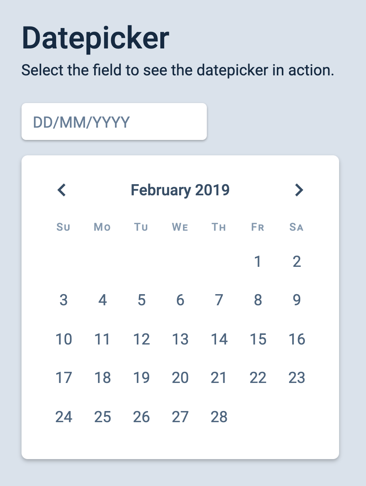
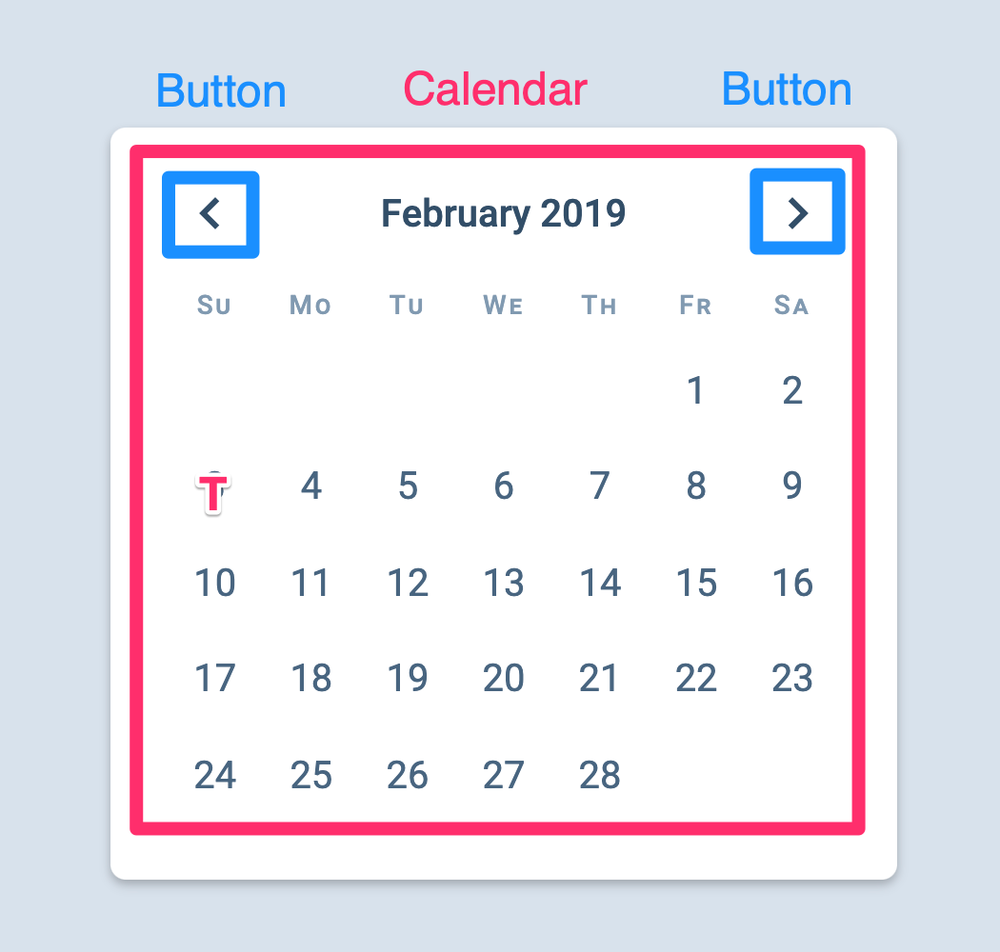
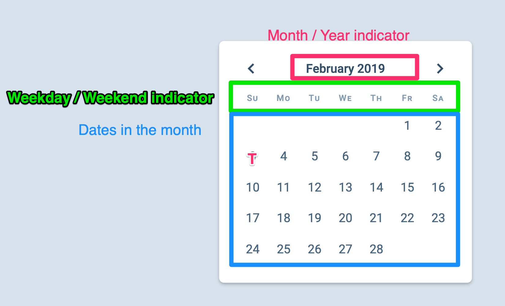
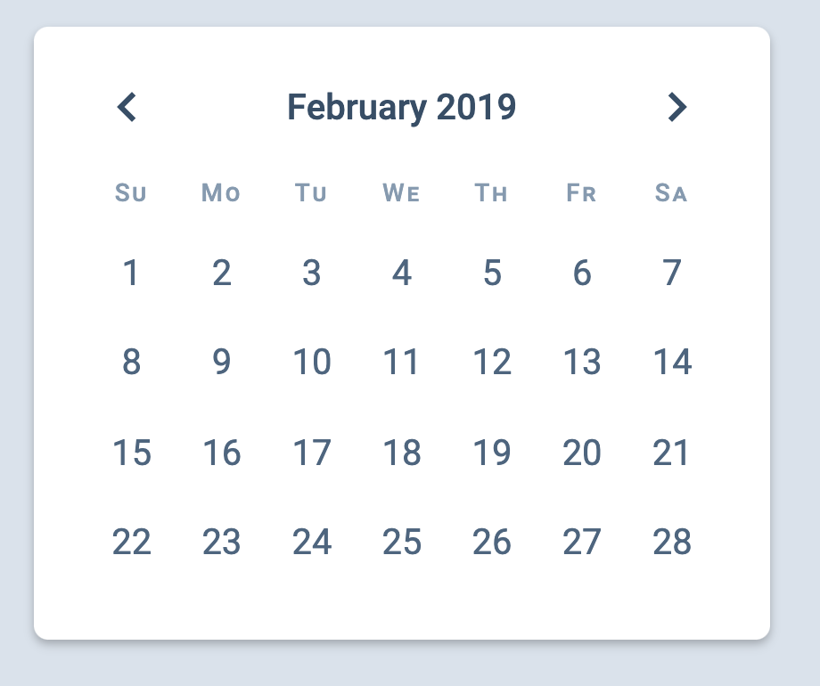

# 🔨 Datepicker: Initial HTML and CSS

We're going to build a datepicker together in this series. It looks like this: 

<figure>
  
</figure>

As usual, you'll find the starter file for this Datepicker in the components directory, under `components/12.datepicker/01.starter`. 

Like all the components we built before, we will begin the datepicker by writing the required HTML and CSS.  

## Building the HTML

There are two parts to a datepicker: 

1. A input field
2. The datepicker itself 

When a user clicks on the input field, the datepicker should pop out. (We're going to make the popping-out portion last because it's really annoying to debug something that's hidden). 

<figure>
  
</figure>

The HTML for his input field will be the same as all other input fields you've seen so far: 

```html
<form>
  <div class="input">
    <label for="start-date">Select Date</label>
    <input
      type="text"
      id="start-date"
      name="start-date"
      placeholder="DD/MM/YYYY"
    />
  </div>
</form>
```

Note: We put the label and input inside a `<div>` to make them easier to position and style. 

## HTML for the Datepicker

The datepicker itself can be split into a two sections: 

1. The buttons section
2. The calendar section

<figure>
  
</figure>

A valid HTML structure can be: 

```html
<div class="datepicker">
  <div class="datepicker__buttons"><!-- ... --></div>
  <div class="datepicker__calendar"><!-- ... --></div>
</div>
```

`.datepicker__buttons` should contain two buttons—one for the previous button and one for the next button. Each button contains an SVG. 

```html
<div class="datepicker__buttons">
  <button class="datepicker__previous"> <!-- SVG Icon --> </button>
  <button class="datepicker__next"> <!-- SVG Icon --> </button>
</div>
```

## HTML for the calendar section

The calendar contains three parts: 

1. The current month/year indicator. 
2. The weekday/weekend indicator.
3. The date grid

<figure>
  
</figure>

```html
<div class="datepicker__calendar">
  <div class="datepicker__monthIndicator"> <!-- ... --> </div>
  <div class="datepicker__dayOfWeek"> <!-- ... --> </div>
  <div class="datepicker__date-grid"> <!-- ... --> </div>
</div>
```

### Month indicator

The month indicator tells us the month and year shown on the datepicker.

```html
<div class="datepicker__monthIndicator">February 2019</div>
```

Since we're showing a date-time value, we should use the  `<time>` element. The correct HTML for the month indicator should look like this: 

```html
<div class="datepicker__monthIndicator">
  <time datetime="2019-02"> February 2019 </time> 
</div>
```

Note: The `<time>` element's `datetime` property can be written many different [formats][1]. For this datepicker, we'll use two of these formats: 

1. year-month: (like `2019-02`)
2. year-month-date: (like `2019-02-03`)

### The weekday/weekend indicator.

The weekday/weekend indicator tells us the day of the week. There should be seven divs since there are seven days in a week. 

```html
<div class="datepicker__dayOfWeek">
  <div>Su</div>
  <div>Mo</div>
  <div>Tu</div>
  <div>We</div>
  <div>Th</div>
  <div>Fr</div>
  <div>Sa</div>
</div>
```

### The date grid

For this Datepicker component, we will build the date grid with CSS Grid. Since we're using CSS Grid, we can create one `<button>` for each date in the month. 

We will also include a `<time>` element inside each button. 

```html
<div class="datepicker__date-grid">
  <button>
    <time datetime="2019-02-01">1</time>
  </button>
  <button>
    <time datetime="2019-02-02">2</time>
  </button>
  <button>
    <time datetime="2019-02-03">3</time>
  </button>
  <!-- ... --> 
  <button>
    <time datetime="2019-02-28">28</time>
  </button>
</div>
```

## CSS for the date grid

First, we need to set `display` to `grid`. Since there are seven days in a week, we can create a grid with seven columns. 

```css
.datepicker__date-grid {
  display: grid;
  grid-template-columns: repeat(7, 1fr);
}
```

The weekday/weekend indicator should show the seven days in the week. This means it can share the same CSS Grid as `.datepicker__date-grid`. 

Ideally, we'll want to use CSS Grid's subgrid feature here, but that isn't well supported yet. So, we'll create another CSS Grid fro `.datepicker__dayOfWeek`. 

```css
.datepicker__dayOfWeek,
.datepicker__date-grid {
  display: grid;
  grid-template-columns: repeat(7, 1fr);
}
```

At this point, your grid should look like this: 

<figure>
  
</figure>

This works. But we have one problem: 1st February 2019 is a Friday. Not a Sunday. This calendar is wrong. To fix this, we need to change the position of the first day. We can do so with `grid-columns`. 

- If we set grid columns to 2, the CSS Grid will start on Monday. 
- If we set `grid-column` to 3, CSS Grid starts on Tuesday
- If `grid-column` is 4, 1st day is Wednesday

Since the first day should be Friday, it we know the `grid-column` must be set to 6. 

```css
.datepicker__date-grid button:first-child {
  grid-column: 6;
}
```

<figure>
  
</figure>

We're now done with the initial HTML and CSS. We can write JavaScript next 🤓. 

[1]:	https://css-tricks.com/time-element/