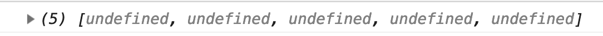

# 🔨 Datepicker: Refactoring the calendar

We created many variables in the previous lesson. Two of them resulted in a variable-name collision (`year2` and `month2`). We had to use `year2` because `year` was already taken. We also had to use `month2` because `month` was already taken.

This is a sign you should refactor your code. And that's what we're going to in this lesson.

## A function for getting month indicator text

We used the following code to get the month indicator text in the previous lesson:

```js
const year = date.getFullYear()
const month = date.getMonth()
const monthName = getMonthName(month)
const monthIndicatorText = `${monthName} ${year}`
```

The purpose of this code isn't clear (in the code itself). We can make the purpose of the code clearer by wrapping them in a function. This will clean up the variables in the global scope at the same time.

```js
const getMonthIndicatorText = (date) => {
  const year = date.getFullYear()
  const month = date.getMonth()
  const monthName = getMonthName(month)
  return `${monthName} ${year}`
}
```

And we can use `getMonthIndicatorText` like this:

```js
const datepicker = document.querySelector('.datepicker')
const monthIndicatorDiv = datepicker.querySelector('.datepicker__monthIndicator')
const monthIndicatorTimeElement = monthIndicatorDiv.firstElementCHild

monthIndicatorTimeElement.textContent = getMonthIndicatorText(date)
```

## A function for getting month indicator datetime attribute

We used the following code to write the `datetime` attribute for the `<time>` element.

```js
const datetimeMonth = month + 1 < 10
  ? `0${month + 1}`
  : month + 1
const datetimeValue = `${year}-${datetimeMonth}`
monthIndicatorTimeElement.setAttribute('datetime', datetimeValue)
```

We want to put this into a function as well. Let's call it `getMonthIndicatorDatetime`. 

```js
const getMonthIndicatorDatetime = date => {
  const year = date.getFullYear()
  const month = date.getMonth()
  const datetimeMonth = month + 1 < 10
    ? `0${month + 1}`
    : month + 1
  return `${year}-${datetimeMonth}`
}
```

Using it: 

```js
monthIndicatorTimeElement.setAttribute('datetime', getMonthIndicatorDatetime(date))
```

## Functions for creating the date grid

This is the code we used to create the date grid:

```js
// Creating the grid
const firstDayOfMonth = new Date(date.setDate(1)).getDay()
const year2 = date.getFullYear()
const month2 = date.getMonth()
const lastDayInMonth = new Date(year2, month2 + 1, 0)
const daysInMonth = lastDayInMonth.getDate()

let dategridHTML = ''
const datetimeMonth2 = month2 + 1 < 10
  ? `0${month2 + 1}`
  : month2 + 1

for (let day = 1; day < daysInMonth; day++) {
  const datetimeDay = day + 1 < 10
    ? `0${day}`
    : day

  const firstDayStyle = day === 1
    ? `--firstDayOfMonth: ${firstDayOfMonth + 1}"`
    : ''

  dategridHTML += `<button style="${firstDayStyle}">
    <time datetime="${year}-${datetimeMonth2}-${datetimeDay}">${day}</time>
  </button>
  `
}

const dategrid = document.querySelector('.datepicker__date-grid')
dategrid.innerHTML = dategridHTML
```

We can make a few improvements here:

1. Create a function to get the first day of the month
2. Create a function to get the last day of the month
3. Create a function to get the `dategridHTML`

### A function to get the first day of the month

Here's what we wrote have now:

```js
const firstDayOfMonth = new Date(date.setDate(1)).getDay()
```

This code is imperative. We have to read the right hand side of the code to understand what it is about (even though the variable name already made sense).

We can wrap the right hand side into a function so we don't care what needs to happen to get the first day of the month.

```js
const getFirstDayOfMonth = date => {
  const firstDateOfMonth = new Date(date.setDate(1))
  return firstDateOfMonth.getDay()
}
```

Since we have a function to get the first day of the month, we don't need the `firstDayOfMonth` variable anymore. We can use the function directly in the `for` loop:

```js
for (let day = 1; day < daysInMonth; day++) {
  // ...
  const firstDayStyle = day === 1
    ? `--firstDayOfMonth: ${getFirstDayOfMonth(date) + 1}"`
    : ''
  // ...
}
```

### A function for getting the number of days in a month

We created four variables to get the number of days in a month:

```js
const year2 = date.getFullYear()
const month2 = date.getMonth()
const lastDayInMonth = new Date(year2, month2 + 1, 0)
const daysInMonth = lastDayInMonth.getDate()
```

There's no need for these variables if we put them in a function.

```js
const getNumDaysInMonth = date => {
  const year = date.getFullYear()
  const month = date.getMonth()
  const lastDayInMonth = new Date(year, month + 1, 0)
  return lastDayInMonth.getDate()
}
```

We can use `getNumDaysInMonth` directly in the for loop:

```js
for (let day = 1; day < getNumDaysInMonth(date); day++) {
  // ...
}
```

### A function to get `dategridHTML`

We will create the date grid many times when we add functionality for the previous and next buttons later. This is why it makes sense to create a function to get the HTML for the date grid. 

First, we can wrap everything we wrote the function. 

Note: We have to create the `year` and `month` variables in `getDategridHTML` because we removed them from the global scope.

```js
const getDategridHTML = date => {
  const year = date.getFullYear()
  const month = date.getMonth()
  let dategridHTML = ''

  const datetimeMonth = month + 1 < 10
    ? `0${month + 1}`
    : month + 1

  for (let day = 1; day < getNumDaysInMonth(date); day++) {
    const datetimeDay = day + 1 < 10
      ? `0${day}`
      : day

    const firstDayStyle = day === 1
      ? `--firstDayOfMonth: ${getFirstDayOfMonth(date) + 1}"`
      : ''

    dategridHTML += `<button style="${firstDayStyle}">
      <time datetime="${year}-${datetimeMonth}-${datetimeDay}">${day}</time>
    </button>
    `
  }

  return dategridHTML
}
```

And we can use `getDategridHTML ` this way:

```js
const dategrid = document.querySelector('.datepicker__dates')
dategrid.innerHTML = getDategridHTML(date)
```

What we have so far is alright. But I'm not a fan of using a `for` loop. So we're going to refactor it as well.

## Refactoring the for loop

We want to generate HTML from a list of numbers. Here, we can use the `map` and `join` technique.

```js
const html = someArray
  .map(/* Create each element in the HTML*/)
  .join('')
```

To use `map` we need to create an array with the correct number of elements. We can do this with `Array.from`.

```js
const emptyArray = Array.from({length: 5})
console.log(emptyArray) // An array with 5 undefined entries
```

<figure>
  
</figure>

The refactored for loop should look somewhat like this:

```js
const getDategridHTML = date => {
  // ...
  const dategridHTML = Array.from({ length: getNumDaysInMonth(date) })
    .map(/* ... */)
    .join('')
  return dategridHTML
}
```

Or, a slightly shorter version:

```js
const getDategridHTML = date => {
  // ...
  return Array.from({ length: getNumDaysInMonth(date) })
    .map(/* ... */)
    .join('')
}
```

In the `map` function, we need to use the `index` value to get the day of the month.

```js
const getDategridHTML = date => {
  // ...
  return Array.from({ length: getNumDaysInMonth(date) })
    .map((value, index) => {
       const day = index + 1
       // ...
     })
    .join('')
}
```

We can then copy the rest of the `for` loop we've written into tho `map` function.

```js
const getDategridHTML = date => {
  // ...

  return Array.from({ length: getNumDaysInMonth(date) })
    .map((value, index) => {
      const day = index + 1
      const datetimeDay = day + 1 < 10
        ? `0${day}`
        : day

      const firstDayStyle = day === 1
        ? `--firstDayOfMonth: ${getFirstDayOfMonth(date) + 1}"`
        : ''

      return `
        <button style="${firstDayStyle}">
          <time datetime="${year}-${datetimeMonth}-${datetimeDay}">${day}</time>
        </button>
      `
    })
    .join('')
}
```

## Pad Start 

When we create the datetime attribute, we had to use the following code to get a leading zero for the month and day values: 

```js
const datetimeMonth = month + 1 < 10
    ? `0${month + 1}`
    : month + 1

const datetimeDay = day + 1 < 10
    ? `0${day}`
    : day
```

This ternary operator can be hard to read. 

There's a simpler way: We can use a method called `padStart` to create the leading zero. `padStart` allows you to add a string to another string. 

It takes in two values: 

```js
padStart(targetLength, padString)
```

- `targetLength` is the number of characters you wish to have. If you want to have a 2-digit string, you use `2`. 
- `padString` lets you decide the value to use to create the string. It defaults to space (`' '`). 

Here's an example:

```js
const withoutLeading = '2'
const withLeading = withouLeading.padStart(2, '0')
console.log(withLeading) // 02
```

This means we can create `datetimeMonth` and `datetimeDay` like this: 

```js
const datetimeMonth = `${month + 1}`.padStart(2, '0')
const datetimeDay = `${day}`.padStart(2, '0')
```

This makes our code slightly neater: 

```js
const getMonthIndicatorDatetime = date => {
  // ...
  const datetimeMonth = `${month + 1}`.padStart(2, '0')
  return `${year}-${datetimeMonth}`
}
```

```js
const getDategridHTML = date => {
  // ...
  const datetimeMonth = `${month + 1}`.padStart(2, '0')

  return Array.from({ length: getNumDaysInMonth(date) })
    .map((value, index) => {
      const day = index + 1
      const datetimeDay = `${day}`.padStart(2, '0')
      // ...
    })
    .join('')
}
```
