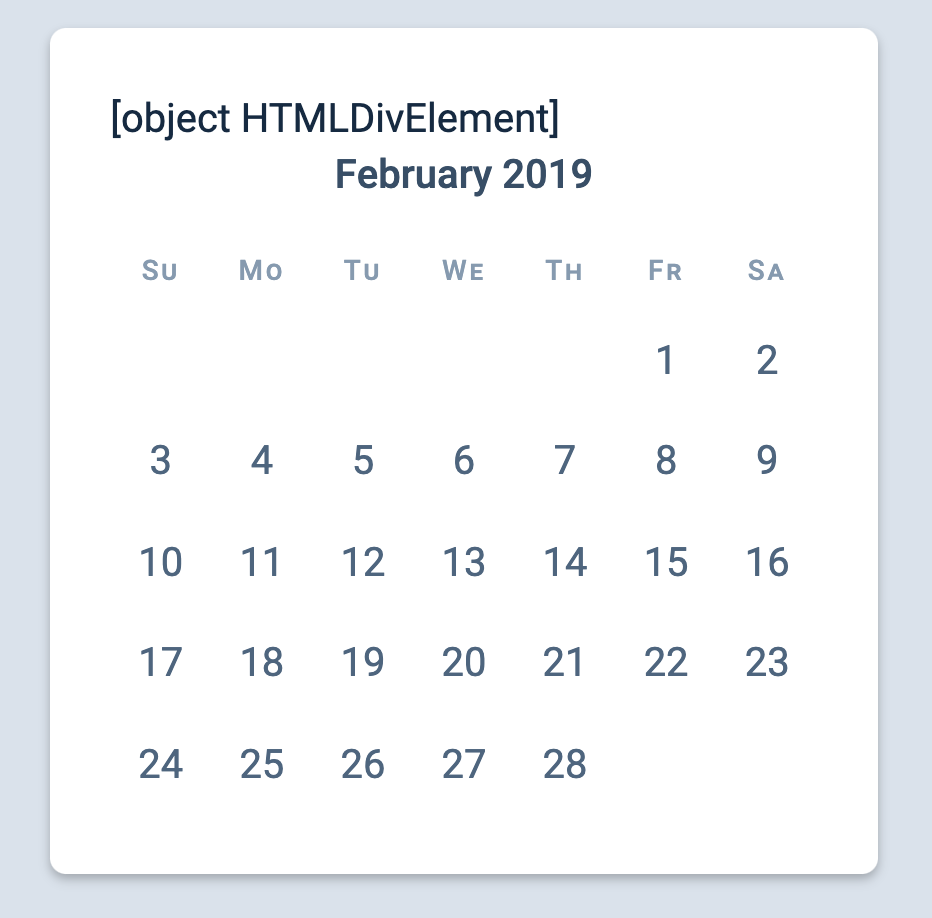
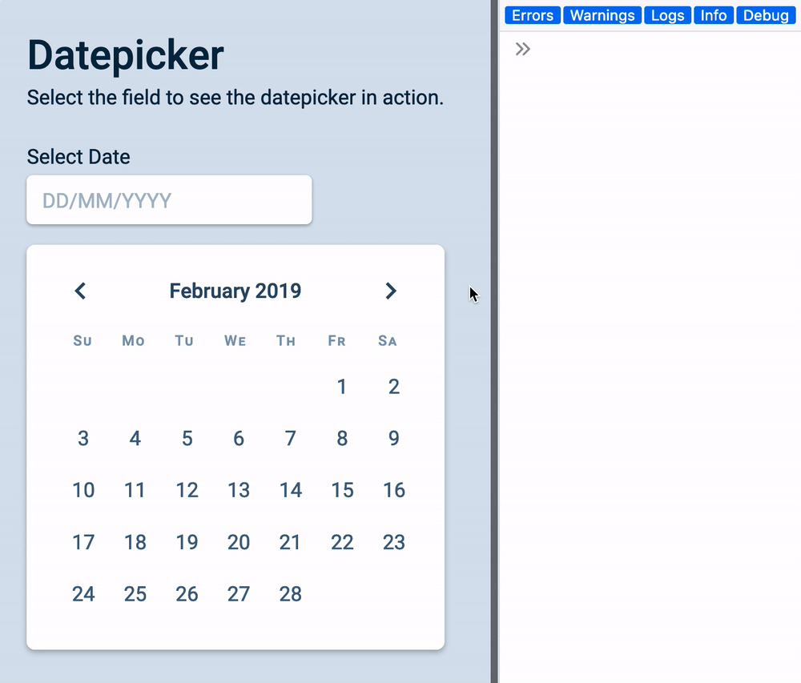
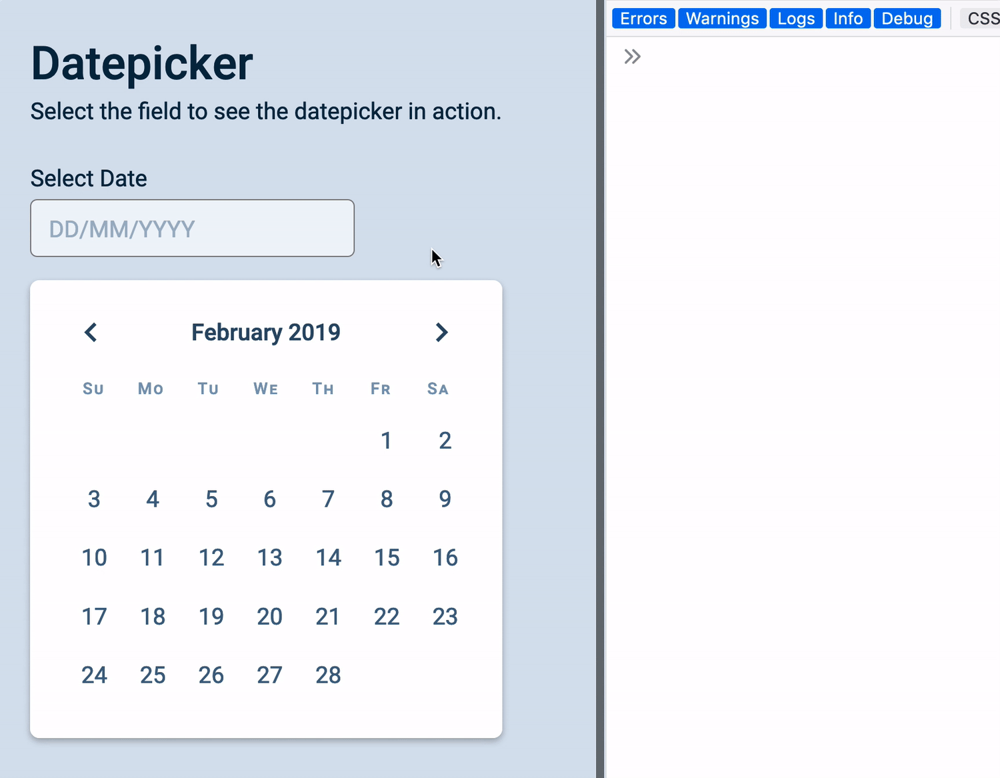

# 🔨 Datepicker: Previous and Next buttons

Now you have a Datepicker that works for every month of the year. The next thing we want is to allow users to switch months with the previous and next buttons.

For the buttons to work, we have to add an event listener to `.datepicker__buttons`.

## Where to add the event listener

If you recall from the previous lesson, we created the Datepicker this way:

```js
// Create datepicker
const date = new Date(2019, 1)
const datepicker = createDatepicker(date)

// Add the datepicker to DOM
const form = document.querySelector('form')
form.appendChild(datepicker)
```

It wouldn't make sense to ask users to create event listeners for the datepicker. This means the event listener should be part of `createDatepicker`.

## Adding the event listener

Event listeners can only be added to Elements. From this line of thought, you might want to convert the `buttons` variable in `createDatepicker` into an element. (You can do this with `document.createElement`).

```js
// Note: This doesn't work
const buttons = document.createElement('div')
buttons.classList.add('datepicker__buttons')
buttons.innerHTML = `
  <button class="datepicker__previous"> ... </button>
  <button class="datepicker__next"> ... </button>
`

const calendar = `
  <div class="datepicker__calendar"> <!-- ... --> </div>
`

datepicker.innerHTML = `
  ${buttons}
  ${calendar}
`

buttons.addEventListener('click', ev => {
  console.log(ev)
})
```

The code above doesn't work because you're trying to include a HTML object into `innerHTML`. `innerHTML` only takes in strings, not objects. It'll turn out like this:

<figure></figure>

If you want to convert `buttons` into an Element, you need to use methods like `appendChild`. You also have to convert `calendar` into an Element (which is more code than necessary).

```js
// This works, but it's not the easiest method out there

// Create the buttons
const buttons = document.createElement('div')
buttons.classList.add('datepicker__buttons')
buttons.innerHTML = `
  <button class="datepicker__previous"> ... </button>
  <button class="datepicker__next"> ... </button>
`

// Create the calendar
const calendar = document.createElement('div')

// Append the buttons and calendar
datepicker.appendChild(buttons)
datepicker.appendChild(calendar)

buttons.addEventListener('click', ev => {
  console.log(ev)
})
```

<figure></figure>

The easiest way to select `.datepicker__buttons` with `querySelector` after it is added to `datepicker`.

```js
// This works
const buttons = `<div class="datepicker__buttons"> ... </div>`
const calendar = `<div class="datepicker__calendar"> ... </div>`

datepicker.innerHTML = `
  ${buttons}
  ${calendar}
`

const buttonsDiv = datepicker.querySelector('.datepicker__buttons')

buttonsDiv.addEventListener('click', evt => {
  console.log(evt.target)
})
```

<figure></figure>

At this point, you may want to change `buttons` to `buttonsHTML` and `calendar` to `calendarHTML`. This change makes our variables describe what they contain. They make our code easier to parse and understand.

```js
const buttonsHTML = `...`
const calendarHTML = `...`

datepicker.innerHTML = `
  ${buttonsHTML}
  ${calendarHTML}
`
```

## The next button

When a user clicks on the next button, we want to show next month's calendar. This means we must:

1. Change the `year/month` indicator
2. Create a new date grid

Before we do anything else, let's make sure our event listener works only if the user clicks on the previous or next buttons.

```css
/* Note: I won't talk about pointer-events from this point onwards. I will include this code in `reset.css` instead. */
button * {
  pointer-events: none;
}
```

```js
buttonsDiv.addEventListener('click', ev => {
  if (!ev.target.matches('button')) return

  // Left button click
  if (ev.target.matches('.datepicker__prev')) {
    // Show previous month
  }

  // Right button click
  if (ev.target.matches('.datepicker__next')) {
    // Show next month
  }
})
```

## Changing the year/month indicator

First, we need to know what's the current year/month that's displayed on the datepicker. We can get this information from the year/month indicator's `datetime` attribute.

```js
if (ev.target.matches('.datepicker__next')) {
  const timeEl = datepicker.querySelector('.datepicker__monthIndicator').firstElementChild
  const datetime = timeEl.getAttribute('datetime')
  console.log(datetime)
}
```

<figure></figure>

We need to create a `Date` from this `datetime` attribute. The simplest way is to use `new Date` with this `datetime` attribute.

```js
if (ev.target.matches('.datepicker__next')) {
  const timeEl = datepicker.querySelector('.datepicker__monthIndicator').firstElementChild
  const datetime = timeEl.getAttribute('datetime')
  const currentDate = new Date(datetime)
  console.log(currentDate)
}
```

<figure></figure>

Note: **You should never create a date with Date Strings**. Even though this seems to work now, something will break later. (I tried, and something broke). Always create dates with the arguments method. I wrote about this back in "[Setting a specific date][1]".

### Creating a date with arguments

We want to create a new date with the arguments approach, and we want to get the arguments from the `datetime` value. Let's create a function called` createDateFromDatetime` to do this.

```js
const createDateFromDatetime = datetime => {
  // ...
}
```

We know the datetime attribute has the format: `YYYY-MM` (like `2019-02`). If we split the `datetime` by `-`, we can get the `year` and `month` easily.

```js
const createDateFromDatetime = datetime => {
  const [year, month] = datetime.split('-')
  console.log(year) // 2019
  console.log(month) // 02
}

createDateFromDatetime('2019-02')
```

`year` and `month` values are string. If we want to use the arguments approach to create a new Date, we need to convert them into numbers. We can `map` through the array created by `split`, and run `parseInt` through each number.

```js
const createDateFromDatetime = datetime => {
  const [year, month] = datetime.split('-')
    .map(num => parseInt(num))

  console.log(year) // 2019
  console.log(month) // 02
}

createDateFromDatetime('2019-02')
```

To create a date from Datetime, we can pass the `year` and `month` arguments into `new Date`.

```js
const createDateFromDatetime = datetime => {
  const [year, month] = datetime.split('-')
    .map(num => parseInt(num))

  // Remember, `month` needs to be zero-indexed
  return new Date(year, month - 1)
}
```

Using it:

```js
if (ev.target.matches('.datepicker__next')) {
  // ...
  const currentDate = createDateFromDatetime(datetime)
}
```

### Back to changing the year/month indicator

Once we know the current date, we can use its value to create a `Date` for the next month.

```js
if (ev.target.matches('.datepicker__next')) {
  // ...
  const currentDate = new Date(datetime)
  const year = currentDate.getFullYear()
  const month = currentDate.getMonth()
  const nextMonth = new Date(year, month + 1)
}
```

Once we know what's the next month, we can change the year/month indicator's `textContent` and `datetime` attributes. We do so by feeding `nextMonth` into `getMonthIndicatorText` and `getMonthIndicatorDatetime`.

```js
if (ev.target.matches('.datepicker__next')) {
  // ...
  const currentDate = new Date(datetime)
  const year = currentDate.getFullYear()
  const month = currentDate.getMonth()
  const nextMonth = new Date(year, month + 1)

  // Update Text Content and datetime attribute
  timeEl.textContent = getMonthIndicatorText(nextMonth)
  timeEl.setAttribute('datetime', getMonthIndicatorDatetime(nextMonth))
}
```

<figure></figure>

## Updating the date grid

It's simple to update the date grid once you know what's the next month. You feed `nextMonth` into `createDategridHTML` and the correct HTML will generated magically.

```js
if (ev.target.matches('.datepicker__next')) {
  // ...
  // ...
  const dategrid = datepicker.querySelector('.datepicker__date-grid')
  dategrid.innerHTML = getDategridHTML(nextMonth)
}
```

(It's not so much of a magic at this point yeah? 😉).

<figure></figure>

## The previous button

You should be able to write the code for the previous button on your own. It uses the same concept.

```js
if (ev.target.matches('.datepicker__previous')) {
  // 1. Find out what's the currently selected month
  const timeEl = datepicker.querySelector('.datepicker__monthIndicator').firstElementChild
  const datetime = timeEl.getAttribute('datetime')
  const currentDate = createDateFromDatetime(datetime)

  // 2. Figure out what's the previous month
  const year = currentDate.getFullYear()
  const month = currentDate.getMonth()
  const previousMonth = new Date(year, month - 1)

  // 3. Update the year/month indicator
  timeEl.textContent = getMonthIndicatorText(previousMonth)
  timeEl.setAttribute('datetime', getMonthIndicatorDatetime(previousMonth))

  // // 4. Update the date-grid
  const dategrid = datepicker.querySelector('.datepicker__date-grid')
  dategrid.innerHTML = getDategridHTML(previousMonth)
}
```

<figure></figure>

## Cleaning up the code

There are many duplicated variables in the code for the previous month and the code for the next month. We can group these duplicated variables in the same scope before the `if` statement.

```js
buttonsDiv.addEventListener('click', ev => {
  if (!ev.target.matches('button')) return

  const timeEl = datepicker.querySelector('.datepicker__monthIndicator').firstElementChild
  const datetime = timeEl.getAttribute('datetime')
  const currentDate = createDateFromDatetime(datetime)
  const year = currentDate.getFullYear()
  const month = currentDate.getMonth()
})
```

Here's what's left in the previous button section

```js
if (ev.target.matches('.datepicker__previous')) {
  const previousMonth = new Date(year, month - 1)

  // Update the year/month indicator
  timeEl.textContent = getMonthIndicatorText(nextMonth)
    timeEl.setAttribute('datetime', getMonthIndicatorDatetime(nextMonth))

  // Change the date grid
  const dategrid = datepicker.querySelector('.datepicker__date-grid')
  dategrid.innerHTML = getDategridHTML(nextMonth)
}

```

And here's what's left in the next button's section

```js
if (ev.target.matches('.datepicker__next')) {
  const nextMonth = new Date(year, month + 1)

  // Update the year/month indicator
  timeEl.textContent = getMonthIndicatorText(nextMonth)
    timeEl.setAttribute('datetime', getMonthIndicatorDatetime(nextMonth))

  // Change the date grid
  const dategrid = datepicker.querySelector('.datepicker__date-grid')
  dategrid.innerHTML = getDategridHTML(nextMonth)
}

```

Notice the similarity between the two sets of code? We only need to get the correct month (either `nextMonth` or `previousMonth`) and these two buttons can share all their code.

The refactored version becomes:

```js
buttonsDiv.addEventListener('click', ev => {
  // ...
  const targetMonth = ev.target.matches('.datepicker__previous')
    ? new Date(year, month - 1)
    : new Date(year, month + 1)

  // Update the year/month indicator
  timeEl.textContent = getMonthIndicatorText(targetMonth)
    timeEl.setAttribute('datetime', getMonthIndicatorDatetime(targetMonth))

  // Change the date grid
  const dategrid = datepicker.querySelector('.datepicker__date-grid')
  dategrid.innerHTML = getDategridHTML(targetMonth)
})
```

That's it!

[1]:	./set-date.md
