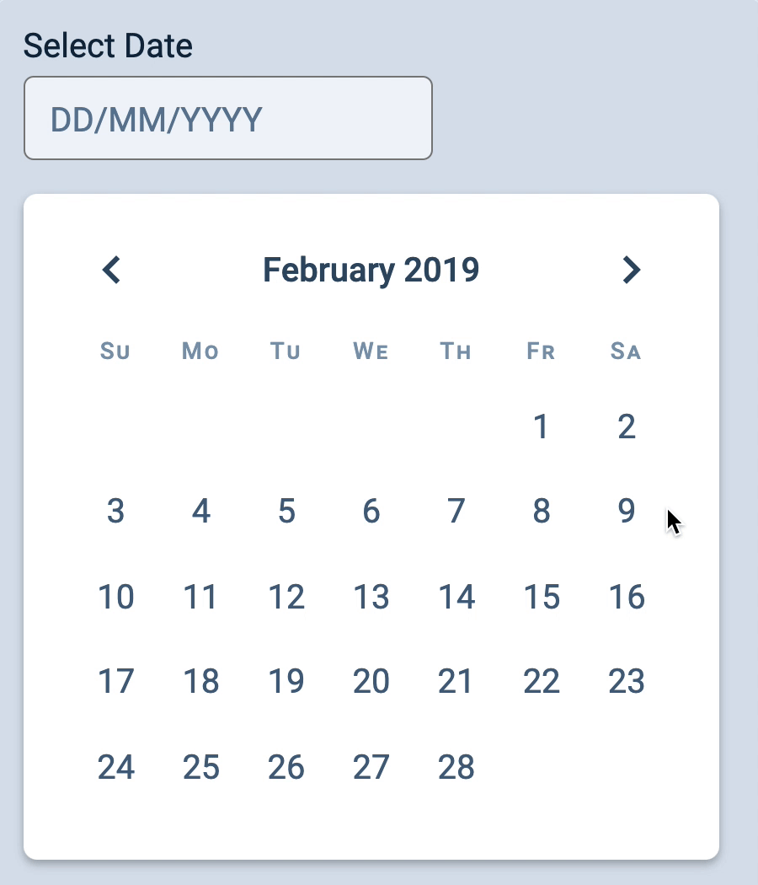
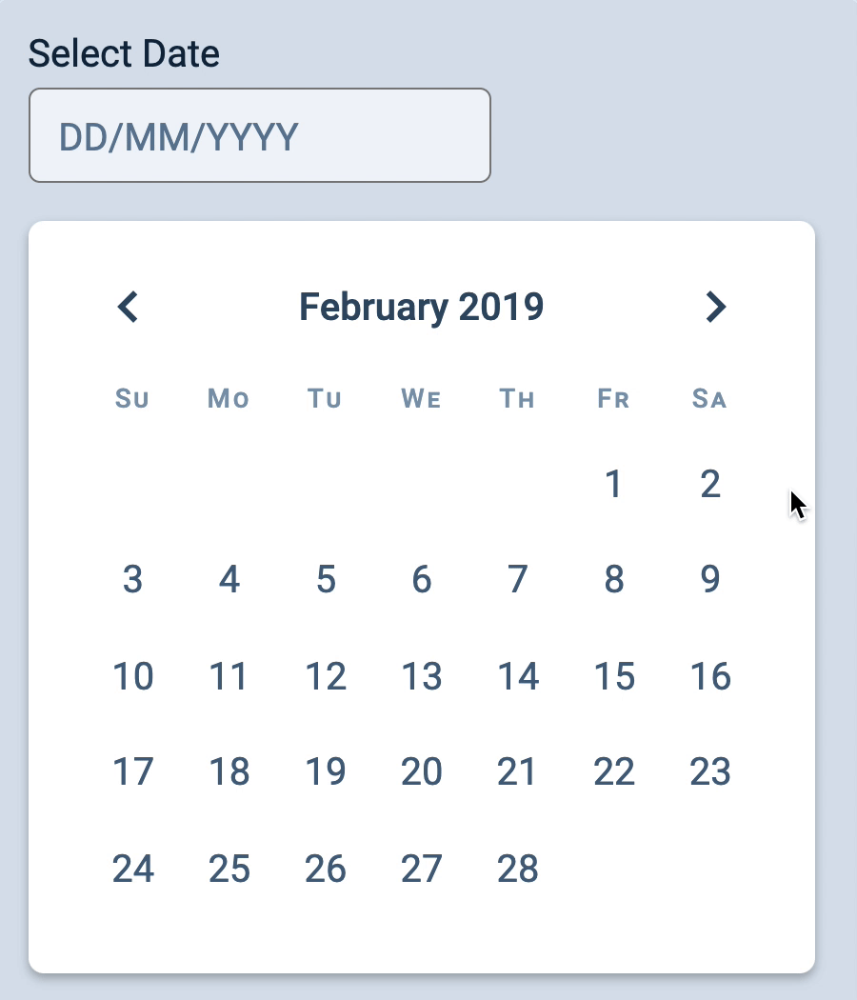

# 🔨 Datepicker: Selecting a date

We want to do two things when a user clicks a date in the date grid.

1. Highlight the selected date on the datepicker
2. Format and output the selected date to the input field

<figure></figure>

But before we do any of these, we have to add an event listener to the date grid.

## Adding an event listener to the date grid

Like the event listener for `.datepicker__buttons`, the event listener for the date grid should also be written inside `createDatepicker`. (Why?).

```js
const createDatepicker = date => {
  // ...

  const dategrid = datepicker.querySelector('.datepicker__date-grid')
  dategrid.addEventListener('click', ev => {
    // Do something here
  })

  // ...
}
```

We only want to do the two things I mentioned if the user clicks on a date (which lives in a `<button>` element).

```js
dategrid.addEventListener('click', ev => {
  if (!ev.target.matches('button')) return
})
```

## Showing the selected date on the datepicker

We can add the `is-selected` class on the clicked `<button>` to highlight the selected date. Before we do this, we want to remove all other highlights by removing `is-selected` from every button.

```js
dategrid.addEventListener('click', ev => {
  if (!ev.target.matches('button')) return
  const button = ev.target
  const buttons = [...button.parentElement.children]

  // Showing the selected class
  buttons.forEach(button => button.classList.remove('is-selected')
  button.classList.add('is-selected)
})
```

<figure></figure>

## Show the selected date in the input field

To show the selected date on the input field, we have to:

1. Figure out what date is selected.
2. Formate the date for output
3. Display the formatted date in the input field

### Figure out what date is selected.

Each date in the dategrid contains a `<time>` element. You can look at the `datetime` attribute to get the selected date.

```js
dategrid.addEventListener('click', ev => {
  // ...

  const timeEl = button.firstElementChild
  const datetime = timeEl.getAttribute('datetime')
  const selectedDate = new Date(datetime)
  console.log(selectedDate)
})
```

<figure></figure>

### Formatting the output

The output requires a date that's written in `DD/MM/YYYY` format. We can get the `day`, `month`, and `year` with `getDate`, `getMonth` and `getFullYear` respectively.

```js
dategrid.addEventListener('click', ev => {
  // ...

  const year = selectedDate.getFullYear()
  const month = selectedDate.getMonth() + 1
  const day = selectedDate.getDate()
})
```

And we can create the required output format with a template string.

```js
dategrid.addEventListener('click', ev => {
  // ...

  const formatted = `${day}/${month}/${year}`
  console.log(formatted)
})
```

<figure></figure>

Pay attention to the console. Notice how we need a `DD/MM/YYYY` format, but `formatted` gives you a number that leaves out a leading zero?

We need to add a leading zero to `day` and `month` if their current values are lesser than 10.

```js
dategrid.addEventListener('click', ev => {
  // ...

  const year = selectedDate.getFullYear()
  let month = selectedDate.getMonth() + 1
  let day = selectedDate.getDate()

  if (month < 10) month = '0' + month
  if (day < 10) day = '0' + day

  const formatted = `${day}/${month}/${year}`
  console.log(formatted)
})
```

<figure></figure>

### Displaying the formatted date

`createDatepicker` needs to where to display the formatted date. This means `createDatepicker` needs to take in a second argument—the input field. Let's call this argument `dateField`.

```js
const createDatepicker = (date, dateField) => {
  // ...
}

// Creating the Datepicker
const date = new Date(2019, 1)
const form = document.querySelector('form')
const input = form.querySelector('input')
const datepicker = createDatepicker(date, input)

// ...
```

To output the date, we simply change `dateField`'s value.

```js
dategrid.addEventListener('click', ev => {
  // ...

  const formatted = `${day}/${month}/${year}`
  dateField.value = formatted
})
```

When a user clicks a date, `dateField` will get updated now. But we have a problem. The browser would refresh every time the user clicks a date. This clears away the value in the input field.

<figure></figure>

This happens because the datepicker is in a `<form>` element. When a `<button>` is in a form element, its default behavior is to submit the `<form>`.

There are two ways to prevent this behavior:

1. Use `event.preventDefault` in the event listener (not recommended).
2. Set the button's `type` attribute to `button` (recommended).

We'll use option 2.

When you set a button's `type` attribute to `button`, it removes any default behavior associated with the button. This means you don't have to call `event.preventDefault` at all.

```js
// Adds `type="button" to the button element
const getDategridHTML = date => {
  // ...
  return Array.from({ length: getNumDaysInMonth(date) })
    .map((value, index) => {
      // ...
      return `
        <button type="button" style="${firstDayStyle}">
          <time datetime="${year}-${month + 1}-${day}">${day}</time>
        </button>
      `
    })
    .join('')
}
```

On the same train of thought, we also want to add `type="button"` to the previous and next buttons.

```js
const buttonsHTML = `
  <div class="datepicker__buttons">
    <button type="button" class="datepicker__previous"> ... </button>
    <button type="button" class="datepicker__next"> ...  </button>
  </div>
`
```

And we're done!

<figure></figure>
