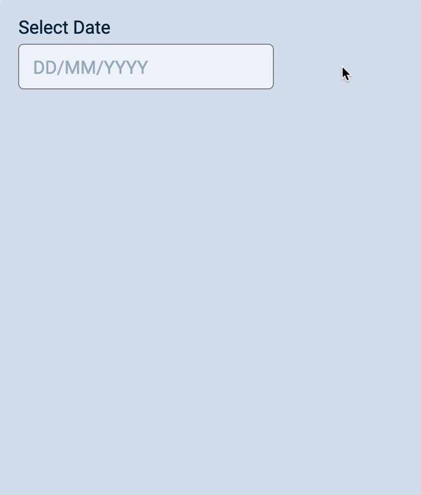
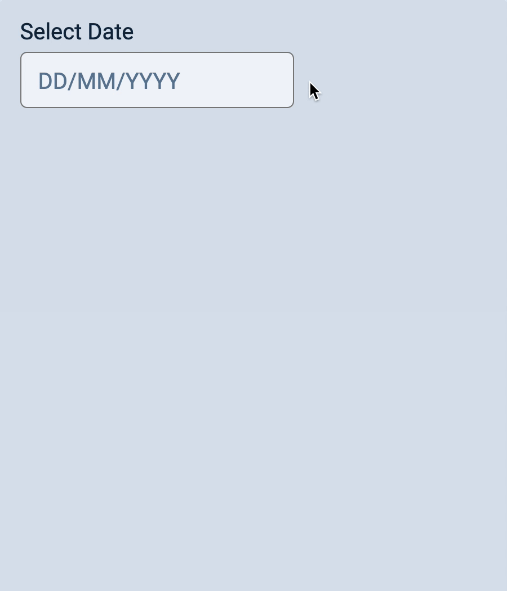
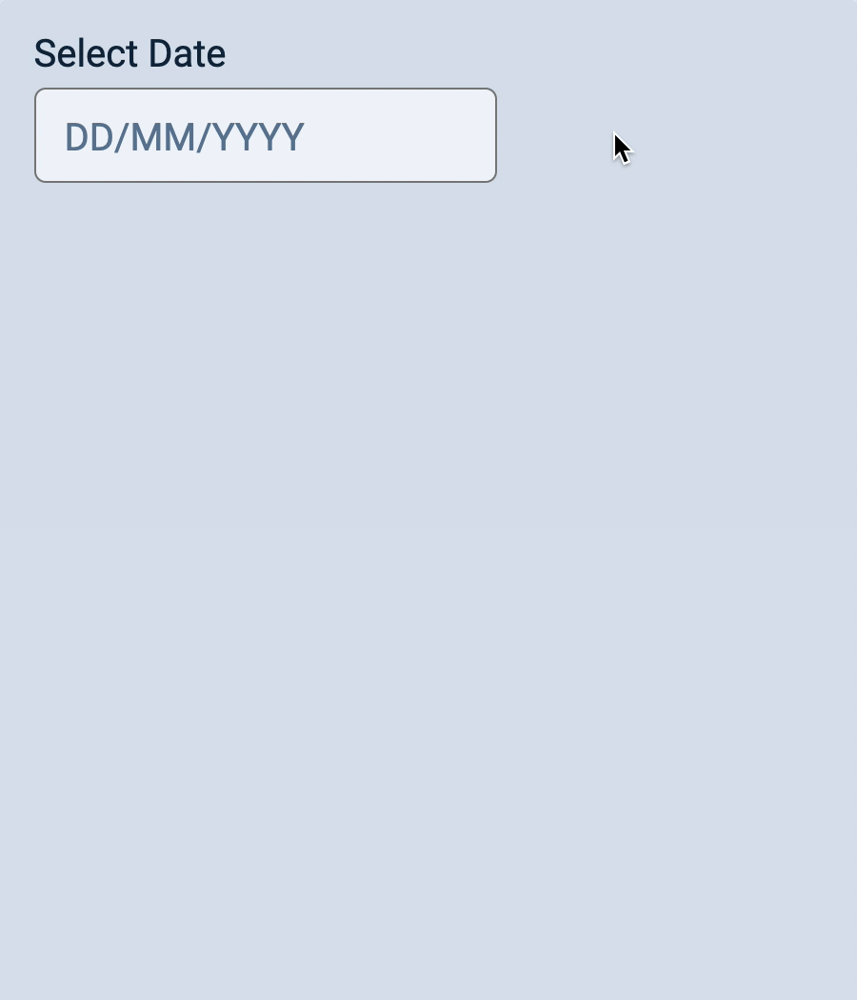

# 🔨 Datepicker: Showing and hiding the datepicker

Let's put our final touches on the datepicker. We're going to add the show/hide functionality. (The datepicker should be hidden at first. We only want to show the datepicker when a user clicks on the input). 

<figure></figure>

## Hiding the datepicker

We can add a `hidden` attribute to the datepicker to hide it. 

```js
const createDatepicker = (date, dateField) => {
  const datepicker = document.createElement('div')
  datepicker.classList.add('datepicker')
  datepicker.setAttribute('hidden', true)
  
  // ...
})
```

Note: This works because I set `[hidden]` to `display: none !important` in `reset.css`. I explain I do this in [this article][1]. 

```css
/* In reset.css */
[hidden] {
  display: none !important;
}
```

## Showing the datepicker

We want to show the datepicker when the user clicks on the input. Here, we can listen for a `click` event on the input. 

```js
dateField.addEventListener('click', ev => {
  datepicker.removeAttribute('hidden')
})
```

<figure></figure>

If the user clicks away from the input, we want to hide the datepicker. Here, you can listen to a `click` event on the document. 

To hide the datepicker, we need to add the `hidden` attribute. 

```js
document.addEventListener('click', ev => {
  if (ev.target !== dateField) {
    datepicker.setAttribute('hidden', true)
  }
})
```

<figure></figure>

If the user clicks on the the datepicker, we want to keep the datepicker open. Right now, the Datepicker closes. This is not ideal. 

<figure></figure>

If we want to keep the datepicker open, we need to make sure the `document` event listener does not close the datepicker if the `event.target` is inside the datepicker. 

We can do this with `closest`.

```js
document.addEventListener('click', ev => {
  if (ev.target.closest('.datepicker')) return
  if (ev.target !== dateField) {
    datepicker.setAttribute('hidden', true)
  }
})
```

<figure></figure>

Finally, when a user clicks on the datepicker, we want the input to remain in an active state (with white background). This tells users the input is tied with the datepicker.

To do this, we will add `.datepicker-opened` to the input whenever the datepicker is opened. 

```js
document.addEventListener('click', ev => {
  if (ev.target.closest('.datepicker')) return
  if (ev.target !== dateField) {
    datepicker.setAttribute('hidden', true)
    dateField.classList.add('datepicker-opened)
  }
})
```

We also have to remove `.datepicker-opened` from the input when the datepicker is closed. 

```js
dateField.addEventListener('click', ev => {
  datepicker.removeAttribute('hidden')
  dateField.classList.remove('datepicker-opened')
})
```

<figure></figure>

## showDatepicker and hideDatepicker

To open a datepicker, we need two lines of code: 

```js
datepicker.removeAttribute('hidden')
dateField.classList.remove('datepicker-opened')
```

It's easier to read and understand these two lines of code if we wrap them in a function. Let's call it `showDatepicker`. 

```js
const showDatepicker = (datepicker, dateField) => {
  datepicker.removeAttribute('hidden')
  dateField.classList.remove('datepicker-opened')
}
```

We used these two lines of code to hide the datepicker: 

```js
datepicker.setAttribute('hidden', true)
dateField.classList.add('datepicker-opened)
```

We can put these two lines into a function called `hideDatepicker`.

```js
const hideDatepicker = (datepicker, dateField) => {
  datepicker.setAttribute('hidden', true)
  dateField.classList.add('datepicker-opened)
}
```

Here's what you need to change to use `showDatepicker` and `hideDatepicker`: 

```js
const createDatepicker = (date, dateField) => {
  // When creating the datepicker 
  // ...
  hideDatepicker(datepicker, dateField)
  
  // When adding event listeners
  // ... 
    
  dateField.addEventListener('click', ev => {
    showDatepicker(datepicker, dateField)
  })

  document.addEventListener('click', ev => {
    if (ev.target.closest('.datepicker')) return
    if (ev.target !== dateField) {
      hideDatepicker(datepicker, dateField)
    }
  })
}
```

## A small cleanup

We wrote two event listeners for showing and hiding the datepicker so far: 

```js
  dateField.addEventListener('click', ev => {
    showDatepicker(datepicker, dateField)
  })

  document.addEventListener('click', ev => {
    if (ev.target.closest('.datepicker')) return
    if (ev.target !== dateField) {
      hideDatepicker(datepicker, dateField)
    }
  })
```

If you look closely, we can actually show the datepicker in the `document` event listener. If we do this, there's no need for the `dateField` event listener. 

```js
document.addEventListener('click', ev => {
  if (ev.target.closest('.datepicker')) return
  if (ev.target === dateField) {
    showDatepicker(datepicker, dateField)
  } else {
    hideDatepicker(datepicker, dateField)
  }
})
```

## Extracting the event listener
  
As before, we don't want to worry about the implementation (until we need it). To do so, we're going to extract the callback into a named function. 

```js
const showHideDatepicker = (ev, datepicker, dateField) => {
  if (ev.target.closest('.datepicker')) return
  if (ev.target === dateField) {
    showDatepicker(datepicker, dateField)
  } else {
    hideDatepicker(datepicker, dateField)
  }
}
```

Using it: 

```js
document.addEventListener('click', ev => {
  showHideDatepicker(ev, datepicker, dateField)
})
```

And we're done!

[1]:	https://zellwk.com/blog/css-reset/#the-hidden-attribute "Zell's personal CSS reset"