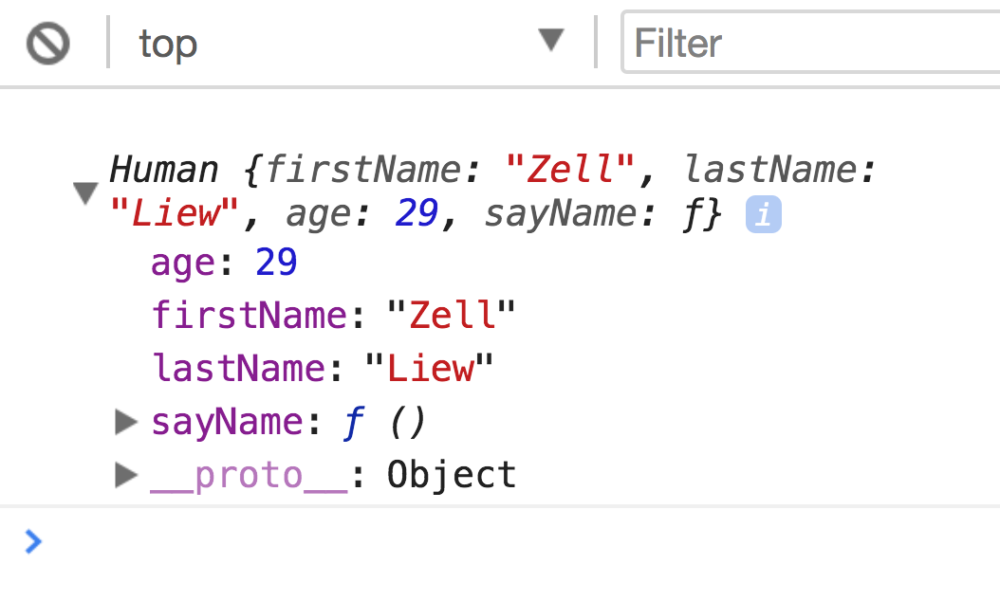
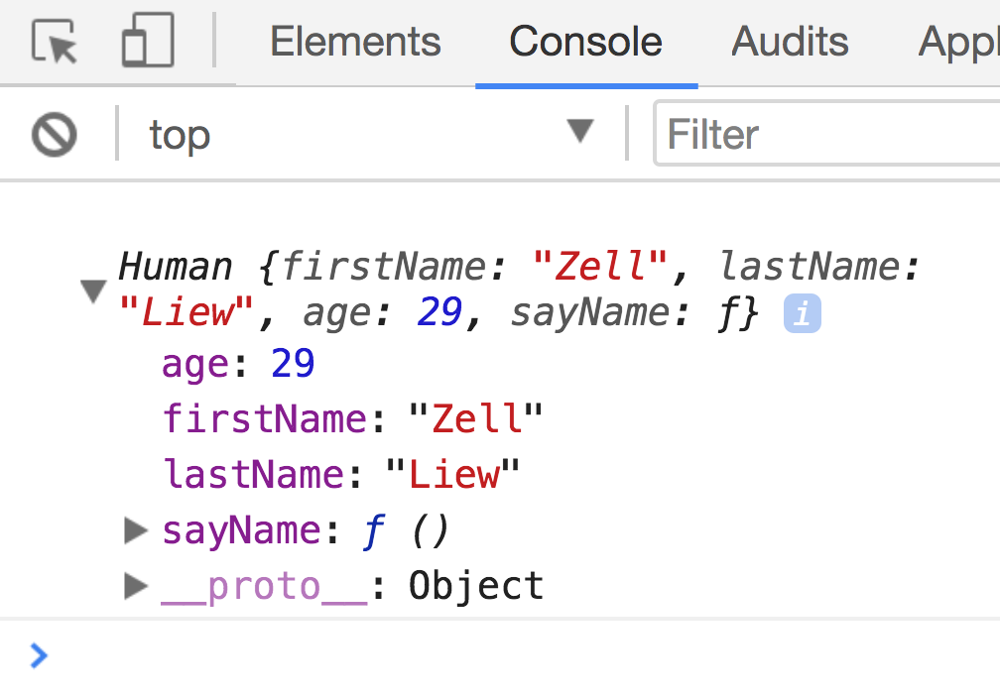

# What is Object Oriented Programming?

Object Oriented Programming is a popular style of programming that has taken root in JavaScript since the beginning.

It's so deeply rooted in JavaScript that many of JavaScript's native functions and methods are written in the Object Oriented style; you'll also find many popular libraries written in the Object Oriented style as well.

**If you already have prior experience with Object Oriented Programming in another language, please put aside the knowledge you know, and read through the entire module with a beginner's mind.**

This is because Object Oriented Programming in JavaScript is very different from Object Oriented Programming in other languages. If you hold on to your current ideas, you might make Object Oriented Programming in JavaScript exponentially more difficult than it really is.

Now, let's begin by finding out what Object Oriented Programming is about.

## Object Oriented Programming is about creating individual objects from a common object.

Object Oriented Programming is about two things:

1. Creating individual objects from a common object
2. Inheritance

For this lesson, we'll only cover the first part. We'll look at inheritance in a later lesson.

## Creating objects from a common object

You know that objects in JavaScript have properties and methods. These objects can resemble real-life things (even people!).

Let's say you're trying to construct a `Human` object in JavaScript. A human has a `firstName`, `lastName` and an `age`. You could add these attributes as properties in JavaScript.

In addition to having names and an age, humans can also say their name. You can write a `sayName` function as a method in the `human` object as well.

```js
const human = {
  firstName: 'Zell'
  lastName: 'Liew',
  age: 29,
  sayName () {
    console.log(`I am Zell Liew`)
  }
}

human.sayName() // I am Zell Liew
```

Since humans are very similar to each other, you can also create another human object with the same properties (`firstName`, `lastName`, `age` ) and methods (`sayName`).

Unfortunately, you can't call it `human` anymore because the `human` variable is taken up.

```js
const human2 = {
  firstName: 'Vincy',
  lastName: 'Zhang',
  age: 28,
  sayName () {
    console.log(`I am Vincy Zhang`)
  }
}
```

Assuming you know Vincy, it's kinda weird to call her `human2`, right? You'll probably call her Vincy instead.

So, instead of naming our human objects `human` and `human2`, it makes more sense to call them `Zell` and `Vincy`.

```js
const Zell = {
  firstName: 'Zell'
  lastName: 'Liew',
  age: 29,
  sayName () {
    console.log(`I am Zell Liew`)
  }
}

const Vincy = {
  firstName: 'Vincy',
  lastName: 'Zhang',
  age: 28,
  sayName () {
    console.log(`I am Vincy Zhang`)
  }
}
```

There we go, much better.

Now, what if you need to create another `human`? You'll have to write the entire object from scratch, but that's a chore, right? You're copy-pasting so much code!

```js
// Ugh, creating another human by writing a new object
const Nicolas = {
  firstName: 'Nicolas',
  lastName: 'Tze',
  age: 30,
  sayName () {
    console.log(`I am Nicolas Tze`)
  }
}
```

At this point, you'll notice that humans are slightly different from each other—we have different names, and we're of different ages.

But we do have a common point—we can say our name.

Wouldn't it be nice if you could create a function (or something similar) that makes individuals?

Turns out, you can! All you need to do is to construct a function that has a `this` keyword, and you can create individuals with a `new` keyword.

Here's what it looks like:

```js
function Human (firstName, lastName, age) {
  // Note: Don't worry about 'this' yet. You'll understand it later. Follow along for now.
  this.firstName = firstName
  this.lastName = lastName
  this.age = age

  this.sayName = function () {
    console.log(`I am ${firstName} ${lastName}`)
  }
}
```

```js
// Creating a new person with the `new` keyword
const zell = new Human('Zell', 'Liew', 29)
```

If you `console.log(zell)`, you'll see that he's a human with a `firstName`, a `lastName`, an `age` and he has the ability to `sayName`.

<figure>
  
  <figcaption>The created human has `firstName`, `lastName` and `age` properties. It also has a `sayName` method.</figcaption>
</figure>

From this point onwards, you can create any number of humans you want with the same syntax. Each person you create will retain their individuality, and they will all be able to say their name!

```js
const vincy = new Human('Vincy', 'Zhang', 28)
const nicolas = new Human('Nicolas', 'Tze', 30)

vincy.sayName() // I am Vincy Zhang
nicolas.sayName() // I am Nicolas Tze
```

Cool, isn't it?

And that's what Object Oriented Programming is in a nutshell – **you construct a function** (`Human`) **that can create instances** (people like `zell`, `vincy` and `nicolas`). Each instance you create needs to be able to contain individual data that's different from other instances.

The function you use to construct instances is called the **constructor**.

## Naming constructors and instances

In Object Oriented Programming, the first letter of the **constructor is capitalized** (`Human`), while **each instance is written like a normal variable** (`zell`, `vincy`, `nicolas`).

This small differentiation instantly shows you the difference between constructors and instances in your code.

## What's "this"?

`this` is a keyword in JavaScript. When it is used in a constructor, it refers to the instance that is created with the constructor.

If you try to `console.log(this)` in a constructor, you'll notice it's the same as logging the instance itself.

```js
function Human (firstName, lastName, age) {
  // Other properties and methods
  console.log(this)
}

const zell = new Human('Zell', 'Liew', 29)
```

<figure>
  
  <figcaption>`this` in a constructor points to the instance</figcaption>
</figure>

`this` is a very important concept in Object Oriented Programming. So you need to be familiar with it.

Unfortunately, the value of `this` in JavaScript changes depending how you call a function, which is unexpected, and can cause a lot of confusion.

So, you'll learn more about `this` in the next lesson to help you familiarize with the different possible values `this` can take up.

## Wrapping up

**Object Oriented Programming is about creating instances from constructors**. Each instance you create should retain its own individuality, so they're different from other instances.

When you create a constructor, you should capitalize the first letter of its name (like `Human`) to differentiate it from instances (like `zell`).

## Exercise

1. Create a constructor function
2. Create three instances that have different names and ages.
3. `Console.log` each instance and notice the differences between them.
