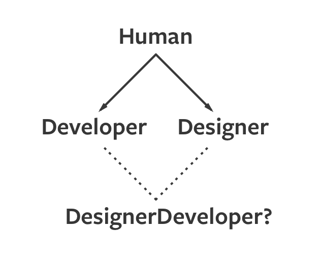

# Composition and Inheritance

If you tried reading about **Inheritance** in JavaScript, you'll come across another term, **Composition**. Most articles out there would say that composition is better than inheritance.

But what is composition? Why should you favor composition over inheritance?

## What is composition

**Composition**, when used in Object Oriented Programming, is the process of combining objects to create new objects. It's different from composition in Functional Programming (where it was used to describe how you can combine functions together).

When combining objects, we rely on `Object.assign` and `assignment` to prevent mutation from happening. This concept should feel familiar to you:

```js
const papayaBlender = { canBlendPapaya: true }
const mangoBlender = { canBlendMango: true }

const fruitBlender = Object.assign(papayaBlender, mangoBlender)

console.log(fruitBlender)
// {
//   canBlendPapaya: true,
//   canBlendMango: true
// }
```

## The problem with inheritance

Many people say you should favor composition over inheritance because of the **diamond problem**. It's easier to explain the diamond problem though the use of an example, so we'll do that.

Let's say you have a `Human` object that has `firstName` and `lastName` properties. It also has the ability to say it's name.

```js
const Human = {
  init (firstName, lastName) {
    this.firstName = firstName
    this.lastName = lastName
  },
  sayName () {
    console.log(`I am ${this.firstName} ${this.lastName}`)
  }
}
```

Let's also say you want to create a `Developer`.

Since a developer is a human (all developers have `firstName` and `lastName` properties, and they should be able to say their name), a developer should inherit from the `Human` object.

In addition to saying their own names, developers can also `code`.

```js
const Developer = Object.create(Human)

Developer.code = function (thing) {
  console.log(`Coded a ${thing}!`)
}
```

Let's also say you want to create a `Designer`. Designers, like developers, are humans too. Instead of coding, they can `design`.

```js
const Designer = Object.create(Human)

Designer.design = function (thing) {
  console.log(`Designed a ${thing}!`)
}
```

The inheritance system we've created so far sounds pretty robust. Designers can design, developers can code, and all humans can say their names. What can go wrong?

But, let's say people with the ability to design and code emerged. How do you create people like these?

Should you inherit from the `Developer`, should you inherit from `Designer`, or should you inherit from both `Designer` and `Developer`? If you inherit from both `Designer` and `Developer`, which should you inherit first? What properties and methods take precedence (if there's an overlap?).

That's the **diamond problem**—if you inherit from multiple objects, which object should inherit first? There's no definite answer to it.

<figure>
  
  <figcaption>Who the DesignerDeveloper inherit from first?</figcaption>
</figure>

## Composition solves the diamond problem

Composition takes on the diamond problem with a different approach. Instead of determining what skills a profession has, we create a new object called `skills`. These skills are added to the `Designer`, `Developer`, or other objects when they're created.

```js
const skills = {
  code (thing) {
    console.log(`Coded a ${thing}!`)
  },
  design (thing) {
    console.log(`Designed a ${thing}!`)
  }
}
```

When you create a `Developer`, you use `Object.assign` to add a skill to the `Developer`.

```js
const Developer = Object.create(Human)
Object.assign(Developer, {
  code: skills.code
})
```

At this point, developer instance you create from `Developer` will all be able to `code` because the skill is added to the `Developer` object.

```js
const zell = Object.create(Developer)
zell.init('Zell', 'Liew')

zell.code('website') // Coded a website!
```

You can also create designers and designer-developers with ease by inheriting them from `Human`, then giving them skills through `Object.assign`.

```js
const Designer = Object.create(Human)
Object.assign(Designer, {
  design: skills.design
})

const jasmine = Object.create(Designer)
jasmine.init('Jasmine', 'Lee')

jasmine.design('website') // Designed a website!
```

```js
const DesignerDeveloper = Object.create(Human)
Object.assign(DesignerDeveloper, {
  code: skills.code
  design: skills.design,
})

const jing = Object.create(DesignerDeveloper)
jing.init('Hui Jing', 'Chen')

jing.code('website') // Coded a website!
jing.design('website') // Designed a website!
```

The composition method is infinitely flexible, which is why it's highly preferred. You can extend your `skills` to include an infinite number of skills.

```js
const skills = {
  climbTrees () { /* ... */ },
  code () { /* ... */ },
  design () { /* ... */ },
  draw () { /* ... */ },
  eatBananas () { /* ... */ },
  throwCoconuts () { /* ... */ }
}
```

These skills can be added to objects however you want them.

```js
const MonkeyFolk = Object.create(Human)

Object.assign(MonkeyFolk, {
  climbTrees: skills.climbTrees,
  eatBananas: skills.eatBananas,
  throwCoconuts: skills.throwCoconuts
})
```

And (to continue with the absurdity), if Monkeyfolk lose the ability to call their names after a century, they won't need to be inherited from `Human` anymore. If this happens, you can create a new object, but still give them money-like skills.

```js
const YoungMonkeyFolks = {
  init () { /*... */ },
  climbTrees: skills.climbTrees,
  eatBananas: skills.eatBananas,
  throwCoconuts: skills.throwCoconuts
}
```

(Note: you don't necessarily need to group all skills into a `skills` object. Do what makes sense).

## Composition doesn't make inheritance obsolete

Both **composition** and **inheritance** have valid uses. For example, `Designer`, `Developer`, and `DesignerDeveloper` in the above examples are all humans. We can create these objects by inheriting the `Human` object.

To determine whether to use composition or inheritance for a given feature, consider if your feature has a "is-a" relationship or a "has-a" relationship to the object in question.

This "is-a" and "has-a" relationship can be obvious with real things. Here are some examples:

- A developer **is a** human. They **have** coding skills.
- An ostrich **is a** bird. They **have feathers**, but they **cannot** (do not have the ability to) fly.
- A dolphin **is a** mammal, but they **have the ability to** swim.

Unfortunately, when it comes to programming, because we're talking about abstract terms, it can be hard to determine if features are a "is-a" or "has-a" relationship to objects. This is why people favor composition over inheritance.

## Wrapping up

People favor composition over inheritance because it makes their data structures more flexible. Don't subscribe to the dogma and believe that composition is always better than inheritance. Sometimes, composition is the better solution; other times, inheritance is.

Discover what's the best solution for your use case through your knowledge and reasoning. If it's wrong, you can always change and learn!

## Exercise

Practice composition.

1. Create three skills—swim, fly and run.
2. Create a `Bird` object. Note that all birds have wings and feathers, but not all birds fly.
3. Create a `Sparrow`. A sparrow should be able to fly.
4. Create a `Duck`. A duck should be able to fly and swim.
5. Create an `Ostrich`. An ostrich can run, but cannot fly or swim.