# Function Composition

Let's say you have two simple pure functions – `add1` and `times2`. `add1` adds 1 to any number given to it, and `times2`, multiples a number by 2.

```js
const add1 = num => num + 1
const times2 = num => num * 2
```

Let's further say you need a function, `times2Add1`, that (1) multiples a number by 2 and (2) and 1 to the result of the multiplication.

One way to make `times2Add1` is to perform the calculation through addition and multiplication:

```js
const times2Add1 = num => num * 2 + 1
console.log(times2Add1(5)) // 11
```

Another way to create `times2Add1` is to use your `add1` and `times2` functions within `times2Add1`.

```js
const times2Add1 = num => {
  const intermediate = times2(num)
  return add1(intermediate)
}
```

You can also create a terser version by combining the two functions into one. When you do so, you omit the `intermediate` variable.

```js
const times2Add1 = num => add1(times2(num))
```

This method is known as function composition.

**Function composition is the process where you combine smaller functions to make a larger function**.

## Understanding how the composed function work

Let's take it step by step to understand how `times2Add1` work. We're going to go through this code together:

```js
const times2Add1 = num => add1(times2(num))
console.log(times2Add1(5)) // 11
```

When Javascript sees `times2Add1(5)`, it calls the `times2Add1` function and passes the value `5` as the argument `num`.

<figure>
  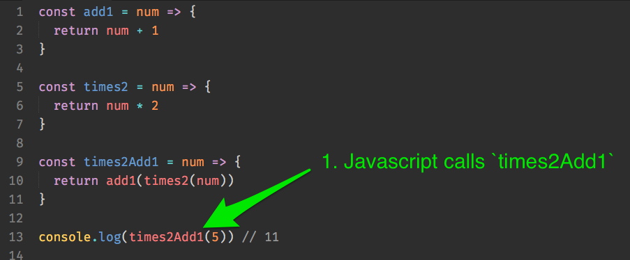
  <figcaption>Javascript calls times2Add1</figcaption>
</figure>

<figure>
  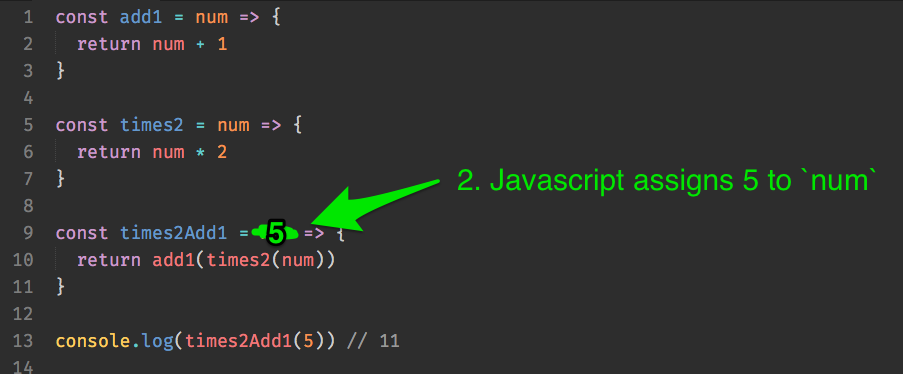
  <figcaption>JavaScript assigns 5 to num</figcaption>
</figure>

Within `times2Add1`, JavaScript sees it needs to return `add1(times2(num))`. Before it can return a value, it needs to evaluate the answer to `add1(times2(num))`.

To do so, it calls `times2(num)` first. Since `num` is 5, JavaScript calls `times2(5)`, which returns 10.

<figure>
  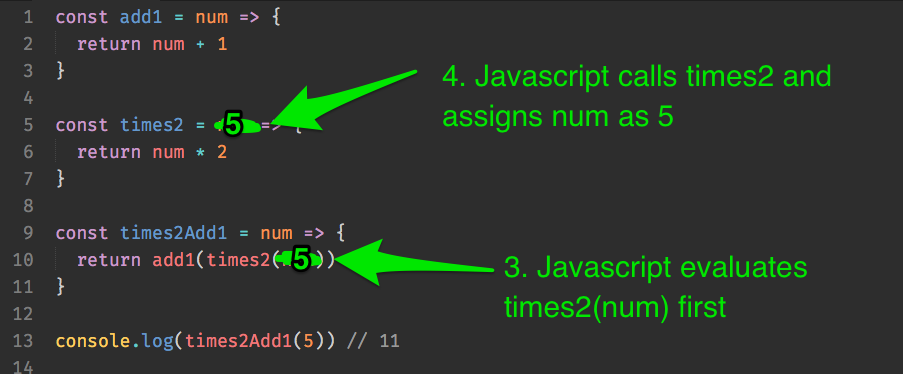
  <figcaption>Javascript calls times2(5)</figcaption>
</figure>

<figure>
  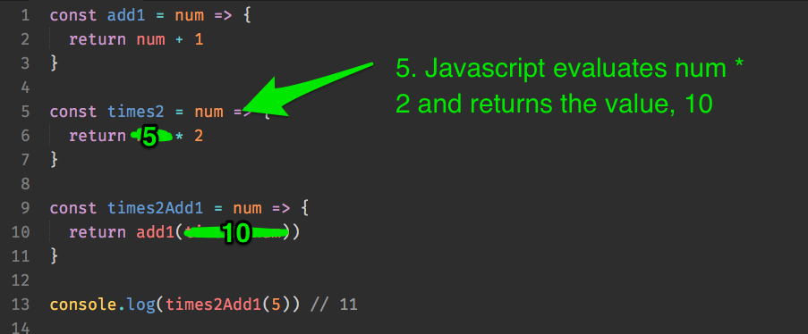
  <figcaption>Javascript returns the value of times2(5)</figcaption>
</figure>

Then, JavaScript calls `add1(10)`, which returns 11.

<figure>
  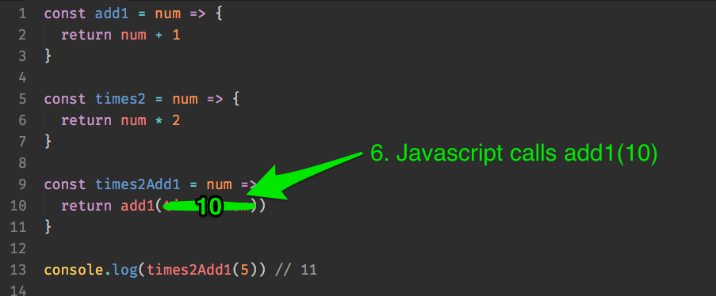
  <figcaption>Javascript calls add1(10)</figcaption>
</figure>

<figure>
  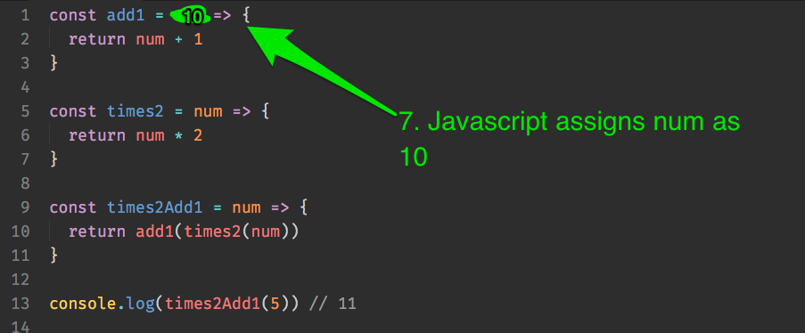
  <figcaption>Javascript assigns num as 10</figcaption>
</figure>

<figure>
  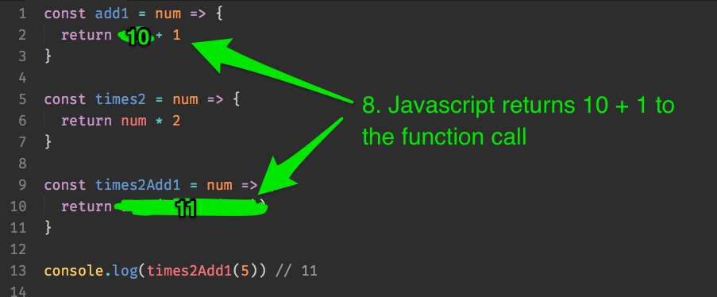
  <figcaption>Javascript returns the value of add1(10)</figcaption>
</figure>

After `add1(times2(5))` has been fully evaluated, it returns the evaluated value, 11, to the origin of the function call.

<figure>
  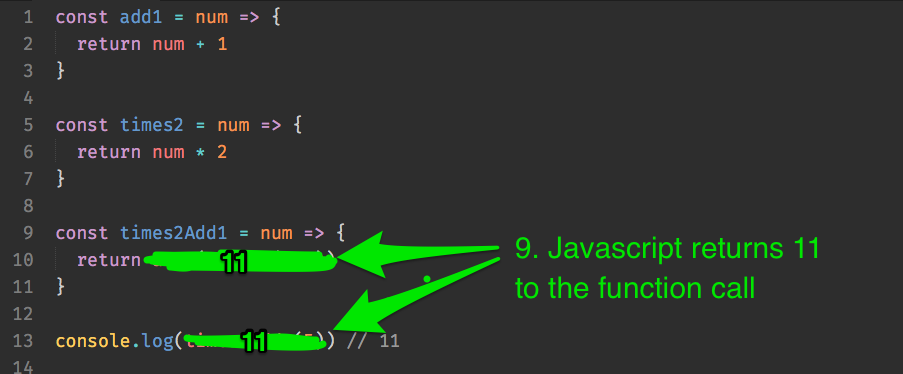
  <figcaption>Javascript returns value of add1(Times2(5))</figcaption>
</figure>

That's how a composed function work.

## Should you compose your functions?

The `times2Add1` function is really difficult to read, right? So why would anyone want to compose functions together?

First, functions in the real world are much more complex than the simple addition and multiplication we've done so far. It might make sense to combine functions if there's a need to do more complicated stuff.

Second, functional programming experts use helper functions like `pipe` and `compose` to make the composed function much easier to read. Here's an example of `times2Add1` with `pipe`.

```js
const times2Add1 = pipe(times2, add1)
const results = times2Add1(5)
console.log(results) // 11
```

Much easier to read, isn't it?

## Explaining pipe

`pipe` is a function that lets you combine multiple functions together. The actual function looks pretty complicated:

```js
const pipe = (...fns) => arg => fns.reduce((acc, fn) => fn(acc), arg)
```

Instead of going through the actual `pipe` function, we'll go through a simpler version of `pipe`, called `simplePipe`.

`simplePipe` works exactly the same way as `pipe`, except `simplePipe` only allows you to combine two functions while `pipe` allows you to combine more than two functions.

```js
function simplePipe (fn1, fn2) {
  return function (num) {
    return fn2(fn1(num))
  }
}
```

Hoo boy, the `simplePipe` already looks complicated! If you look closely, you'll realize that `simplePipe` contains a closure. (Remember, when you create an inner function in an outer function, [the inner function is the closure](../02.js-basics/09.scopes-and-closures.md)).

There are lots of closures in Functional Programming. So, its important to understand how `simplePipe` works.

We'll go through this code together:

```js
const times2Add1 = simplePipe(times2, add1)
const results = times2Add1(5)
console.log(results) // 11
```

When Javascript sees `simplePipe(times2, add1)`, it knows it needs to call `simplePipe`.

<figure>
  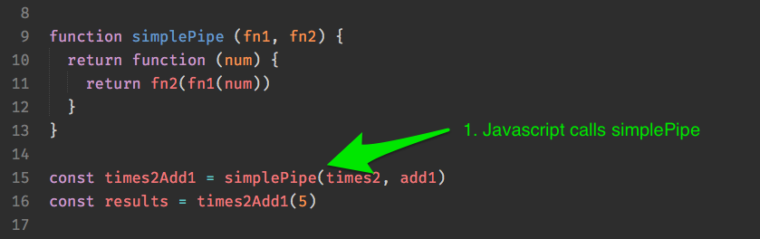
  <figcaption>Javascript needs to call simplePipe</figcaption>
</figure>

When it calls `simplePipe`, Javascript assigns `times2` to `fn1` and `add1` to `fn2` respectively.

<figure>
  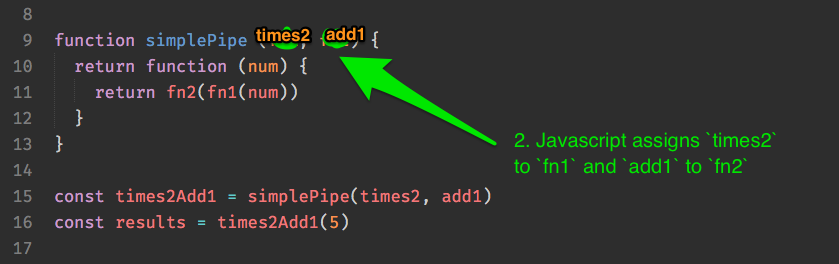
  <figcaption>Javascript assigns times2 to fn1 and add1 to fn2</figcaption>
</figure>

In the next line, Javascript sees a `return` statement. This statement returns a function, which is a valid value to be passed around as a variable. Here, Javascript stops executing and returns the function to `times2Add1`.

<figure>
  
  <figcaption>Javascript returns the function</figcaption>
</figure>

Next, Javascript notices `times2Add1(5)`. Here' it knows it needs to call our newly created function, `times2Add1`. It should also assign `5` to `num`.

<figure>
  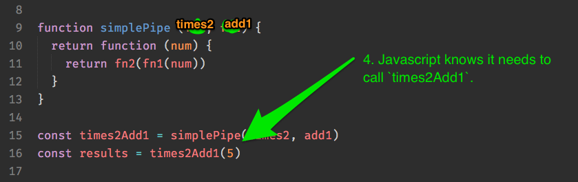
  <figcaption>Javascript calls times2Add1</figcaption>
</figure>

<figure>
  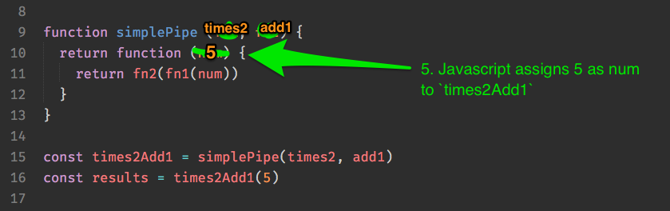
  <figcaption>It assigns num as 5</figcaption>
</figure>

Then, Javascript sees `fn2(fn1(num))`. It knows that `num` is 5, but what's `fn1` and `fn2`? Do you know what they are?

The good thing about closures in Javascript is it retains information about variables that are previously declared in its containing function.

So, if you `console.log(fn1)`, you'll see that `fn1` is `times2`. If you `console.log(fn2)`, you'll see that `fn2` is `add1`.

```js
function simplePipe (fn1, fn2) {
  return function (num) {
    console.log('fn1 is ' + fn1)
    console.log('fn2 is ' + fn2)
    return fn2(fn1(num))
  }
}
```

<figure>
  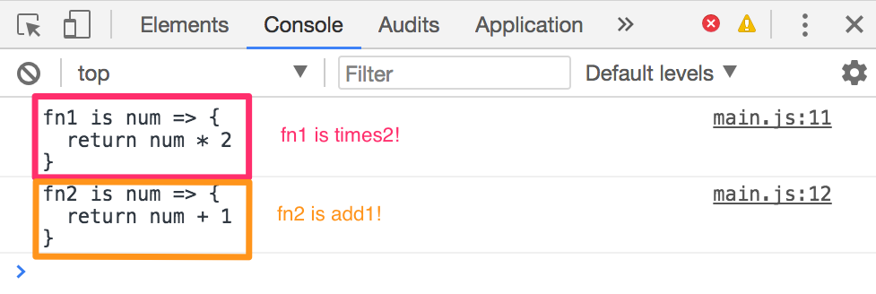
  <figcaption>Closures retain information variables that were declared in their containing functions!</figcaption>
</figure>

Since `fn1` is already `times2`, and `fn2` is already `add1`, `fn2(fn1(num))` is actually `add1(times2(num))`.

<figure>
  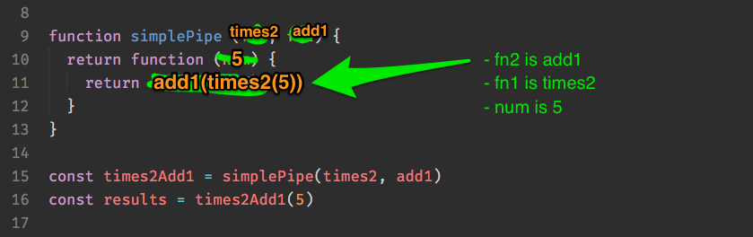
  <figcaption>Javascript substitutes fn1 as times2 and fn2 as add1</figcaption>
</figure>

And you know what happens next 😉.

This is a nutshell of how `simplePipe` (and other closures) work.

## Back to composition

Composition is really cool. In the real world, Functional programmers use `pipe` (not `simplePipe`, obviously) to combine multiple functions. You can even chain 4 or more functions!

```js
const complicatedFn = pipe(times2, add1, times2, add1)
console.log(complicatedFn(5)) // 23
```

It feels really good to compose functions. You'll feel like a pro. Don't you wish you could compose functions all day long?

If you do, stop right there. I've got bad news.

**Composing functions is the fun part. The hard part is learning to create composable functions (functions that can be composed).**

To create composable functions, you need to learn a whole slew of terminologies and concepts, including but not limited to **partial application**, **currying**, **type signatures**, **monads**, **functors**, etc. .

Since you're learning to make real components right now, I suggest you don't dive into the nitty gritty of functional programming yet. It's still too early, and you'll end up totally confused.

Instead, I recommend you use the practices you've learned so far when you build components. They'll help you make your code much better than before.

To jog your memory, the practices you learned are:

1. Write pure functions (as much as possible)
2. Reduce side effects (as much as possible)
3. Reduce state changes (as much as possible)
4. Prevent arrays and objects from mutating.

Feel free to come back to Functional Programming when you're comfortable with building things from scratch. When you return, you might find [this book](https://www.gitbook.com/book/drboolean/mostly-adequate-guide/details) helpful.

## Wrapping up

Function composition is the process where you combine smaller functions to make a larger function.

In the real world, functional programmers use functions like `pipe` to compose functions in a highly readable way.

The hard part about functional programming is writing functions that can be composed together. At this point, I recommend you skip the composing part and commit to using practices you've learned in the past few lessons. You can come back to functional programming at a later date.

## Exercise

Make sure you understand how `simplePipe` and closures work before moving on. We won't be composing functions much in this course, but closures are important.

Move on once you understood how to use `simplePipe`.