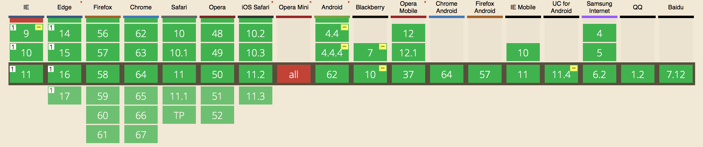

# Detecting Vendor Prefixes

Vendor prefixes are keywords like `-webkit`, `-moz`, `-o`, and `-ms`. They are added in front of CSS properties, in the following form:

```css
.selector {
  -webkit-transform: translateX(50px);
  transform: translateX(50px);
}
```

## Why we use vendor prefixes

Vendor prefixes are used to implement experimental CSS features. This allows browser creators to tweak the implementation while we use it. Both parties are happy when vendor prefixes are available.

Browser creators will remove vendor prefixes when they're happy with the implementation. Sometimes, this takes as long as four years. (`-webkit-transform` existed in Chrome since version 4, but they only removed the prefix in version 35).

## But vendor prefixes are a pain in the ass

We don't have the bandwidth to remember vendor prefixes when we're working on our projects, or when we're learning about these properties.

One property that has really bad vendor prefixes is Flexbox. If you wanted flexbox to work properly, you'll need a whole slew of prefixes. Here's an example:

```css
.selector {
  /* This three properties do the same thing across different versions. */
  display: -webkit-box;
  display: -ms-flexbox;
  display: flex;
}
```

```css
.selector {
  /* These four properties are required to set flexbox orientation to "column" */
  -webkit-box-orient: vertical;
  -webkit-box-direction: normal;
  -ms-flex-flow: column;
  flex-flow: column;
}
```

```css
.selector {
  /* These three properties are required to set flex-grow to 1 */
  -webkit-box-flex: 1;
  -ms-flex-positive: 1;
  flex-grow: 1;
}
```

Notice how vendor-prefixed properties can look different from the actual property? These are the hardest to remember. Thankfully, libraries like prefix-free and autoprefixer help us write prefixes automatically. When we use these libraries, we can write standard CSS properties to get the whole slew vendor-prefixed properties.

```css
/* These three properties are equivalent to all of the above properties when used with a prefixing library */
.selector {
  display: flex;
  flex-flow: column;
  flex-grow: 1;
}
```

There are differences between prefixing libraries, though. [Prefix free](https://leaverou.github.io/prefixfree/) uses JavaScript to create prefixes on the fly. The downsides to prefixfree is it requires JavaScript, which means prefixes won't be applied if JavaScript is disabled.

[Autoprefixer](http://autoprefixer.github.io), on the other hand, helps write vendor prefixes directly in your CSS file. A large majority of the industry prefers autoprefixer because there are no external dependencies for a user. You can learn more about autoprefixer in the free chapters of [Automate Your Workflow](https://automateyourworkflow.com)

## Vendor prefixes in JavaScript

Normally, you don't need to worry about vendor prefixes when writing JavaScript, because almost everything that needs to be prefixed can be handled with CSS and Autoprefixer.

But there is one case you need to be aware of though—you need to write vendor prefixes if you write the `transform` property with JavaScript.

Let's say you want to move an object 100 pixels to the right with `transform: translateX(100px)`. In JavaScript, you'll write this:

```js
Element.style.transform = 'translateX(100px)'
```

The code works across major browsers except Internet Explorer 9 (which supports `transform` behind a `-ms` prefix), Blackerry and the default Andriod browser (which supports `transform` behind a `-webkit` prefx), and for Opera Mini (which does not support transforms at all).

<figure>
  
  <figcaption>IE9, Blackberry and Android browser supports the transform property with prefixes</figcaption>
</figure>

To provide support for IE9, Blackberry, and the default Android browser, you need to add write vendor prefixes.

## Writing vendor prefixes in JavaScript

There are two steps to writing vendor prefixes in JavaScript. The first step is to identify the prefix. You can do so with the code below.

Note: I modified the snippet below for simplicity. You can find the original snippet from [this post on Davidwalsh's blog](https://davidwalsh.name/vendor-prefix)

Note2: Don't worry about `prototype`, `call`, and `.join`, etc. You'll learn about them in time.

Note 3: `.match` and `//` stuff are part of regular expressions. We won't cover them in this course since you'll rarely use them on a day-to-day basis. For regular expression help, visit [regexone.com](https://regexone.com).

```js
const getPrefix = _ => {
  const styles = window.getComputedStyle(document.documentElement, '')
  const pre = (Array.prototype.slice
      .call(styles)
      .join('')
      .match(/-(moz|webkit|ms)-/) || (styles.OLink === '' && ['', 'o'])
    )[1]
  return '-' + pre + '-'
}
```

You can get the vendor prefix by writing `getPrefix()`. Try logging the prefix and you'll see `-webkit-`, `-moz-`, `-o-` or `-ms` in your console, depending on the browser you use.

```js
const prefix = getPrefix()
console.log(prefix) // -webkit-, -moz-, -o- or -ms-
```

You can then write style the element with the bracket notation. Write both versions; the prefix version should come after the unprefixed version.

```js
// The unprefixed version
ELement.style.transform = 'translateX(50px)'
// The prefixed version
Element.style[prefix + 'transform'] = 'translateX(50px)'
```

Note: Modern browsers remove the prefixes automatically when they're not required. Try writing the prefixed version only; you'll still see the unprefixed version in your inspector if your browser supports the unprefixed version.

## Wrapping up

Vendor prefixes are a pain in the ass. The good news is, we have excellent tools like Autoprefixer that handles prefixing for us automatically.

In JavaScript, you only need to write prefixes for the `transform` property to support browsers like Internet Explorer 9, Blackberry, and the default Android browser.

## Exercise

Try completing these exercises:

1. Console.log the prefix in different browsers like Internet Explorer, Edge, Safari, Chrome, Firefox, etc.
2. Create a vendor-prefixed transform property via JavaScript
