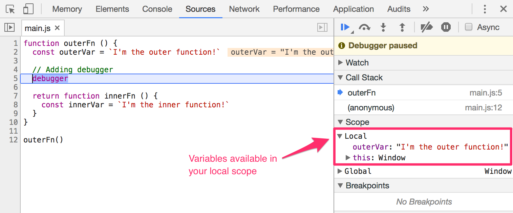
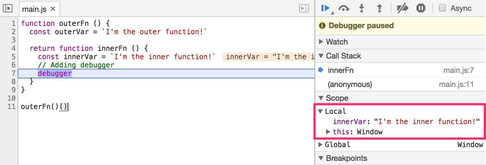

## Closures

When you create an `innerFn` in an `outerFn`, you have created a closure. This pattern is called a closure.

```js
// This is a closure pattern
function outerFn () {
  return function innerFn() {}
}
```

Inner functions have access to an outer function's scope. When we create closures, we usually return the inner function so that we can use the outer function's variables later.

In the example below, `innerFn` has access to `outerVar` even though we call it outside `outerFn`.

```js
function outerFn () {
  var outerVar = `I'm a variable in the outer function!`
  return function innerFn () {
    console.log(outerVar)
  }
}

// Storing a reference to the closure
const theInnerFunction = outerFn()

// Calling the inner function
theInnerFunction() // I'm a variable in the outer function!
```

## Debugging scopes with devtools

Chrome's (and Firefox's) developer tools make it simple for you to debug scopes. There are two ways to use this functionality.

The **first way** is to add a `debugger` keyword in your code. When JavaScript in browsers hits the `debugger` keyword, they pause execution at that point, which allows you to debug.

Here's an example:

```js
function outerFn () {
  const outerVar = `I'm the outer function!`

  // Adding debugger
  debugger

  return function innerFn () {
    const innerVar = `I'm the inner function!`
  }
}

outerFn()
```

Open up your developer tools and navigate to the Sources tab (in Chrome) or Debugger tab (in Firefox), and you'll see the variables at the point where you added the `debugger` keyword:

<figure>
  
  <figcaption>Debugging outerFn's scope</figcaption>
</figure>

In the image above, you can see that you can access `outerVar` and `outerFn`.

Try shifting the `debugger` keyword into `innerFn`. Notice how the scope changes:

```js
function outerFn () {
  const outerVar = `I'm the outer function!`

  return function innerFn () {
    const innerVar = `I'm the inner function!`
    // Adding debugger
    debugger
  }
}

// Notice the two parenthesis here?
// We use two parenthesis because we want to run two functions
outerFn()()
```

<figure>
  
  <figcaption>Debugging the innerFn scope</figcaption>
</figure>

You can see that `innerFn` has access to `innerVar`.

Now, add a `console.log` statement for `outerVar` within `innerFn`. You'll see that `outerVar` is in a closure scope:

```js
function outerFn () {
  const outerVar = `I'm the outer function!`

  return function innerFn () {
    const innerVar = `I'm the inner function!`
    console.log(outerVar)
    // Adding debugger
    debugger
  }
}

outerFn()()
```

<figure>
  
  <figcaption>Getting outerVar in innerFn</figcaption>
</figure>

### Second way to use devtools

The second way is to add a breakpoint in the Sources (or Debugger) tab. You do so by clicking on a line number.

After you add the breakpoint, refresh your page and JavaScript will pause *just before executing your breakpoint*.

<figure>
  
  <figcaption>Debugging scopes by adding breakpoints</figcaption>
</figure>

## Exercise

Answer these questions:

1. What is a block scope?
2. What is a function scope?
4. Can you use global variables in a function scope?
5. Can you use a local variable in the global scope?
6. What is a closure?

Practice working with scopes. Do the following:

1. Create a global variable.
2. Create a local variable in a block scope.
3. Create a local variable in a function scope.
4. Create a closure.
5. Get the value of a variable in a closure after the outerFn is called

---

- Previous Lesson: [Arrow Functions](08.arrow-functions.md)
- Next Lesson: [Objects](10.objects.md)
