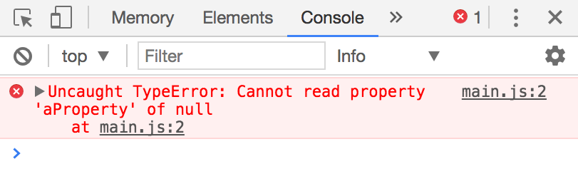
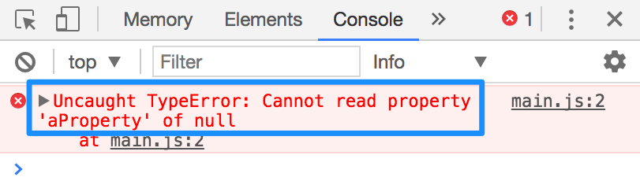
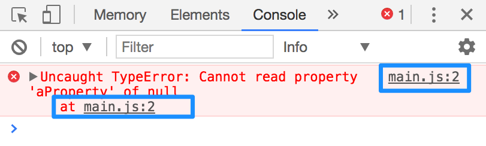

# Debugging errors

It doesn't matter whether you're a novice or an expert at JavaScript. You will make errors as you code. It's a given.

When novices encounter an error, they panic; their minds go blank.

When experts encounter an error, they use the error messages to trace what's wrong. They fix the error and continue forward.

To become a good developer, the #1 skill is to be able to figure out what went wrong, and make the necessary adjustments. This is a process known as **debugging**.

## How to debug

Debugging occurs when you notice something goes wrong. Sometimes, your cue would be an error message. Other times, you cue may be results that don't match what you're expecting.

Let's go through a simple example with an error message. Say you have the following code:

```js
const anObject = null
console.log(anObject.aProperty)
```

If you navigate to the Console tab in your developer tools, you'll see an error message:

<figure>
  
  <figcaption>An error message</figcaption>
</figure>

To debug the error message, you follow these *five steps*:

1. Regain your composure
2. Read the error message
3. See where the error occurred
4. Console.log if necessary
5. Fix the error

**First, regain your composure**. Remember, it's normal to make mistakes when you code. It's likely that you made a typo. Nothing is going to explode, so don't worry, don't panic. Take deep breath and regain your composure.

**Second, read the error message**. Error messages contain valuable information that tells you what went wrong. In this case, the error says you can't read a property of `null`. This is a valid error because the `null` primitive cannot have properties. Only objects have properties.

<figure>
  
  <figcaption>Read the error message</figcaption>
</figure>

**Third, see where the error occurred**. The error message also tells you the origin of your error. In this case, the error originated from line #2 in `main.js`.

<figure>
  
  <figcaption>Locate the error</figcaption>
</figure>

**Fourth, console.log if necessary**. If you don't know how to fix the error immediately, you might want to `console.log` to figure out what to do.

For instance, let's say you don't know that `anObject` is `null` right now. Since you're uncertain whether `anObject` is really `null`, you can `console.log(anObject)` to see what it is.

Make sure you write your log statements before the offending line of code (since JavaScript stops executing when an error happens).

```js
console.log(anObject) // Checks in anObject is null
console.log(anObject.aProperty) // Error
// anything here would not execute because the error stops execution
```

**Fifth, fix the error**. Once you confirm the cause of the error message, go ahead and fix it. In this case, you can set `anObject` to an empty object and the error will go away.

```js
const anObject = {}
console.log(anObject.aProperty)
```

## Exercise

Is there an error with the following code? If yes, find out what it is and fix it.

```js
const anObject = {}
console.log(anObject.someMethod())
```

---

- Previous Lesson: [For Loops](15.for-loops.md)
- Next Lesson: [Callbacks](17.callbacks.md)