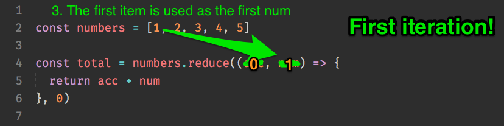
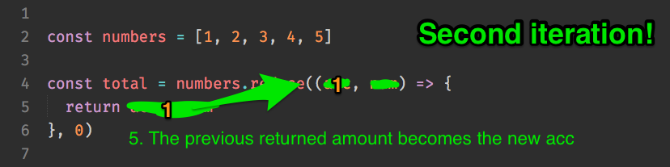

## Array.reduce

`array.reduce` is a function that helps to simplify a complex array into a simpler value. It looks like this:

```js
const callback = (accumulator, currentValue, index) => {
  // return something here
}
const result = array.reduce(callback, initialValue)
```

There are a lot of moving parts, so let's take it slow.

**accumulator** is the accumulated value from previous reductions. The value you return in each iteration will be the value for the accumulator in the next iteration.

**currentValue** is the current item in the array that you're looping through. It's the same value that you'll expect to see when you use `forEach`, `filter` and `map`.

**initialValue** is the starting value passed into accumulator.

It's much easier to explain reduce with the use of some examples, so let's get straight into some use cases for reduce and how it works.

### Reducing an array of values into a single value

Let's say you have a list of numbers, and you want to find the total sum of these numbers.

```js
const numbers = [1, 2, 3, 4, 5]
```

One way to get the total sum of the numbers is through a `for` loop. If you do this, you can create a variable called `total` outside the loop, then add to `total` as you loop through the numbers.

```js
let total = 0

for (let num in numbers) {
  total = total + num
}

console.log(total) // 15
```

You can also do it with `array.reduce`.

```js
const total = numbers.reduce((acc, num) => acc + num, 0)
console.log(total) // 15
```

`array.reduce` can be difficult to understand at the start, so let's break down what's happening, step by step.

First, you pass an initial value to the `array.reduce`. Since we're starting the count from 0, you can pass in 0.

<figure>
  
  <figcaption>Initial value set to 0</figcaption>
</figure>

This `initialValue` will be used as the `accumulator` in the first iteration. The `currentValue` in the first iteration is the first item in the array.

<figure>
  
  <figcaption>accumulator assigns as 0</figcaption>
</figure>

<figure>
  
  <figcaption>currentValue is the first item in the array</figcaption>
</figure>

In a `reduce` callback, you need to return a value to be used as the next `accumulator`.

<figure>
  
  <figcaption>The next return value is calculated</figcaption>
</figure>

In the second iteration, the `accumulator` value is the previous returned value while the `currentValue` is the second item in the array.

<figure>
  
  <figcaption>The previous return value is used as the next accumulator</figcaption>
</figure>

<figure>
  
  <figcaption>currentValue becomes the second item in the array</figcaption>
</figure>

This process goes on and on until `reduce` loops over every item in the array. The final value that is returned will be returned to the function call.

<figure>
  
  <figcaption>The return value is calculated and the process repeats</figcaption>
</figure>

### Getting unique values from an array

Let's say you have an array of fruits in a basket. Some of these fruits are duplicated. You just want to know what kinds of fruits are in the basket.

```js
const fruitsBasket = ['apple', 'banana', 'banana', 'orange', 'pear', 'apple']

// Want you want:
// ['apple', 'banana', 'orange', 'pear']
```

Here's how you'll do it with reduce.

```js
const uniqueFruits = fruitsBasket.reduce((acc, item) => {
  if (acc.indexOf(item) === -1) {
    return acc.concat(item)
  } else {
    return acc
  }
}, [])
```

Let's go through it step by step again.

Since you want an array of items that are unique, you start off by passing an array as the initial value.

<figure>
  
  <figcaption>Setting initialValue to an empty array</figcaption>
</figure>

In the first iteration, the `accumulator` is an empty array. The `item` is the `apple`.

<figure>
  
  <figcaption>The empty array is used as the first accumalator value</figcaption>
</figure>

<figure>
  
  <figcaption>The first item in the array is set as currentValue</figcaption>
</figure>

Next, you check if `accumulator` contains `apple`. If it doesn't, you add it with `Array.concat` and return the newly accumulator.

If the accumulator already contains `apple`, you return the accumulator without touching it, so the reduction continues with the next item.

<figure>
  
  <figcaption>Checks if apple is in acc</figcaption>
</figure>

<figure>
  
  <figcaption>Adds apple to the accumulator since its not already there</figcaption>
</figure>

<figure>
  
  <figcaption>Continues with the reduction, setting ['apple'] as the new accumulator</figcaption>
</figure>

### Creating an object from an array

Let's say you have an array of fruits in a basket. You want to know how many of each fruit is in it.

```js
const fruitsBasket = ['apple', 'banana', 'banana', 'orange', 'pear', 'apple']

// What you want
// {
//   apple: 2,
//   banana: 2,
//   orange: 1
//   pear: 1,
// }
```

Since you want an object, you need to pass an object as the initialValue to the reducing function. The principle here is the same as the above, so I'll leave you to figure out how it works.

```js
const fruitsCount = fruitsBasket.reduce((tally, fruit) => {
  if (tally[fruit]) {
    tally[fruit] = tally[fruit] + 1
  } else {
    tally[fruit] = 1
  }
  return tally
}, {})
```
