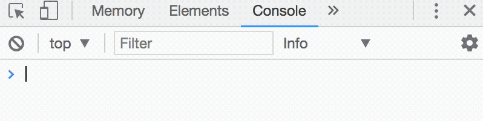
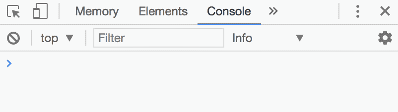

## Example of a callback: setTimeout

`setTimeout` is a function that executes a function after a certain amount of time has elapsed. It takes in two variables, `callback` and `delay`:

```js
setTimeout (callback, delay)
```

`delay` is a number in milliseconds. It determines how long to wait for before executing the callback. If `delay` is omitted, a value of 0 will be used. When this happens, the callback would be executed as soon as possible.

`callback` is a function to execute when the delay is up.

Let's go through a quick example.

Say you have a function that logs `Hello world`. You want to execute this function after 1 second with `setTimeout`. Here's what you'll do:

```js
const sayHello = function () {
  console.log('Hello world!')
}

setTimeout(sayHello, 1000)
```

If you navigate to your console, you should see `Hello world!` after one second:

<figure>
  
  <figcaption>Hello world appears one second after refreshing the page</figcaption>
</figure>

You can also choose to declare `sayHello` as an anonymous function (function without a name) directly as an argument of `setTimeout`. This method is useful when you don't intend to use the callback anywhere else.

```js
setTimeout(function () {
  console.log('Hello world!')
}, 1000)
```


An example of an asynchronous function is `setTimeout`. Let's see how `setTimeout` works if you give JavaScript another task to complete:

```js
function fiveSecondsLater () {
  console.log('5 seconds passed!')
}

setTimeout(fiveSecondsLater, 5000)
console.log('Start!')
```

In the code above, JavaScript executes `setTimeout` first. While executing setTimeout, JavaScript knows it needs to wait for ten seconds before executing `fiveSecondsLater`.

While waiting, JavaScript executes other lines of code, like `console.log("Start!")`.

So, this is what you'll see if you check the above code with your console:

```js
// What happens:
// > Start! (almost immediately)
// > 5 seconds passed! (after five seconds)
```

<figure>
  
  <figcaption>JavaScript executes other code while waiting for setTimeout</figcaption>
</figure>
